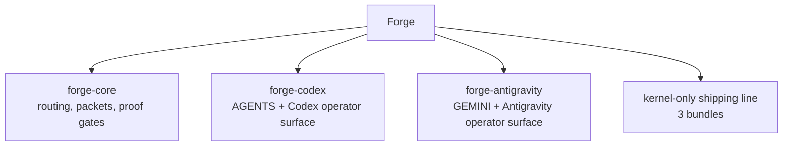
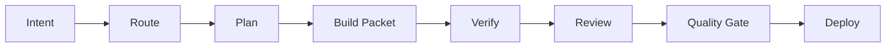

# Forge
### Evidence-first execution kernel.

**1 core kernel, 2 host adapters, stable 2.15.0**


Forge is an evidence-first execution kernel for coding agents.
This repository is the source monorepo for Forge: `forge-core + host adapters`.

Current maintainer docs live under `docs/current/`.
Forge currently follows the operating contract in `docs/current/target-state.md`.
Pre-`2.15.0` plans, specs, audits, and archived references are available from git history instead of live docs.

Forge is built around a simple split:

- `forge-core` owns routing, packetized execution, verification discipline, release-state thinking, and durable work artifacts.
- Host adapters such as `forge-codex` and `forge-antigravity` adapt Forge to a specific host without pushing host UX into core.
- The shipped product line is kernel-only: `forge-core`, `forge-codex`, and `forge-antigravity`.

### If Forge improves your workflow, give the repo a Star.

---

## The Problem Nobody Likes To Debug Twice

AI coding agents are fast.
That does not automatically make delivery reliable.

| What actually happens | The real cost |
| --- | --- |
| The agent starts coding before scope is truly clear | Rework, drift, and hidden assumptions |
| Session context lives mostly in chat | You reconstruct the same intent every morning |
| Verification changes from task to task | "Looks done" replaces proof |
| Host wrappers drift away from each other | The same workflow means different things on different hosts |
| Browser or runtime proof sits off to the side | UI confidence becomes theater instead of execution evidence |

Forge exists to close those gaps without turning every small task into ceremony.

---

## The Solution: A Shared Execution Kernel

Forge gives coding agents one shared operating model:

- route the task by intent and complexity
- keep medium and risky work in repo-visible artifacts
- preserve one packet contract across hosts
- verify before claims, not after the fact



Forge is not a prompt wrapper.
It is an evidence-first execution kernel meant for real repos where the cost of being confidently wrong is high.

---

## What Makes Forge Different

### Full Delivery Lifecycle, Not Just Code Generation

Forge treats planning, build execution, review, release, and follow-up as one connected system:



### Host-Neutral Core, Host-Specific Surfaces

- Core semantics live in `forge-core`.
- Host adapters change UX surface, not the meaning of routing, packets, verification, or release gates.
- Generated `AGENTS.global.md` and `GEMINI.global.md` stay thin bootstrap files, not second orchestrators.

### Evidence Before Claims

- Verification is defined before edits on meaningful work.
- Packet and workflow-state artifacts survive beyond the current chat.
- Runtime and browser proof are bounded execution tools, not vanity add-ons.

### Lighter On Small Tasks, Structured On Risky Work

- Low-risk slices can use fast lane while still keeping proof-before-claims.
- Size is advisory: markdown-first workflow selection can still escalate nominally small work when durable artifacts or repo evidence show broader risk.
- Medium and large slices keep explicit packet state, merge readiness, and residual risk.
- Forge stays brownfield-safe instead of assuming a clean greenfield repo.

---

## Loose Agent Setup vs Forge

| Surface | Loose agent setup | Forge |
| --- | --- | --- |
| Planning | Optional and usually chat-only | Routed through `brainstorm`, `plan`, and `architect` with explicit readiness checkpoints before build |
| Execution state | Buried in chat scrollback | Persisted in packet and workflow-state artifacts |
| Verification | Ad hoc and inconsistent | Defined up front, rerun before claims |
| Host behavior | Wrapper-specific drift | Shared core contract with adapter overlays |
| Browser proof | Detached sidecar | Bounded runtime path that feeds execution decisions |

---

## Current Status

- License: `MIT`
- Repo maturity: stable release available
- Current stable release: `2.15.0`
- Canonical verification gate: `python scripts/verify_repo.py`
- `forge-antigravity` is currently the most mature adapter for real rollout
- `forge-codex` ships in the current stable release after passing the canonical release gates

Public-readiness notes live in `docs/release/public-readiness.md`.

---

## What Ships From This Repo

| Bundle | Role | Default install target |
| --- | --- | --- |
| `forge-core` | host-agnostic execution kernel | no default target |
| `forge-antigravity` | Antigravity host adapter | `~/.gemini/antigravity/skills/forge-antigravity` |
| `forge-codex` | Codex host adapter | `~/.codex/skills/forge-codex` |

The kernel-only release line keeps the shipped bundle table intentionally short.

---

## Quick Start

### Source workflow

Do not edit installed bundles directly.
Make changes in this monorepo, verify them here, build release artifacts into `dist/`, then install from `dist/`.

```powershell
python scripts/verify_repo.py
python scripts/build_release.py
```

What `verify_repo.py` covers:

- generated host artifact freshness
- Python compile checks
- repo secret scan
- repo-level unit tests
- bundle verification
- release build
- install dry-runs for the shipped kernel and host adapter bundles
- dist bundle verification

### Start Here (Solo Operator)

For a first-run repo where context is still weak:

1. Run `python scripts/verify_repo.py --profile fast` to confirm tooling health when repo health is still unclear.
2. In the host session, start with `help` or `next` and let Forge route directly from repo state.
3. State one bounded slice and persist packet or workflow-state before wider edits.

For low-complexity work, use fast lane only when the slice is truly low-risk and still keep proof-before-claims.
For medium or high-risk work, use full packet mode and rerun verification before claiming completion.

### Install On Codex

```powershell
python scripts/verify_repo.py
python scripts/build_release.py
python scripts/install_bundle.py forge-codex --activate-codex
```

What `--activate-codex` does:

- installs `forge-codex` into the default Codex skill path
- rewrites `~/.codex/AGENTS.md` so Forge becomes the global orchestrator
- retires legacy `awf-codex` runtime artifacts and matching legacy skills

If Codex should reply in Vietnamese with full diacritics on Windows:

```powershell
python scripts/install_bundle.py forge-codex --activate-codex
python "$HOME/.codex/skills/forge-codex/scripts/write_preferences.py" --language vi --orthography vietnamese_diacritics --apply
powershell -ExecutionPolicy Bypass -File "$HOME/.codex/skills/forge-codex/scripts/enable_windows_utf8.ps1"
powershell -ExecutionPolicy Bypass -File "$HOME/.codex/skills/forge-codex/scripts/enable_windows_utf8.ps1" -Persist
```

### Install On Antigravity

```powershell
python scripts/verify_repo.py
python scripts/build_release.py
python scripts/install_bundle.py forge-antigravity --build
```

If you want Forge to rewrite the global Gemini entrypoint from the bundle template:

```powershell
python scripts/install_bundle.py forge-antigravity --activate-gemini
```

### Install Forge Core Explicitly

`forge-core` has no default host target, so install it only when you have a specific runtime path in mind:

```powershell
python scripts/install_bundle.py forge-core --target C:\path\to\custom\runtime
```

### Safety Notes

- Install commands snapshot the existing target by default under the target's runtime-managed Forge state root, typically `.../rollbacks/install/`.
- `--activate-codex` also backs up the existing Codex global entrypoint and retired legacy artifacts.
- `--activate-gemini` backs up the existing Gemini global entrypoint when present.
- Use `--backup-dir` when you want an explicit override outside the default runtime-managed backup root.
- Do not install inside the repo tree, including `packages/`, `dist/`, or the repo root.
- Use `--dry-run` before a risky rollout.

---

## Repo Layout

```text
forge/
|-- packages/
|   |-- forge-core/
|   |-- forge-antigravity/
|   `-- forge-codex/
|-- docs/
|   |-- architecture/
|   |-- archive/
|   |-- current/
|   `-- release/
|-- scripts/
|-- tests/
`-- dist/   # generated by build_release.py
```

---

## Operating Principles

- Process-first: understand the work before editing.
- Evidence before claims: verification is part of the contract, not optional polish.
- Brownfield-safe: optimize for real repos with real history.
- Host-neutral core: adapters shape UX, not semantics.
- Kernel-only shipping: keep the shipped bundle line small and explicit.

---

## Release Model

Release flow:

1. Edit source in the monorepo.
2. Run `python scripts/verify_repo.py`.
3. Build `dist/` with `python scripts/build_release.py`.
4. Install or publish from `dist/`.
5. Optionally run extra smoke checks for changed runtime surfaces when additional confidence is useful.

The detailed release contract lives in `docs/release/release-process.md`.
The detailed install contract lives in `docs/release/install.md`.

---

## Documentation Guide

Start here depending on intent:

- `docs/release/install.md` for install flags and target behavior
- `docs/release/release-process.md` for release discipline and promotion rules
- `docs/architecture/adapter-boundary.md` for the core-versus-adapter boundary
- `CONTRIBUTING.md` for source contribution workflow
- `SECURITY.md` for security reporting expectations

## Documentation Language Policy

- Public package docs, architecture docs, and adapter boundary docs should default to English.
- Maintainer-facing operational notes such as plans, release notes, and changelog entries may remain in Vietnamese.
- Keep each file internally consistent in one language instead of mixing English and Vietnamese within the same document.
