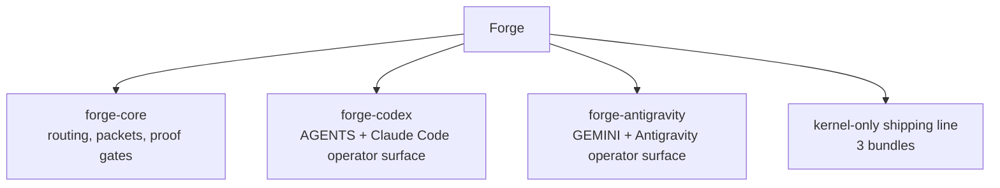
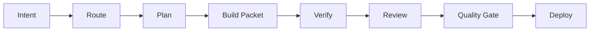

# Forge

> Evidence-first execution kernel for coding agents working in real repositories.

**Stable 5.4.0 · 1 core kernel · 2 host adapters · verification before claims**


Forge is a markdown-first execution kernel for AI coding agents. It gives agents a
shared operating contract for routing work, preserving task state, and proving
claims with fresh evidence before they report success.

This repository is the Forge source monorepo:

- `forge-core` owns routing, packetized execution, verification discipline,
  release-state thinking, and durable work artifacts.
- `forge-codex` adapts Forge to Claude Code / Codex-style `AGENTS.md` surfaces.
- `forge-antigravity` adapts Forge to Gemini Antigravity / `GEMINI.md` surfaces.

Current maintainer docs live under `docs/current/`. The active operating contract
is documented in `docs/current/target-state.md`. Historical plans, specs, audits,
and archived references before `2.15.0` are available from git history instead of
live docs.

If Forge improves your workflow, give the repo a star.

---

## Why Forge Exists

AI coding agents are fast. Speed alone does not make delivery reliable.

| What often happens                            | Real cost                                         |
| --------------------------------------------- | ------------------------------------------------- |
| The agent starts coding before scope is clear | Rework, drift, and hidden assumptions             |
| Session context lives only in chat            | The same intent must be reconstructed later       |
| Verification changes from task to task        | "Looks done" replaces proof                       |
| Host wrappers drift apart                     | The same workflow means different things per host |
| Runtime or browser proof sits off to the side | Confidence becomes theater instead of evidence    |

Forge closes those gaps without turning every small task into heavy ceremony.
Low-risk work can stay lightweight; risky work gets explicit state, checkpoints,
and proof.

---

## What Forge Provides

Forge gives coding agents one shared operating model:

1. route the task by intent and complexity;
2. keep medium and risky work in repo-visible artifacts;
3. preserve one packet contract across hosts;
4. verify before claims, not after the fact.



Forge is not a prompt wrapper. It is an evidence-first execution kernel for real
repos where the cost of being confidently wrong is high.

---

## What Makes Forge Different

### Full delivery lifecycle

Forge treats planning, build execution, review, release, and follow-up as one
connected system.



### Host-neutral core

- Core semantics live in `forge-core`.
- Host adapters change the UX surface, not the meaning of routing, packets,
  verification, or release gates.
- Generated `AGENTS.global.md` and `GEMINI.global.md` stay thin bootstrap files,
  not second orchestrators.

### Evidence before claims

- Verification is defined before edits on meaningful work.
- Packet and workflow-state artifacts survive beyond the current chat.
- Runtime and browser proof are bounded execution tools, not vanity add-ons.

### Context Persistence Contract

Forge separates execution state from optional continuity notes:

- Automatic state: workflow-state records stage, packet, gate, and execution
  transitions when Forge routing or execution tools write them. Resume may also
  seed workflow-state from an existing plan or spec when no canonical root
  exists yet.
- Save context: `forge-session-management` writes `.brain/session.json`, and
  writes `.brain/handover.md` only when handover is requested.
- Selective closeout: completion closeout writes lazily only when durable
  signals exist. It can write `.brain/session.json`, `.brain/handover.md`,
  `.brain/decisions.json`, or `.brain/learnings.json` depending on the supplied
  signals.
- Raw errors are not persisted as a first-class `.brain` record. Store recurring
  failure knowledge as a learning, blocker, risk, decision, or verification note
  instead of a raw error log.

### Lightweight when safe, structured when risky

- Low-risk slices can use fast lane while keeping proof-before-claims.
- Medium and large slices keep explicit packet state, merge readiness, and
  residual-risk reporting.
- Markdown-first workflow selection can escalate a nominally small task when repo
  evidence shows broader risk.
- Forge stays brownfield-safe instead of assuming a clean greenfield repo.

---

## Loose Agent Setup vs Forge

| Surface         | Loose agent setup              | Forge                                            |
| --------------- | ------------------------------ | ------------------------------------------------ |
| Planning        | Optional and usually chat-only | Routed through explicit workflow checkpoints     |
| Execution state | Buried in chat scrollback      | Persisted in packet and workflow-state artifacts |
| Verification    | Ad hoc and inconsistent        | Defined up front, rerun before claims            |
| Host behavior   | Wrapper-specific drift         | Shared core contract with adapter overlays       |
| Runtime proof   | Detached sidecar               | Bounded evidence path for execution decisions    |

---

## Current Status

- License: `MIT`
- Repo maturity: stable release available
- Current stable release: `5.4.0`
- Canonical verification gate: `python scripts/verify_repo.py`
- `forge-antigravity` is the most mature adapter for real rollout
- `forge-codex` ships in the current stable release after passing canonical
  release gates

Public-readiness notes live in `docs/release/public-readiness.md`.

---

## What Ships From This Repo

| Bundle              | Role                             | Default install target                           |
| ------------------- | -------------------------------- | ------------------------------------------------ |
| `forge-core`        | Host-agnostic execution kernel   | No default target                                |
| `forge-antigravity` | Antigravity host adapter         | `~/.gemini/antigravity/skills/forge-antigravity` |
| `forge-codex`       | Claude Code / Codex host adapter | `~/.codex/skills/forge-codex`                    |

The kernel-only release line keeps the shipped bundle table intentionally small.

---

## Quick Start

### Source workflow

Do not edit installed bundles directly. Make changes in this monorepo, verify
here, build release artifacts into `dist/`, then install from `dist/`.

```powershell
python scripts/verify_repo.py
python scripts/build_release.py
```

`verify_repo.py` covers:

- generated host artifact freshness;
- Python compile checks;
- repo secret scan;
- repo-level unit tests;
- bundle verification;
- release build;
- install dry-runs for shipped kernel and host adapter bundles;
- dist bundle verification.

### Start here as a solo operator

For a first-run repo where context is still weak:

1. Run `python scripts/verify_repo.py --profile fast` to confirm tooling health.
2. In the host session, start with `help` or `next` and let Forge route from repo
   state.
3. State one bounded slice and persist packet or workflow-state before wider
   edits.

For low-complexity work, use fast lane only when the slice is truly low-risk and
still keep proof-before-claims. For medium or high-risk work, use full packet mode
and rerun verification before claiming completion.

### Install on Claude Code / Codex

```powershell
python scripts/verify_repo.py
python scripts/build_release.py
python scripts/install_bundle.py forge-codex --activate-codex
```

`--activate-codex`:

- installs `forge-codex` into the default Claude Code / Codex skill path;
- rewrites `~/.codex/AGENTS.md` so Forge becomes the global orchestrator;
- retires legacy `awf-codex` runtime artifacts and matching legacy skills.

If Claude Code should reply in Vietnamese with full diacritics on Windows:

```powershell
python scripts/install_bundle.py forge-codex --activate-codex
python <installed forge-customize write-preferences owner command> --language vi --orthography vietnamese_diacritics --apply
powershell -ExecutionPolicy Bypass -File "$HOME/.codex/skills/forge-codex/scripts/enable_windows_utf8.ps1"
powershell -ExecutionPolicy Bypass -File "$HOME/.codex/skills/forge-codex/scripts/enable_windows_utf8.ps1" -Persist
```

### Install on Antigravity

```powershell
python scripts/verify_repo.py
python scripts/build_release.py
python scripts/install_bundle.py forge-antigravity --build
```

If you want Forge to rewrite the global Gemini entrypoint from the bundle
template:

```powershell
python scripts/install_bundle.py forge-antigravity --activate-gemini
```

### Install Forge Core explicitly

`forge-core` has no default host target, so install it only when you have a
specific runtime path in mind.

```powershell
python scripts/install_bundle.py forge-core --target C:\path\to\custom\runtime
```

### Safety notes

- Install commands snapshot existing targets by default under the target's
  runtime-managed Forge state root, typically `.../rollbacks/install/`.
- `--activate-codex` also backs up the existing Claude Code / Codex global
  entrypoint and retired legacy artifacts.
- `--activate-gemini` backs up the existing Gemini global entrypoint when present.
- Use `--backup-dir` when you want an explicit override outside the default
  runtime-managed backup root.
- Do not install inside the repo tree, including `packages/`, `dist/`, or the repo
  root.
- Use `--dry-run` before a risky rollout.

---

## Repo Layout

```text
forge/
|-- packages/
|   |-- forge-core/
|   |-- forge-antigravity/
|   `-- forge-codex/
|-- docs/
|   |-- architecture/
|   |-- archive/
|   |-- current/
|   `-- release/
|-- scripts/
|-- tests/
`-- dist/   # generated by build_release.py
```

---

## Operating Principles

- Process-first: understand the work before editing.
- Evidence before claims: verification is part of the contract, not optional
  polish.
- Brownfield-safe: optimize for real repos with real history.
- Host-neutral core: adapters shape UX, not semantics.
- Kernel-only shipping: keep the shipped bundle line small and explicit.

---

## Release Model

Release flow:

1. Edit source in the monorepo.
2. Run `python scripts/verify_repo.py`.
3. Build `dist/` with `python scripts/build_release.py`.
4. Install or publish from `dist/`.
5. Optionally run extra smoke checks for changed runtime surfaces when additional
   confidence is useful.

The detailed release contract lives in `docs/release/release-process.md`. The
detailed install contract lives in `docs/release/install.md`.

---

## Documentation Guide

Start here depending on intent:

- `docs/release/install.md` for install flags and target behavior
- `docs/release/release-process.md` for release discipline and promotion rules
- `docs/architecture/adapter-boundary.md` for the core-versus-adapter boundary
- `CONTRIBUTING.md` for source contribution workflow
- `SECURITY.md` for security reporting expectations

## Documentation Language Policy

- Public package docs, architecture docs, and adapter boundary docs should default
  to English.
- Maintainer-facing operational notes such as plans, release notes, and changelog
  entries may remain in Vietnamese.
- Keep each file internally consistent in one language instead of mixing English
  and Vietnamese within the same document.
