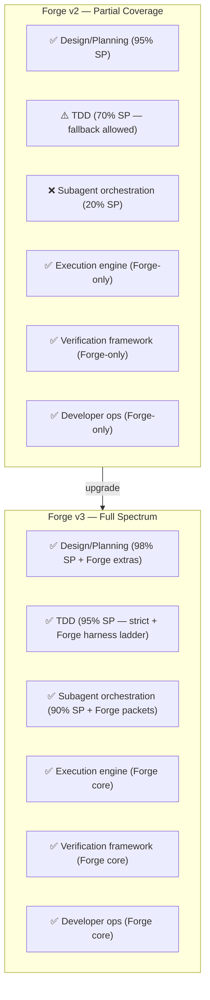

# Forge v3 Upgrade Plan: Full-Spectrum Build System

Status: implemented

## Completion Update

Completed on: 2026-04-21

Implementation status:
- Tier 1.1 DONE: strict TDD discipline, delete rule, RED/GREEN/REFACTOR, no-harness fallback, and generated host/overlay verification contract updates.
- Tier 1.2 DONE: packet-first subagent execution model and `implementer-subagent-quality` pipeline.
- Tier 1.3 DONE: subagent prompt templates for implementer, spec-reviewer, quality-reviewer, and final-reviewer.
- Tier 1.4 DONE: subagent status protocol for `DONE`, `DONE_WITH_CONCERNS`, `NEEDS_CONTEXT`, and `BLOCKED`.
- Tier 1.5 DONE: Final Implementation Review mode and quality-gate handoff.
- Tier 2.1 DONE: model/tier selection guidance using vendor-agnostic task complexity signals.
- Tier 2.2 DONE: branch resolution options in review and quality gate.
- Tier 2.3 DONE: multi-subsystem scope decomposition before approach generation.
- Tier 3.1 DONE: type, method signature, and property name consistency check in plan self-review.
- Tier 3.2 DONE: section-by-section approval for large designs, with independent sub-project planning allowed only after section approval and locked shared contracts.

Verification:
- `python -m pytest packages\forge-core\tests -q` -> `187 passed, 5 skipped`
- `python -m pytest packages\forge-codex\overlay\tests -q` -> `9 passed`
- `python -m pytest packages\forge-antigravity\overlay\tests -q` -> `12 passed`
- `python -m pytest tests -q` -> `89 passed`
- `python scripts\generate_overlay_skills.py --check` -> PASS
- `python scripts\generate_host_artifacts.py --check --format json` -> PASS
- Content contract grep -> PASS
- ASCII check for new reference/prompt files -> PASS
- `git diff --check` -> PASS

Final review findings resolved:
- Added canonical `references/subagent-prompts/final-reviewer-prompt.md` and reference-map entry.
- Clarified `brainstorm.md` so section-by-section approval does not block independently approved sub-projects.

## Vision

```
Forge v3 = SP's front-end thinking + subagent orchestrator
          + Forge's execution engine + verification framework + developer ops
```

Không phải "Forge wrapper cho SP". Forge **absorb** SP capabilities vào core engine, giữ registry-driven routing, execution packets, quality profiles, state machine, và operator surface.

---

## Current State → Target State



---

## 10 Gaps → 3 Tiers

### Tier 1: Core — Thay đổi build chain (5 items)

#### 1.1 TDD Absolute Enforcement ✅ DONE (Codex đã thực hiện trên main)

**Gap:** Forge cho phép fallback khi không có harness. SP yêu cầu xóa code nếu viết trước test.

**Đã hoàn thành:**
- ✅ Tạo `references/tdd-discipline.md` — full SP TDD discipline adapted cho Forge (94 dòng)
- ✅ `build.md` Iron Law: `NO BEHAVIORAL CHANGE WITHOUT A FAILING TEST FIRST` (line 25)
- ✅ `build.md` HARD-GATE: delete rule + "keep as reference" rejection (lines 37-38)
- ✅ `build.md` Verification Strategy: full RED → GREEN → REFACTOR cycle (lines 278-304)
- ✅ `build.md` Anti-Rationalization: mở rộng lên 11 entries (lines 337-349)
- ✅ `build.md` Execution Packet: thêm 8 TDD fields (harness stance, RED/GREEN proof, delete reset, etc.) (lines 113-122)
- ✅ `build.md` Fast Lane: thêm `red_proof_or_no_harness_reason`, `green_proof`, `delete_reset_state` (lines 154-156)
- ✅ `build.md` Process Flow: updated với RED → verify RED → GREEN → REFACTOR steps (lines 56-72)
- ✅ `test.md` Iron Law: `NO HARNESS-CAPABLE BEHAVIOR CHANGE WITHOUT VERIFIED RED FIRST` (line 20)
- ✅ `test.md` HARD-GATE: delete rule + "delete before restart" (lines 26-33)
- ✅ `test.md` Delete Rule section (lines 118-124)
- ✅ `test.md` Red Flags section (lines 247-256)
- ✅ `test.md` Reset Rules: 8 conditions (lines 257-269)
- ✅ `test.md` Test Packet: expanded with TDD fields (lines 149-168)
- ✅ `test.md` Anti-Rationalization: expanded lên 14 entries (lines 208-225)

**Files đã thay đổi:** `build.md` (457→507 dòng), `test.md` (257→311 dòng), new `references/tdd-discipline.md` (94 dòng)

#### 1.2 Subagent Execution Model DONE

**Gap:** Forge có `subagent-split` nhưng chỉ là 1 trong 3 isolation options, không có orchestration protocol.

**Solution:**
- Tạo `references/subagent-execution.md` — Forge-adapted subagent orchestration guide
- Update `build.md` Execution Pipeline: thêm `implementer-subagent-quality` pipeline
- Pipeline selection: khi host có subagent support → prefer subagent pipeline cho medium+
- Giữ `single-lane` và `implementer-quality` cho hosts không có subagent
- Subagent pipeline tích hợp với execution packet — mỗi subagent nhận packet, không phải raw task text

**Files changed:** `build.md`, new `references/subagent-execution.md`

#### 1.3 Subagent Prompt Templates DONE

**Gap:** SP có 3 prompt templates (implementer, spec-reviewer, code-quality-reviewer). Forge không có.

**Solution:**
- Tạo `references/subagent-prompts/implementer-prompt.md`
- Tạo `references/subagent-prompts/spec-reviewer-prompt.md`
- Tạo `references/subagent-prompts/quality-reviewer-prompt.md`
- Templates reference Forge execution packet thay vì raw task text
- Templates include TDD discipline, evidence response contract
- Templates vendor-agnostic (không hard-code model names)

**Files changed:** 3 new files in `references/subagent-prompts/`

**Implementation note:** completed with 4 prompt templates, including `final-reviewer-prompt.md`.

#### 1.4 Subagent Status Protocol DONE

**Gap:** SP có 4 statuses (DONE/DONE_WITH_CONCERNS/NEEDS_CONTEXT/BLOCKED) + handling logic. Forge chỉ có basic reopen/blocked.

**Solution:**
- Add to `references/subagent-execution.md`:
  - `DONE` → proceed to spec review
  - `DONE_WITH_CONCERNS` → read concerns, address if correctness/scope, note if observational
  - `NEEDS_CONTEXT` → provide context, re-dispatch
  - `BLOCKED` → assess: context problem → re-dispatch, reasoning problem → upgrade tier, too large → decompose, plan wrong → escalate to human
- Update `build.md` completion states to map subagent statuses

**Files changed:** `references/subagent-execution.md`, `build.md`

#### 1.5 Final Holistic Review DONE

**Gap:** SP dispatches a final code reviewer cho toàn bộ implementation sau khi all tasks done. Forge không có.

**Solution:**
- Update `review.md`: thêm "Final Implementation Review" mode
- Trigger: khi build chain complete medium+ work → dispatch holistic review trước quality-gate
- Reviewer nhận: tất cả changed files, execution packet history, spec, plan
- Output: findings → disposition → feed vào quality-gate
- Optional cho small work, recommended cho medium, required cho large
- Khi host có subagent → dispatch reviewer subagent. Không có → self-review with holistic checklist.

**Files changed:** `review.md`

---

### Tier 2: Enhancement — Thêm capabilities (3 items)

#### 2.1 Model Selection Tiers DONE

**Gap:** SP có vendor-specific model tiers. Forge có abstract tiers nhưng thiếu selection guidance.

**Solution:**
- Update `build.md` Lane Model: thêm task complexity signals → tier mapping
  - 1-2 files, complete spec → `cheap`
  - Multi-file, integration → `standard`
  - Design judgment, broad codebase → `capable`
- Giữ vendor-agnostic (không hard-code model names)

**Files changed:** `build.md`

#### 2.2 Finishing Branch Options DONE

**Gap:** SP có 4 structured options (Merge/PR/Keep/Discard). Forge has deploy workflow nhưng thiếu clean branch lifecycle cho non-deploy work.

**Solution:**
- Update `quality-gate.md` hoặc `review.md`: thêm "Branch Resolution" section
  - Option 1: Merge locally
  - Option 2: Push + PR
  - Option 3: Keep branch
  - Option 4: Discard (with confirmation)
- Tích hợp worktree cleanup logic

**Files changed:** `review.md` hoặc `quality-gate.md`

#### 2.3 Scope Decomposition DONE

**Gap:** SP explicitly flags multi-subsystem projects. Forge implicit.

**Solution:**
- Update `brainstorm.md`: thêm scope check trước approach generation
  - "If request describes multiple independent subsystems, flag and decompose before designing"
  - Each sub-project gets own spec → plan → build cycle

**Files changed:** `brainstorm.md`

---

### Tier 3: Polish (2 items)

#### 3.1 Type Consistency Check DONE

- Update `plan.md` self-review: thêm "Do types, method signatures, and property names match across tasks?"

**Files changed:** `plan.md`

#### 3.2 Section-by-Section Design Approval DONE

- Update `brainstorm.md`: thêm optional mode cho large designs
  - "Scale each section to its complexity. For large designs, approve section by section."

**Files changed:** `brainstorm.md`

---

## Architectural Principles

### Absorb, Don't Replace

```
SP capability → Forge reference doc / lens / pipeline option
NOT: SP skill → replaces Forge workflow
```

SP capabilities become Forge references that workflows can invoke. Forge's core engine (registry, packets, profiles, state machine, operator surface) stays intact.

### Host-Agnostic Subagent Support

```
Host has subagents → use subagent pipeline, dispatch per template
Host doesn't → use lane-based pipeline, sequential execution
Same quality bar regardless of host
```

### TDD with Escape Hatch

```
Default: SP-strict TDD (delete rule, absolute enforcement)
Escape: Only for genuinely no-harness work (config, docs, generated code)
Escape requires: explicit technical justification + human permission
```

---

## Impact Summary

| Area | Before (v2) | Current | After (v3) |
|---|---|---|---|
| Design | 95% SP | 95% SP | 98% SP + Forge extras |
| Planning | 95% SP | 95% SP | 98% SP + Forge extras |
| TDD | 70% SP | **95% SP ✅** | 95% SP + Forge harness ladder |
| Execution | 40% SP + 100% Forge | 40% SP + 100% Forge | 90% SP + 100% Forge |
| Review | 75% SP + 100% Forge | 75% SP + 100% Forge | 95% SP + 100% Forge |
| Verification | 60% SP + 100% Forge | 60% SP + 100% Forge | 80% SP + 100% Forge |
| Developer ops | 0% SP + 100% Forge | 0% SP + 100% Forge | 0% SP + 100% Forge |

## Files Changed Summary

| Tier | Modified | New |
|---|---|---|
| Tier 1 | `build.md`, `test.md`, `review.md` | `references/tdd-discipline.md`, `references/subagent-execution.md`, `references/subagent-prompts/` (3 files) |
| Tier 1 completion note | `quality-gate.md`, `brainstorm.md`, `plan.md`, generated overlays, contract tests | `references/subagent-prompts/final-reviewer-prompt.md` added; total new reference files is 6 |
| Tier 2 | `build.md`, `review.md` or `quality-gate.md`, `brainstorm.md` | — |
| Tier 3 | `plan.md`, `brainstorm.md` | — |
| **Total** | 6 workflows modified | 5 reference files created |
| **Implemented total** | 6 workflows modified plus generated overlays and contract tests | 6 reference files created |

## Execution Order

```
Tier 1.1 (TDD) → Tier 1.2-1.4 (Subagent) → Tier 1.5 (Final Review)
→ Tier 2 (Enhancements) → Tier 3 (Polish)
```

Tier 1 thay đổi build chain — cần verify routing + tests.
Tier 2-3 additive — không break existing chain.
