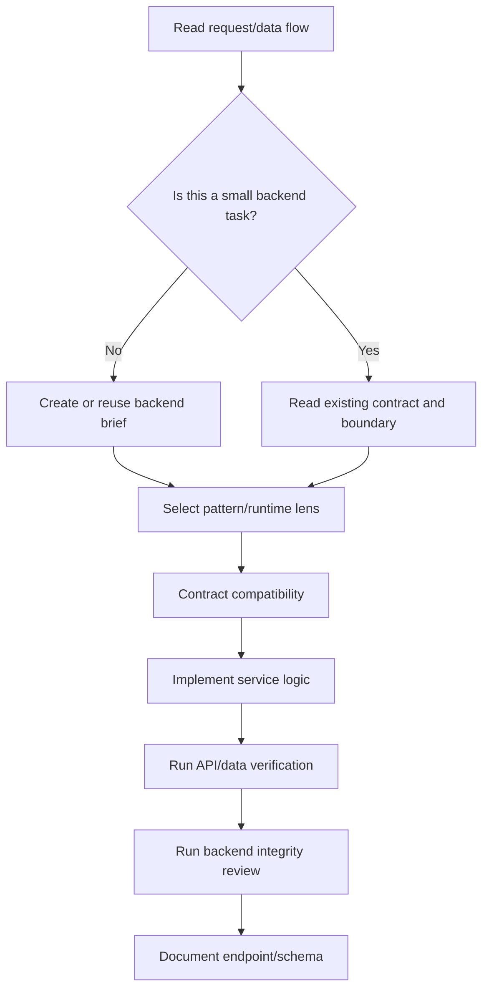

# Backend - Backend & Database Expertise

## The Iron Law

```
VALIDATE AT THE BOUNDARY, KEEP LOGIC OUT OF TRANSPORT
```

## First Artifact

```
NO MEDIUM/LARGE BACKEND CHANGE WITHOUT A BACKEND BRIEF.
```

Finalize the backend brief first:
- contract or surface in scope
- validation and authorization boundary
- data model / migration impact
- consistency / idempotency / retry / replay notes
- observability / ops notes
- caller / consumer compatibility

If there is no brief or the contract impact is still vague:

```powershell
python scripts/generate_backend_brief.py "Task summary" --pattern sync-api --runtime generic
```

If the task is long or touches multiple endpoints/jobs/events, add `--persist` and read `../references/backend-briefs.md`.
If you are using a persisted brief, validate it with:

```powershell
python scripts/check_backend_brief.py .forge-artifacts/backend-briefs/<project-slug> --surface <surface>
```

## Process



## Pattern Lens

Quick routing:
- `sync-api`: request/response contract, authz, status/error semantics
- `async-job`: retry, idempotency, partial failure, dead-letter/recovery
- `event-flow`: schema versioning, replay, dedup, producer/consumer blast radius
- `data-change`: migration safety, backfill, compatibility window

If the runtime is clear, choose the closest lens in the backend brief generator to force deeper thinking.

## Contract Conventions

### Transport
```
- Follow the protocols already present in the repo: REST, GraphQL, RPC, webhook, queue, event
- If the repo already has a style, preserve it instead of automatically applying the new transport standard
- Request/response/event contracts must be explicit, version-aware when necessary
```

### Success / Error Shape
```
- Success and error shapes must stay consistent with the service's existing conventions
- If the repo doesn't have a standard envelope yet, keep the output predictable and machine-readable
- Status codes / error codes / retry semantics must match the transport being used
- Breaking contract changes must have a clear compatibility note or migration window
```

## Backend Integrity Checklist

Before calling the backend change "done", check:

- The new contract does not break existing callers/consumers outside the locked scope
- Validation, authz, and error semantics are still at the correct boundary
- Migration/data change has compatibility paths or risks that are clearly noted
- Retry, replay, idempotency, or concurrency do not duplicate side effects
- Logging, metrics, traces, or audit signals are sufficient to investigate real failures
- Don't pull business logic backwards into the transport layer just because it's "faster"
- Do not create hidden coupling across services, workers, webhooks, and database steps
- If the surface is external or release-sensitive, hook to `secure` or `deploy` as needed

## Database Patterns

### Query Optimization
```
- EXPLAIN ANALYZE for slow queries
- Avoid N+1
- Use appropriate pagination
- Index for WHERE / JOIN / ORDER BY
```

### Transactions
```
- Collect related writes in a transaction or equivalent atomic unit
- If the path includes retries, webhooks, or jobs, make the idempotency stance explicit
- Don't leave side effects half-baked when the middle step fails
```

### Migrations
```
- Every schema change goes through migration
- Migration with rollback if possible
- Do not edit migrations that are already in production
- Prioritize expand-contract or compatibility window before destructive change
- If backfill is needed, specify lock/volume/blast-radius risk
```

## Consistency, Idempotency, and Async Safety

```
- Request retry, webhook replay, and job retry must have a clear stance: idempotent or not
- Transaction boundary must match side effects and recovery story
- Event/job flow must clearly state ordering, dedup, and partial failure handling
- Don't assume "at least once" or "exactly once" if you haven't said it
```

## Observability & Ops

```
- Logs have enough context to trace important requests/jobs/events
- Metrics or counters for important flows must have a place to stick when needed
- Error paths have signals that can be investigated, not just swallowed and returned generically
- If a migration or job has a blast radius, there must be a note about rollback, disable path, or isolation strategy
```

## Service Layer

```
validate input -> authorize if necessary -> business logic -> persistence -> map to contract transport
```

## Fast Anti-Patterns

Reject quickly if you see:
- Large business logic resides in the controller/handler
- contract changes but caller/consumer is not mentioned
- migration destruction without compatibility note
- webhook/job retry but no idempotency stance
- async flow has side effects but no recovery story
- "log error already" without signal to help investigate production

## Good / Bad Examples

### Handler bloat

Bad:

```ts
app.post("/orders", async (req, res) => {
  // validate, authorize, compute pricing, write DB, emit event, map response...
});
```

Good:

```ts
app.post("/orders", async (req, res) => {
  const command = validateCreateOrder(req);
  const result = await orderService.create(command, req.user);
  return res.status(201).json(mapOrderResult(result));
});
```

### Destructive migration

Bad:

```sql
ALTER TABLE orders DROP COLUMN legacy_status;
```

Good:

```sql
ALTER TABLE orders ADD COLUMN status_v2 text;
-- backfill + callers migrate first, then remove old column later
```

### Retry without idempotency

Bad:

```py
def handle_webhook(payload):
    create_invoice(payload)
```

Good:

```py
def handle_webhook(payload):
    if already_processed(payload["id"]):
        return
    create_invoice(payload)
```

### Missing observability

Bad:

```go
if err != nil { return err }
```

Good:

```go
if err != nil {
    logger.Error("reconcile payout failed", "payout_id", payoutID, "attempt", attempt, "err", err)
    return err
}
```

## Companion Runtime Skill Hook

- Detect runtime from real artifact: `package.json`, `pyproject.toml`, `requirements.txt`, `go.mod`, `pom.xml`, `build.gradle`, `*.csproj`, `*.sln`
- If there is a suitable companion skill for the runtime/framework, you can load it to get the idiom code, framework structure, dependency conventions, and specific command stack.
- If you don't have any companion skills, the Forge backend should still be enough to maintain contract clarity, migration safety, idempotency, and verification discipline.
- Forge backend retains the same general principles: boundary validation, contract clarity, transaction safety, migration discipline, and API/data verification
- Contract details: see `../references/companion-skill-contract.md`

## Verification Checklist

- [ ] Backend brief already exists or confirmed the current brief is still correct
- [ ] If a persisted brief is used, `check_backend_brief.py` does not fail
- [ ] Input is validated at boundary
- [ ] Business logic is not all in the handler/controller
- [ ] Transaction / idempotency stance is correct for related writes or retries
- [ ] Contract / schema / caller / consumer has been updated
- [ ] Observability or ops note is enough for a flow with blast radius
- [ ] API/data checks run
- [ ] Backend integrity checklist has no obvious regressions

## Output

```
Backend reports:
- Brief: [new/reused + path if available]
- Contract/schema changed: [...]
- Pattern/runtime lens: [...]
- Services touched: [...]
- Verified: [tests/checks]
- Migration/data risk: [...]
```

## Activation Announcement

```
Forge: backend | Close the contract and validation at the boundary first
```

## Response Footer

When this skill is used to complete a task, record its exact skill name in the global final line:

`Skills used: backend`

When multiple Forge skills are used, list each used skill exactly once in the shared `Skills used:` line. When no Forge skill is used for the response, use `Skills used: none`. Keep that `Skills used:` line as the final non-empty line of the response and do not add anything after it.