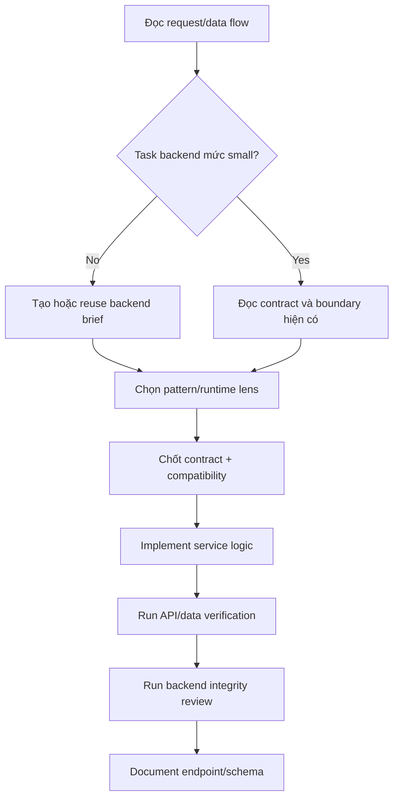

# Backend - Backend & Database Expertise

## The Iron Law

```
VALIDATE AT THE BOUNDARY, KEEP LOGIC OUT OF TRANSPORT
```

## First Artifact

```
NO MEDIUM/LARGE BACKEND CHANGE WITHOUT A BACKEND BRIEF.
```

Backend brief phải chốt trước:
- contract hoặc surface in scope
- validation và authorization boundary
- data model / migration impact
- consistency / idempotency / retry / replay notes
- observability / ops notes
- caller / consumer compatibility

Nếu chưa có brief hoặc contract impact còn mơ hồ:

```powershell
python scripts/generate_backend_brief.py "Task summary" --pattern sync-api --runtime generic
```

Nếu task kéo dài hoặc chạm nhiều endpoint/job/event, thêm `--persist` và đọc `../references/backend-briefs.md`.
Nếu dùng persisted brief, validate nhanh bằng:

```powershell
python scripts/check_backend_brief.py .forge-artifacts/backend-briefs/<project-slug> --surface <surface>
```

## Process



## Pattern Lens

Quick routing:
- `sync-api`: request/response contract, authz, status/error semantics
- `async-job`: retry, idempotency, partial failure, dead-letter/recovery
- `event-flow`: schema versioning, replay, dedup, producer/consumer blast radius
- `data-change`: migration safety, backfill, compatibility window

Nếu runtime đã rõ, chọn lens gần nhất trong backend brief generator để ép thinking sâu hơn.

## Contract Conventions

### Transport
```
- Theo protocol sẵn có của repo: REST, GraphQL, RPC, webhook, queue, event
- Nếu repo đã có style, preserve thay vì tự áp chuẩn transport mới
- Request/response/event contract phải explicit, version-aware khi cần
```

### Success / Error Shape
```
- Success và error shape phải nhất quán theo convention hiện có của service
- Nếu repo chưa có envelope chuẩn, giữ output predictable và machine-readable
- Status codes / error codes / retry semantics phải đúng với transport đang dùng
- Breaking contract change phải có compatibility note hoặc migration window rõ
```

## Backend Integrity Checklist

Trước khi gọi backend change là "xong", kiểm tra:

- Contract mới không vô tình phá caller/consumer cũ ngoài scope đã chốt
- Validation, authz, và error semantics vẫn nằm ở boundary đúng
- Migration/data change có compatibility path hoặc rủi ro đã được note rõ
- Retry, replay, idempotency, hoặc concurrency không làm side effect nhân đôi
- Logging, metrics, trace, hoặc audit signal đủ để điều tra sự cố thật
- Không kéo business logic ngược vào transport layer chỉ vì "nhanh hơn"
- Không tạo hidden coupling giữa service, worker, webhook, và DB step
- Nếu surface là external hoặc release-sensitive, đã hook sang `secure` hoặc `deploy` khi cần

## Database Patterns

### Query Optimization
```
- EXPLAIN ANALYZE cho query chậm
- Tránh N+1
- Dùng pagination phù hợp
- Index cho WHERE / JOIN / ORDER BY
```

### Transactions
```
- Gom related writes trong một transaction hoặc đơn vị atom tương đương
- Path có retry/webhook/job nên xem idempotency
- Không để side effect nửa vời khi step giữa fail
```

### Migrations
```
- Mọi schema change đi qua migration
- Migration có rollback nếu có thể
- Không sửa migration đã lên production
- Ưu tiên expand-contract hoặc compatibility window trước destructive change
- Nếu cần backfill, nêu rõ lock/volume/blast-radius risk
```

## Consistency, Idempotency, and Async Safety

```
- Request retry, webhook replay, và job retry phải có stance rõ: idempotent hay không
- Transaction boundary phải khớp với side effects và recovery story
- Event/job flow phải nói rõ ordering, dedup, và partial failure handling
- Không assume "at least once" hay "exactly once" nếu chưa nói ra
```

## Observability & Ops

```
- Log có context đủ để trace request/job/event quan trọng
- Metrics hoặc counters cho flow quan trọng phải có nơi bám khi cần
- Error path có signal điều tra được, không chỉ swallow rồi trả generic
- Nếu migration hoặc job có blast radius, phải có note về rollback, disable path, hoặc isolation strategy
```

## Service Layer

```
validate input -> authorize nếu cần -> business logic -> persistence -> map sang contract transport
```

## Fast Anti-Patterns

Reject nhanh nếu thấy:
- business logic lớn nằm nguyên trong controller/handler
- contract đổi nhưng caller/consumer không được nhắc tới
- migration destructive mà không có compatibility note
- webhook/job retry nhưng không có idempotency stance
- async flow có side effects nhưng không có recovery story
- "log error rồi thôi" mà không có signal giúp điều tra production

## Good / Bad Examples

### Handler bloat

Bad:

```ts
app.post("/orders", async (req, res) => {
  // validate, authorize, compute pricing, write DB, emit event, map response...
});
```

Good:

```ts
app.post("/orders", async (req, res) => {
  const command = validateCreateOrder(req);
  const result = await orderService.create(command, req.user);
  return res.status(201).json(mapOrderResult(result));
});
```

### Destructive migration

Bad:

```sql
ALTER TABLE orders DROP COLUMN legacy_status;
```

Good:

```sql
ALTER TABLE orders ADD COLUMN status_v2 text;
-- backfill + callers migrate first, then remove old column later
```

### Retry without idempotency

Bad:

```py
def handle_webhook(payload):
    create_invoice(payload)
```

Good:

```py
def handle_webhook(payload):
    if already_processed(payload["id"]):
        return
    create_invoice(payload)
```

### Missing observability

Bad:

```go
if err != nil { return err }
```

Good:

```go
if err != nil {
    logger.Error("reconcile payout failed", "payout_id", payoutID, "attempt", attempt, "err", err)
    return err
}
```

## Companion Runtime Skill Hook

- Detect runtime từ artifact thật: `package.json`, `pyproject.toml`, `requirements.txt`, `go.mod`, `pom.xml`, `build.gradle`, `*.csproj`, `*.sln`
- Nếu có companion skill phù hợp cho runtime/framework, có thể load nó để lấy idiom code, framework structure, dependency conventions, và command đặc thù stack
- Nếu chưa có companion skill nào, Forge backend vẫn phải đủ để giữ contract clarity, migration safety, idempotency, và verification discipline
- Forge backend vẫn giữ các nguyên tắc chung: boundary validation, contract clarity, transaction safety, migration discipline, và API/data verification
- Contract chi tiết: xem `../references/companion-skill-contract.md`

## Verification Checklist

- [ ] Backend brief đã có hoặc đã xác nhận brief hiện tại vẫn đúng
- [ ] Nếu dùng persisted brief, `check_backend_brief.py` không fail
- [ ] Input được validate ở boundary
- [ ] Business logic không nằm hết trong handler/controller
- [ ] Transaction / idempotency stance đúng cho related writes hoặc retries
- [ ] Contract / schema / caller / consumer đã được update
- [ ] Observability hoặc ops note đủ cho flow có blast radius
- [ ] API/data checks đã chạy
- [ ] Backend integrity checklist không có regression rõ ràng

## Output

```
Backend report:
- Brief: [new/reused + path nếu có]
- Contract/schema changed: [...]
- Pattern/runtime lens: [...]
- Services touched: [...]
- Verified: [tests/checks]
- Migration/data risk: [...]
```

## Activation Announcement

```
Forge: backend | chốt contract và validation ở boundary trước
```
