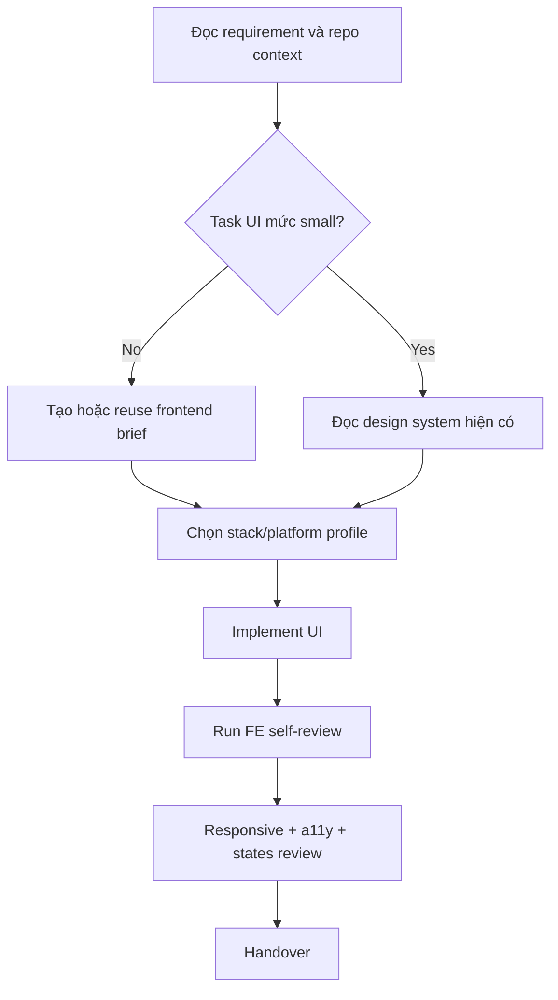

# Frontend - Frontend Expertise

## The Iron Law

```
PRESERVE THE EXISTING DESIGN SYSTEM BEFORE INVENTING A NEW ONE
```

## First Artifact

```
NO MEDIUM/LARGE FRONTEND CHANGE WITHOUT A FRONTEND BRIEF.
```

Frontend brief phải chốt trước:
- visual direction
- screens/components in scope
- states: default/loading/empty/error
- responsive/platform lens
- accessibility boundary
- stack-specific watchouts

Nếu chưa có brief hoặc visual direction còn mơ hồ:

```powershell
python scripts/generate_ui_brief.py "Task summary" --mode frontend --stack generic-web --platform web
```

Nếu task kéo dài nhiều bước hoặc nhiều màn hình, thêm `--persist` và đọc `../references/ui-briefs.md`.
Nếu dùng persisted brief, validate nhanh bằng:

```powershell
python scripts/check_ui_brief.py .forge-artifacts/ui-briefs/<project-slug>/frontend --mode frontend --screen <screen>
```

Nếu task UI kéo dài, nhiều màn hình, hoặc cần handoff qua nhiều bước:

```powershell
python scripts/track_ui_progress.py "Task summary" --mode frontend --stage implementation --status active
```

## Process



## Stack Lens

Đừng dùng guideline chung chung nếu stack đã rõ. Chọn profile gần nhất trong `../references/frontend-stack-profiles.md`.

Quick routing:
- `generic-web`: stack chưa rõ hoặc chỉ đang reasoning
- `html-tailwind`: utility-first UI
- `react-vite`: component/state-heavy frontend
- `nextjs`: server/client boundary matters
- `mobile-webview`: Capacitor/webview/tablet POS style UI

Nếu cần mở visual range rộng hơn thay vì chỉ implementation guidance, xem `../references/ui-escalation.md` và cân nhắc load thêm `$ui-ux-pro-max`.
Examples nhanh để tránh anti-patterns: `../references/ui-good-bad-examples.md`
Heuristics cho touch/dense-data/dashboard UI: `../references/ui-heuristics.md`

## Core Rules

### Design System & Tokens
```
- Giữ token, spacing scale, và typography system có sẵn nếu project đã có
- Nếu phải mở visual direction mới, brief phải nói rõ vì sao
- Ưu tiên design tokens / CSS vars hơn ad-hoc values
- Không hardcode màu lung tung nếu lẽ ra nên thành token
```

### Component & State Design
```
- Chốt state model trước khi polish UI
- Mọi screen/component vừa/lớn phải nghĩ rõ loading/empty/error
- Không để interaction quan trọng chỉ tồn tại ở happy path
- Layout và state ownership phải nhất quán với stack đang dùng
```

### Interaction Quality
```
- Clickable surfaces phải có affordance rõ
- Hover/focus không gây layout shift
- Không phụ thuộc hover cho hành vi cốt lõi trên touch-heavy surfaces
- Không dùng emoji làm UI icons
```

### Motion & Responsive
```
- Animate chủ yếu bằng `transform` và `opacity`
- Tránh `transition: all`
- Mobile-first hoặc touch-first nếu product cần
- Breakpoints cần xem tối thiểu: 375, 768, 1024, 1440 nếu là web app
- Touch targets >= 44px cho UI chạm
```

### Accessibility
```
- Contrast >= 4.5:1 cho body text
- Focus state rõ ràng
- Keyboard navigable nếu có interactive UI
- Accessible names / labels đúng cho element cần thiết
- Tôn trọng reduced-motion khi có animation
```

## Fast Anti-Patterns

Reject nhanh nếu thấy:
- scale hover làm card hoặc list nhảy layout
- border quá mờ hoặc surface quá trong ở light mode
- text màu xám quá nhạt nên hierarchy bị mất
- fixed/sticky UI che mất content thật
- visual polish có nhưng thiếu empty/loading/error states

Checklist chi tiết: `../references/ui-quality-checklist.md`
Examples cụ thể: `../references/ui-good-bad-examples.md`

## Frontend Integrity Checklist

Trước khi gọi UI là "xong", kiểm tra các điểm giữ integrity của bề mặt hiện có:

- Không làm vỡ design tokens, spacing scale, hoặc typography hierarchy ngoài phạm vi chủ đích
- Không làm regress state quan trọng: loading, empty, error, disabled, success
- Không phá keyboard/focus order hoặc semantic structure của surface đã chạm
- Không tạo visual drift ngoài scope: màu, shadow, radius, spacing chỉ đổi ở nơi đã chủ đích
- Không để responsive behavior mới che content, tạo overflow lạ, hoặc làm sticky/fixed UI cản thao tác
- Không làm touch target, hit area, hoặc affordance tệ hơn bản cũ
- Không làm interaction model mâu thuẫn với pattern sẵn có của product
- Không bỏ quên copy, icon, empty-state tone, hoặc hierarchy đã là một phần của UX contract

Nếu có thay đổi lớn về interaction model hoặc visual language, brief phải nói rõ đây là intentional break, không phải side effect.

## Good / Bad Examples

### Hover stability

Bad:

```css
.card:hover { transform: scale(1.04); }
```

Good:

```css
.card:hover,
.card:focus-within {
  border-color: var(--color-border-strong);
  box-shadow: 0 8px 24px rgb(0 0 0 / 0.08);
}
```

### State coverage

Bad:

```tsx
return <OrderList orders={orders} />;
```

Good:

```tsx
if (isLoading) return <OrdersSkeleton />;
if (error) return <InlineError message="Load failed" />;
if (orders.length === 0) return <EmptyState title="No orders yet" />;
return <OrderList orders={orders} />;
```

### Touch targets

Bad:

```tsx
<button className="h-8 px-2">Pay</button>
```

Good:

```tsx
<button className="min-h-[44px] px-4 font-medium">Pay</button>
```

## Long-Task Progress

Khi task UI không còn là one-shot edit, track stage bằng `../references/ui-progress.md`.

## FE Self-Review Checklist

- [ ] Frontend brief đã có hoặc đã xác nhận brief hiện tại vẫn đúng
- [ ] Nếu dùng persisted brief, `check_ui_brief.py` không fail
- [ ] Nếu task dài, progress artifact đã được update
- [ ] Preserve design system hoặc nêu rõ visual direction mới
- [ ] Chọn stack profile phù hợp nếu stack đã rõ
- [ ] States: default/loading/empty/error đã được nghĩ rõ
- [ ] Responsive ở các breakpoints hoặc platform cần thiết
- [ ] Focus, contrast, reduced-motion, touch targets đã được xem
- [ ] Dense-data / dashboard / touch-heavy heuristics đã được xem nếu task thuộc loại đó
- [ ] Frontend integrity checklist không có regression rõ ràng
- [ ] Không có anti-pattern rõ ràng trong `ui-quality-checklist.md`

## Handover

```text
Frontend report:
- Brief: [new/reused + path nếu có]
- Progress: [path nếu có]
- Visual direction: [...]
- Stack/profile lens: [...]
- Screens/components touched: [...]
- Verified: [responsive/a11y/manual checks]
- Known gaps: [...]
```

## Activation Announcement

```text
Forge Antigravity: frontend | tạo/reuse frontend brief trước, rồi mới implement UI
```
