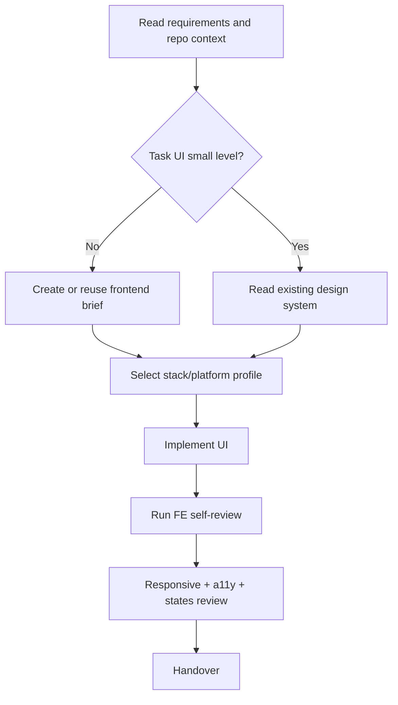

# Frontend - Frontend Expertise

## The Iron Law

```
PRESERVE THE EXISTING DESIGN SYSTEM BEFORE INVENTING A NEW ONE
```

## First Artifact

```
NO MEDIUM/LARGE FRONTEND CHANGE WITHOUT A FRONTEND BRIEF.
```

Frontend brief must be finalized first:
- visual direction
- screens/components in scope
- states: default/loading/empty/error
- responsive/platform lens
- accessibility boundary
- stack-specific watchouts

If there is no brief or the visual direction is still vague:

```powershell
python scripts/generate_ui_brief.py "Task summary" --mode frontend --stack generic-web --platform web
```

If the task spans multiple steps or screens, add `--persist` and read `../references/ui-briefs.md`.
If using persisted brief, validate as quickly as:

```powershell
python scripts/check_ui_brief.py .forge-artifacts/ui-briefs/<project-slug>/frontend --mode frontend --screen <screen>
```

If the UI task is long, has multiple screens, or needs handoff through multiple steps:

```powershell
python scripts/track_ui_progress.py "Task summary" --mode frontend --stage implementation --status active
```

## Process



## Stack Lens

Don't use general guidelines if the stack is clear. Select the closest profile in `../references/frontend-stack-profiles.md`.

Quick routing:
- `generic-web`: stack is unclear or just reasoning
- `html-tailwind`: utility-first UI
- `react-vite`: component/state-heavy frontend
- `nextjs`: server/client boundary matters
- `mobile-webview`: Capacitor/webview/tablet POS style UI

If you need a wider visual range than just implementation guidance, see `../references/ui-escalation.md` and consider loading `$ui-ux-pro-max`.
Quick examples to avoid anti-patterns: `../references/ui-good-bad-examples.md`
Heuristics for touch/dense-data/dashboard UI: `../references/ui-heuristics.md`

## Core Rules

### Design System & Tokens
```
- Keep the token, spacing scale, and typography system available if the project already has one
- If a new visual direction must be opened, the brief must clearly state why
- Prioritize design tokens / CSS vars over ad-hoc values
- Don't hardcode random colors if they should be tokens
```

### Component & State Design
```
- Finalize the state model before polishing the UI
- Every medium/large screen/component must think clearly about loading/empty/error
- Don't let important interactions exist only in the happy path
- Layout and state ownership must be consistent with the stack in use
- For solo-dev release-sensitive UI, the tail should be `FE self-review -> review-pack -> quality-gate`, not memory or chat recollection
```

### Interaction Quality
```
- Clickable surfaces must have clear affordances
- Hover/focus does not cause layout shift
- Doesn't rely on hover for core behavior on touch-heavy surfaces
- Do not use emojis as UI icons
```

### Motion & Responsive
```
- Animate mainly with `transform` and `opacity`
- Avoid `transition: all`
- Mobile-first or touch-first if the product needs it
- Breakpoints to see at least: 375, 768, 1024, 1440 if web app
- Touch targets >= 44px for touch UI
```

### Accessibility
```
- Contrast >= 4.5:1 for body text
- Focus state is clear
- Keyboard navigable if interactive UI is present
- Accessible names / labels are correct for the required element
- Respect reduced-motion when there is animation
```

## Fast Anti-Patterns

Reject quickly if you see:
- scale hover makes card or list jump layout
- Borders are too faint or surfaces disappear in light mode
- The gray text is too light so the hierarchy is lost
- fixed/sticky UI hides real content
- visual polish has it but is missing empty/loading/error states

Detailed checklist: `../references/ui-quality-checklist.md`
Specific examples: `../references/ui-good-bad-examples.md`

## Frontend Integrity Checklist

Before calling the UI "done", check the integrity points of the existing surface:

- Do not disrupt design tokens, spacing scale, or typography hierarchy beyond the intended scope
- Do not regress important states: loading, empty, error, disabled, success
- Does not destroy the keyboard/focus order or semantic structure of the touched surface
- Do not create visual drift outside the scope: color, shadow, radius, spacing only change in the intended place
- Don't let the new responsive behavior cover content, create strange overflows, or make sticky/fixed UI prevent operations
- Does not make touch target, hit area, or affordance worse than the old version
- Do not make the interaction model conflict with the product's existing pattern
- Don't forget the copy, icon, empty-state tone, or hierarchy that are part of the UX contract

If there is a major change to the interaction model or visual language, the brief must clearly state that this is an intentional break, not a side effect.

## Good / Bad Examples

### Hover stability

Bad:

```css
.card:hover { transform: scale(1.04); }
```

Good:

```css
.card:hover,
.card:focus-within {
  border-color: var(--color-border-strong);
  box-shadow: 0 8px 24px rgb(0 0 0 / 0.08);
}
```

### State coverage

Bad:

```tsx
return <OrderList orders={orders} />;
```

Good:

```tsx
if (isLoading) return <OrdersSkeleton />;
if (error) return <InlineError message="Load failed" />;
if (orders.length === 0) return <EmptyState title="No orders yet" />;
return <OrderList orders={orders} />;
```

### Touch targets

Bad:

```tsx
<button className="h-8 px-2">Pay</button>
```

Good:

```tsx
<button className="min-h-[44px] px-4 font-medium">Pay</button>
```

## Long-Task Progress

When the UI task is no longer a one-shot edit, track stage with `../references/ui-progress.md`.

## FE Self-Review Checklist

- [ ] Frontend brief already exists or has confirmed that the current brief is still correct
- [ ] If a persisted brief is used, `check_ui_brief.py` does not fail
- [ ] If the task is long, the progress artifact has been updated
- [ ] Preserve design system or state new visual direction
- [ ] Select the appropriate stack profile if the stack is clear
- [ ] States: default/loading/empty/error has been clearly thought out
- [ ] Responsive at necessary breakpoints or platforms
- [ ] Focus, contrast, reduced-motion, touch targets have been viewed
- [ ] Dense-data / dashboard / touch-heavy heuristics were seen if the task was of that type
- [ ] Frontend integrity checklist has no obvious regressions
- [ ] There is no explicit anti-pattern in `ui-quality-checklist.md`
- [ ] If the surface is release-sensitive, the review-pack tail has been considered before handoff

## Handover

```text
Frontend reports:
- Brief: [new/reused + path if available]
- Progress: [path if available]
- Visual direction: [...]
- Stack/profile lens: [...]
- Screens/components touched: [...]
- Verified: [responsive/a11y/manual checks]
- Known gaps: [...]
```

## Activation Announcement

```text
Forge: frontend | create/reuse the frontend brief first, then implement the UI
```

## Response Footer

When this skill is used to complete a task, include this exact English line in a footer block at the end of the response:

`Used skill: frontend.`

Keep that footer block as the last block of the response. If multiple skills are used, include one exact `Used skill:` line per unique skill and do not add anything after the footer block.