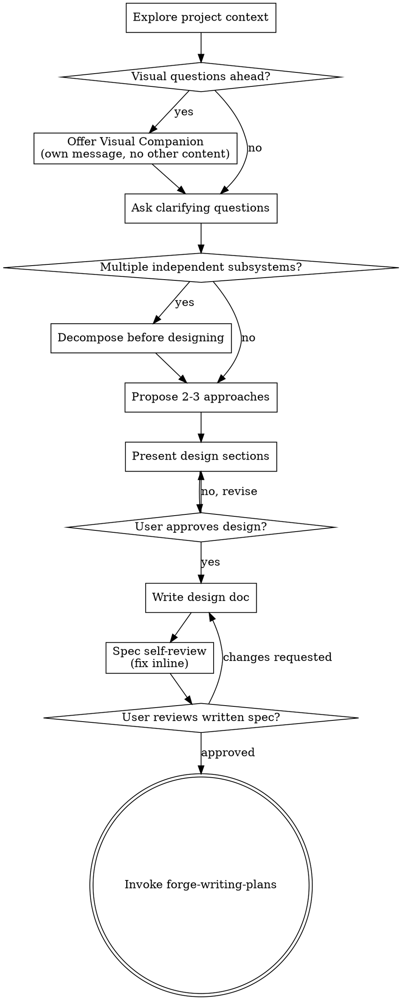

# Forge Brainstorming

<EXTREMELY-IMPORTANT>
**REQUIRED GATE:** Use this before answering, asking clarifying questions, exploring files, or implementing when the task matches the trigger.

```text
NO IMPLEMENTATION BEFORE APPROVED DESIGN
```

**Questions are tasks. Exploration is work.** Do not skip this because the request seems "small" if behavior, UX, workflow, data flow, public contract, or visual direction may change.

**DO NOT INVOKE IMPLEMENTATION SKILLS** until a design has been presented and approved.
</EXTREMELY-IMPORTANT>

## Use When

- New feature, behavior change, UX change, visual design, architecture shape, workflow change, or public contract change.
- The user asks to explore options, compare approaches, improve behavior, or decide direction.
- A prompt opens multiple independent subsystems; decompose before designing.
- Visual work is involved; offer Visual Companion before detailed visual preference questions when useful.
- Existing code structure may need targeted reshaping to support the requested behavior cleanly.

## Do Not Use When

- Pure typo, formatting, rename, dependency bump, generated artifact, or other mechanical-only work.
- An approved design and implementation plan already exist and the user only wants execution.
- The request is a bug or regression investigation; use `forge-systematic-debugging` first.

## Process Flow



## The Process

### 1. Explore Project Context

- Inspect only the context needed to understand current behavior, constraints, and existing patterns.
- Check relevant files, docs, recent changes, and architectural boundaries before proposing a direction.
- Decide early whether this is one coherent problem or several. If there are multiple independent subsystems, decompose before designing.

### 2. Offer Visual Companion

- **REQUIRED:** If layout, spacing, interaction, screenshots, animation, information hierarchy, or rendered browser state will matter, offer Visual Companion in its own message before detailed visual questions.
- Use browser or screenshot evidence for rendered behavior.
- Use terminal and file inspection for implementation details, contracts, and non-visual constraints.
- If the user declines the visual path, continue normally without forcing it.

## Visual Companion

Use it when the answer depends on what the user will see, click, compare, or feel in the UI. Do not use it for purely structural questions that are fully answered by code and specs.

Offer shape:

> Some of what we're working on might be easier to explain if I can show it in a browser. I can put together mockups, diagrams, comparisons, and other visuals as we go. Want to try it? This requires opening a local URL.

**REQUIRED:** This offer MUST be its own message. Do not combine it with clarifying questions, context summaries, tradeoff lists, or any other content.

After the user accepts, still decide per question whether the browser helps. The test is: would the user understand this better by seeing it than reading it?

- Use the browser for content that is visual: mockups, wireframes, layout comparisons, architecture diagrams, state machines, side-by-side visual options, or browser-rendered behavior.
- Use the terminal for content that is textual: requirements questions, conceptual choices, tradeoff lists, scope decisions, implementation constraints, or non-visual architecture discussion.
- A UI topic is not automatically a visual question. "What does personality mean in this context?" stays in the terminal. "Which wizard layout reads better?" belongs in the browser.

If the user accepts the companion, read `references/design/visual-companion-guidance.md` before proceeding.

## Architectural Lens

When the design risk is about boundaries rather than visuals, use the architectural lens inside brainstorming.

- Reach for it when system shape, data ownership, compatibility, migration, auth, payment, state sync, or public interface boundaries may change.
- The goal is to make the boundary explicit before planning, not to create a separate architecture workflow.
- If the boundary is ambiguous, keep working inside brainstorming and read `references/design/architectural-lens.md`.

### 3. Ask Clarifying Questions

- **Ask one blocking question at a time.**
- Keep the interaction one question at a time when clarification is needed.
- Focus on purpose, constraints, success criteria, non-goals, and reversal cost.
- If the user says to decide, state a controlled assumption instead of pretending nothing is ambiguous.
- Questions are tasks, so do not ask them before deciding whether brainstorming applies.

### 4. Propose Approaches

- Compare 2-3 real approaches when meaningful alternatives exist.
- Lead with the recommended option and name the accepted tradeoff.
- If the request touches multiple independent subsystems, propose decomposition before detailed architecture.

### 5. Present Design

- Present the design in sections scaled to the task.
- Use section-by-section approval for medium or large work.
- Cover architecture, components, data flow, error handling, boundary conditions, testing, and proof plan.
- **STOP** if a section is uncertain instead of smuggling ambiguity into implementation.

### 6. Design For Isolation And Clarity

- Break the system into smaller units with one clear purpose and well-defined interfaces.
- For each unit, answer: what does it do, how is it used, and what does it depend on?
- Prefer boundaries that let one unit change internally without breaking consumers.
- Smaller, well-bounded units are easier to reason about, test, review, and modify safely.
- When a file or concept is already overloaded, include targeted simplification in the design instead of piling new behavior onto a confused boundary.

### 7. Working In Existing Codebases

- Explore the current structure before proposing changes. Follow existing patterns unless they directly block the goal.
- If existing code has problems that materially affect the work, include targeted improvement as part of the design.
- Do not propose unrelated refactoring. Improve only what the current goal needs.
- When the repo already has a style for naming, state ownership, data flow, or layering, preserve it unless the design explicitly changes that contract.

### 8. Write The Design Doc

Write the validated design to:

```text
docs/specs/YYYY-MM-DD-<topic>-design.md
```

The doc should be specific enough that `forge-writing-plans` can turn it into an executable implementation plan without re-inventing architecture.

### 9. Spec Self-Review

Before asking the user to approve the written spec, review it inline for placeholders, contradictions, ambiguity, and hidden scope.

After the self-review passes, request user review of the written spec before handoff to planning.

## Required Design Doc Sections

- Problem
- Context
- Goals and non-goals
- Approaches considered
- Recommended design
- Detailed design
- Proof plan
- Open questions

## Spec Self-Review Checklist

- Placeholder scan: remove `TBD`, `TODO`, vague stubs, and empty sections.
- Internal consistency: architecture, interface names, and behavior statements do not contradict each other.
- Scope check: the design is focused enough for a single implementation plan, or decomposition is explicit.
- Ambiguity check: if a requirement could be read two ways, choose one and make it explicit.
- Risk check: security, migration, auth, payment, compatibility, and data boundary concerns are named instead of hidden.

## Flat Readiness Checkpoint

Brainstorm must make behavioral build work safe enough for planning. Before handoff, confirm:

- The accepted tradeoff is explicit.
- Assumptions that would change scope are named.
- Security, migration, auth, payment, public-interface, or compatibility boundaries are not hidden.
- The first proof can expose the main failure mode.
- The reversal signal says when to reopen design instead of pushing uncertainty into build.
- The plan-readiness handoff states scope assumptions, boundary assumptions, and proof expectations.

## Red Flags

| Rationalization | Reality |
| --- | --- |
| "I can ask one quick question first." | Questions are tasks; check the bootstrap and this skill first. |
| "The implementation is obvious." | Obvious behavior changes still need direction locked. |
| "Small visual polish does not need design." | Visual and UX work defaults here unless purely mechanical. |
| "We can decompose during build." | Multiple independent subsystems decompose before designing. |
| "We can preserve the current tangled file and just add one more branch." | Design should improve isolation when the boundary is already overloaded. |
| "Existing code is messy, so new work can ignore its patterns." | Working in existing codebases means following patterns or explicitly changing them. |
| "The spec can stay vague because the details will emerge while coding." | Vague specs create rework and false progress. |

## Integration

- Called by: the Forge bootstrap for new features, behavior changes, visual work, workflow changes, and approach exploration.
- Calls next: `forge-writing-plans` after design approval.
- Pairs with: `forge-session-management` for resume and handoff, `forge-systematic-debugging` when the request is actually a bug or regression.

## Handoff

End in exactly one state:

- `design-approved`: design doc approved; next skill is `forge-writing-plans`.
- `design-blocked`: one precise design question must be answered.

Shared scripts and references live in the installed Forge orchestrator bundle, not in this sibling skill.
