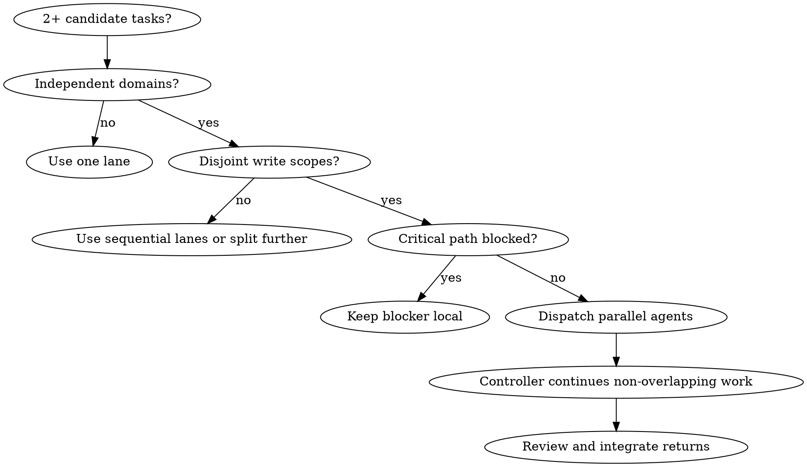

# Forge Dispatching Parallel Agents

<EXTREMELY-IMPORTANT>
Parallel dispatch is only safe when write scopes are disjoint and the next local step is not blocked by the delegated result.

Do not spawn agents for vague ownership, overlapping edits, or work that should stay on the controller's critical path.

One focused agent per independent problem domain. The controller keeps integration, sequencing, and final claims.
</EXTREMELY-IMPORTANT>

## Why Parallel Agents

Parallel agents help when several domains can be understood and completed without sharing state. They are not a speed button. They are a coordination pattern for independent work.

Use them to:

- investigate unrelated failures concurrently
- implement disjoint plan slices while the controller keeps the critical path
- review independent artifacts without context pollution
- preserve controller attention for integration decisions

Do not use them to avoid thinking about dependency order. Bad decomposition creates conflicts faster than one careful lane.

## Use When

- There are 2+ independent tasks.
- Each task has a clear goal, owned files, proof, and return format.
- Work can proceed in parallel without sequencing dependency.
- The user or host permits subagents.
- The tasks touch different files, modules, artifacts, test groups, or review scopes.
- The controller can keep doing useful non-overlapping work while agents run.

## Do Not Use When

- The very next step depends on the result.
- Write scopes overlap.
- The contract or interface between tasks is not locked.
- A single focused implementation lane is safer.
- The failures may share one root cause; use `forge-systematic-debugging` first.
- The plan is still vague; use `forge-writing-plans` before dispatch.
- The controller would only wait for the agents and do no useful work.

## Decision Flow



## Process

1. Identify critical-path work to keep local.
2. Split only sidecar tasks that materially advance the goal.
3. Assign disjoint ownership and explicit non-revert instructions.
4. Provide each worker with goal, files, constraints, verification, and expected return.
5. Continue local non-overlapping work while agents run.
6. Review returned changes before integration.

## Independence Checklist

Before dispatch, answer these explicitly:

- Do the tasks have separate root causes, features, artifacts, or review scopes?
- Can each worker succeed without waiting for another worker's output?
- Are owned files or write scopes disjoint?
- Is the shared interface already defined?
- Can verification run per lane before final integration?
- What local controller work continues while agents run?

If any answer is unclear, do not dispatch yet. Split the plan, run debugging, or keep execution sequential.

## Grouping Problem Domains

Good parallel domains are narrow and named by what is broken or being built:

- `agent-tool-abort.test.ts timing failures`
- `batch completion event shape`
- `installer dry-run output contract`
- `docs architecture wording sweep`
- `release bundle verification`

Bad domains are broad and conflict-prone:

- `fix all tests`
- `clean up the code`
- `make the feature work`
- `review everything`
- `update docs and implementation wherever needed`

Each domain should have one owner, one output contract, and one proof strategy.

## Dispatch Packet

- Task goal
- Owned files or write scope
- Read-only context allowed
- Dependencies and non-goals
- Verification to run
- Return format: status, changed files, proof, residual risk
- Collaboration rule: other workers may be editing elsewhere; do not revert unrelated changes

## Agent Prompt Structure

Good parallel prompts are focused, self-contained, and specific about output.

```text
You own: <one problem domain>
Goal: <exact success state>
Owned write scope: <files/modules/artifacts>
Read-only context: <files/logs/specs the agent may inspect>
Constraints: <what not to change>
Verification: <command or proof to run before return>
Collaboration: other workers may be editing elsewhere; do not revert unrelated changes
Return: status, changed files, root cause or implementation summary, proof, residual risk
```

If the prompt says "figure out where to edit", ownership is not ready. If the prompt has no proof requirement, the lane is not ready.

## While Agents Run

The controller should not idle by default.

Useful parallel controller work:

- inspect the next non-overlapping task
- update the plan or task board
- run read-only verification or baseline checks
- prepare final integration checklist
- review artifacts that no worker owns

Do not start local edits in files owned by running agents.

## Review And Integrate

When agents return:

1. Read each status and concern before touching files.
2. Check whether any worker exceeded ownership.
3. Compare changed files for overlap.
4. Run each lane's stated proof if needed.
5. Run an integration-level verification after combining results.
6. Send incomplete or risky lanes back with a precise packet.

Parallel completion is not final completion. `forge-verification-before-completion` still owns the claim boundary.

## Red Flags

| Rationalization | Reality |
| --- | --- |
| "More agents always means faster." | Overlap and unclear contracts slow work down. |
| "They can figure out files." | Vague ownership causes conflicts. |
| "I will just wait." | Keep critical-path work local instead. |
| "These failures look separate enough." | Similar symptoms may share one root cause; debug first if unsure. |
| "Parallel agents can edit nearby files carefully." | Nearby ownership still needs an explicit merge plan. |
| "The first return looks good, so we are done." | All lanes need integration verification before claims. |
| "A broad review prompt is fine." | Broad prompts produce unfocused output and duplicate work. |

## Integration

- Called by: `forge-executing-plans` and `forge-subagent-driven-development` when the plan contains safe parallel lanes.
- Calls next: worker dispatch packets, then `forge-requesting-code-review` or `forge-verification-before-completion` after integration.
- Pairs with: `forge-using-git-worktrees` for isolation, `forge-systematic-debugging` when independence is uncertain, and `forge-session-management` for durable handoff.
