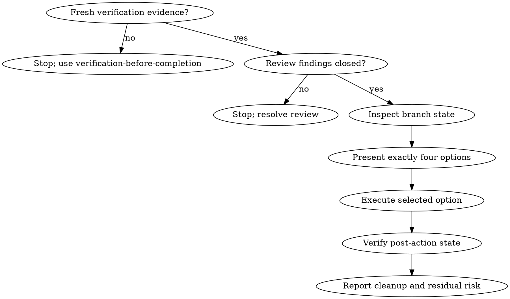

# Forge Finishing A Development Branch

<EXTREMELY-IMPORTANT>
Never merge, PR, delete, or discard branch or worktree state without fresh evidence and an explicit branch resolution.

Verify first. Present structured options. Execute exactly the chosen option. Clean up only when it is safe.
</EXTREMELY-IMPORTANT>

## Core Principle

Finishing a branch is a state transition, not a vibe check.

The branch can end in only one of four states:

```text
merge locally | push and PR | keep as-is | discard with confirmation
```

Do not invent a fifth implicit path such as "looks done, so merge" or "probably safe to delete."

## Use When

- Work is verified and review or gate evidence is ready.
- The user asks what to do with the branch.
- A PR, merge, cleanup, or worktree decision is needed.
- A worktree was used and needs a keep/remove decision.
- Subagent or parallel-agent work has been integrated and needs final branch disposition.

## Do Not Use When

- Tests or checks have not run or the current state is blocked.
- Review findings remain open.
- The user has not authorized destructive cleanup.
- You have not inspected current branch, target branch, and git status.
- The user is still deciding requirements or implementation scope.

## Process Flow



## Preflight

Before presenting options, gather:

- current branch
- target/base branch
- `git status --short`
- ahead/behind or diff summary when available
- latest verification evidence
- review disposition
- worktree path, if any
- untracked files or generated artifacts that need a decision

If the target branch is unclear, infer from repo conventions when safe; otherwise ask before merge/PR actions.

## If Verification Fails

Stop. Do not present merge/PR/discard-as-complete options.

Report:

- command or proof that failed
- failure summary
- whether the failure appears related
- next skill: `forge-systematic-debugging` for unexpected failures, or `forge-executing-plans` for known remaining work

## Branch Resolution

Choose exactly one:

- `merge-local`: clean local merge is intended.
- `push-and-pr`: human review, CI, or remote collaboration is needed.
- `keep-branch`: useful work remains but is not ready to merge.
- `discard-with-confirmation`: abandon only after explicit user confirmation.

## Presenting Options

When the user has not already chosen, present exactly four options:

```text
Implementation is verified enough for a branch decision. Choose one:

1. Merge locally into <target-branch>
2. Push branch and create/open a PR
3. Keep the branch/worktree as-is
4. Discard this branch/worktree after explicit confirmation
```

Keep the options concise. Do not bias the user toward cleanup or merge unless they asked for a recommendation.

## Option 1: Merge Locally

Before merge:

- confirm current branch and target branch
- ensure working tree is clean or explicitly account for local changes
- update or inspect target branch according to repo convention
- verify there are no open review blockers

After merge:

- run the relevant verification on the merged result
- report merge result and verification
- delete the feature branch only if merged cleanly and no unpushed work remains
- remove worktree only after confirming no uncommitted work or needed artifacts remain

## Option 2: Push And PR

Before PR:

- ensure branch contains the intended commits
- push the branch or confirm it is already pushed
- prepare PR summary from accepted request, implementation, and evidence
- include test plan and residual risk

After PR:

- do not delete the local branch or worktree unless the user explicitly wants that cleanup
- report PR state, CI uncertainty, and local cleanup stance

## Option 3: Keep Branch

Use when:

- user wants to continue later
- PR is not ready
- verification is partial but useful work should be preserved
- branch is a handoff artifact

Report:

- branch name
- worktree path
- latest verification
- next recommended command or skill
- what remains before merge/PR

## Option 4: Discard With Confirmation

Discard is destructive. Require explicit confirmation after showing what would be removed.

Show:

- branch name
- worktree path
- unmerged commits or diff summary
- untracked files or generated artifacts
- remote branch or PR risk, if any

Require an explicit confirmation phrase such as `discard` before deleting branch or worktree state.

Never discard because the work "looks unnecessary" without user confirmation.

## Required Evidence

- Current branch and target branch
- Git status
- Verification just run
- Review disposition
- Quality gate decision from `forge-verification-before-completion`
- Cleanup stance for worktree or artifacts

## Cleanup Rules

- `merge-local`: cleanup branch/worktree only after merged result is verified and no uncommitted work remains.
- `push-and-pr`: usually keep branch/worktree until PR is merged or user says cleanup.
- `keep-branch`: do not cleanup.
- `discard-with-confirmation`: cleanup only after explicit confirmation and state inspection.

Use `git worktree list` or equivalent repo inspection before removing a worktree.

## Final State Packet

Report:

```text
Resolution:
- <merge-local | push-and-pr | keep-branch | discard-with-confirmation>

Evidence:
- <latest verification and review disposition>

Branch state:
- <current branch, target branch, status>

Cleanup:
- <kept, removed, deferred, or blocked>

Residual risk:
- <CI pending, unverified checks, open decisions, or none known>
```

## Red Flags

| Rationalization | Reality |
| --- | --- |
| "Tests pass, merge automatically." | Branch resolution still needs explicit choice. |
| "Discard is obvious." | Destructive cleanup requires confirmation. |
| "PR can be ready without fresh gate." | Ready claims require verification-before-completion. |
| "The branch is merged, so delete the worktree." | Check uncommitted work, artifacts, and PR state first. |
| "Keep and cleanup mean the same thing." | Keep preserves state; cleanup removes state. |
| "The target branch is probably main." | Confirm or infer from evidence before merge actions. |
| "CI will catch it." | CI does not replace local branch-state verification. |

## Integration

- Called by: `forge-verification-before-completion` and `forge-requesting-code-review` after evidence is fresh enough to choose a branch outcome.
- Calls next: merge, push, PR, keep, or discard actions according to the selected resolution.
- Pairs with: `forge-using-git-worktrees` for cleanup stance and `forge-session-management` for durable handoff.

## Output

- Resolution
- Evidence
- Command or action proposed or taken
- Cleanup state
- Residual risk
