# Forge Test-Driven Development

<EXTREMELY-IMPORTANT>
If behavior changes and a viable harness exists, this skill is mandatory before implementation code.

```text
NO HARNESS-CAPABLE BEHAVIOR CHANGE WITHOUT VERIFIED RED FIRST
```

Code written before RED must be deleted. "Keep as reference" is not an exception. Delete means delete.
</EXTREMELY-IMPORTANT>

## Use When

- New feature, bugfix, regression fix, refactor, or behavior change.
- Existing tests can be reused or a focused test can be added.
- A deterministic content or check harness can express the expected behavior.
- Review feedback requires a behavior-changing fix and a harness is viable.
- A debugging investigation has identified a root cause and the fix can now be driven through proof.

## Do Not Use When

- Docs-only changes, generated artifacts whose behavior is already verified at a boundary, or pure config chores where no meaningful behavior harness exists.
- The user explicitly permits a throwaway prototype spike; discard the spike code before real implementation.
- No harness is viable after an honest search; record the no-harness reason and strongest fallback proof before editing.
- The issue is still unexplained; use `forge-systematic-debugging` first instead of writing speculative tests around symptoms.

If you are unsure whether a harness exists, spend time looking. "I do not see a test immediately" is not evidence that TDD does not apply.

## Real-World Impact

Spending 15-30 minutes establishing RED is usually cheaper than losing hours to false fixes, stale assumptions, or tests that only prove the final code path after you already committed to the wrong shape.

TDD is not ceremony. It is the fastest way to prove that the behavior was missing, that the change really introduced it, and that the surrounding baseline still holds.

## Red-Green-Refactor Flow

```dot
digraph forge_tdd {
    rankdir=LR;
    red [label="RED\nWrite failing test", shape=box];
    verify_red [label="Verify fails\nfor the right reason", shape=diamond];
    green [label="GREEN\nWrite minimal code", shape=box];
    verify_green [label="Rerun RED proof\nand baseline", shape=diamond];
    refactor [label="REFACTOR\nClean up", shape=box];
    next [label="Next behavior", shape=ellipse];

    red -> verify_red;
    verify_red -> red [label="wrong failure"];
    verify_red -> green [label="expected failure"];
    green -> verify_green;
    verify_green -> green [label="still red"];
    verify_green -> refactor [label="green"];
    refactor -> verify_green [label="stay green"];
    verify_green -> next [label="baseline green too"];
}
```



## RED - Write Failing Test

1. Write one minimal test for one concrete behavior.
2. Name the behavior clearly.
3. Prefer real code paths over mocks unless isolation is impossible without them.
4. Keep the test narrow enough that failure tells you what is missing.
5. If the work spans multiple behaviors, choose one first slice instead of writing a giant proof.

## Verify RED - Watch It Fail

1. Run the targeted command.
2. Confirm the test fails, not merely errors.
3. Confirm the failure is the expected signal for missing behavior.
4. If it passes immediately, the test is wrong or the behavior already exists.
5. If it fails for setup reasons, fix setup until the failure proves the missing behavior.

## GREEN - Write Minimal Code

1. Write the minimum implementation needed for the same proof.
2. Do not widen scope while chasing green.
3. Do not add optional behavior, polish, or unrelated refactors.
4. If you discover a bigger architectural issue, stop and return to design or planning instead of smuggling redesign into GREEN.

## Verify GREEN - Watch It Pass

1. Rerun the exact RED command first.
2. Run the named baseline that must remain green.
3. Do not call GREEN until both pass.
4. If the baseline fails, the slice is not complete.

## REFACTOR - Clean Without Changing Behavior

- Refactor only after GREEN.
- Keep the original RED proof and named baseline green throughout.
- Do not add new behavior during refactor.
- If refactor changes expected behavior, that is a new RED cycle.

## Good Tests

| Quality | Good | Bad |
| --- | --- | --- |
| Minimal | One behavior, one failure reason | A giant test proving several behaviors at once |
| Clear | The name says what should happen | `test1`, `works`, or another vague label |
| Behavioral | Proves real behavior at the right boundary | Mostly proves mocks or private implementation details |
| Useful | Makes the intended API or contract obvious | Hides the requirement behind setup noise |

If the test is hard to read, it will be hard to trust when it fails.

## Why Order Matters

Tests written after code answer "what does this implementation do?" Tests written first answer "what should the behavior be?"

That difference matters because tests-after:

- pass immediately and prove nothing about missing behavior
- are biased by the implementation already in front of you
- make it easier to miss edge cases you forgot to imagine
- turn verification into a story you tell yourself instead of evidence you observed

Test-first forces you to watch the proof catch the missing behavior before you are attached to a solution shape.

## No-Harness Fallback

- Name the no-harness reason before editing.
- Name the strongest available proof: repro script, build, lint, typecheck, diff, content check, smoke check, or manual procedure.
- Do not invent the fallback after editing; that is post-hoc justification.
- If a harness becomes viable later, stop and restart from RED for the behavior under change.

## Test Packet

For important work, record:

- Behavior under proof
- Harness stance
- Baseline command
- RED proof and expected failure signal
- Production code existed before RED: yes or no
- Delete reset proof if needed
- GREEN proof
- Named baseline and baseline-green proof
- Boundary or broader checks
- Residual risk

## Stop And Start Over

| Signal | Required action |
| --- | --- |
| Implementation code existed before RED | Delete it completely before restarting. |
| RED passed immediately | Rewrite the test. |
| RED failed for the wrong reason | Fix setup or test intent. |
| Original RED proof was never rerun first | Rerun the original proof. |
| Named baseline is still red | GREEN is not complete. |
| No-harness fallback was invented after editing | Reset the packet and restate proof honestly. |
| "Deleting X hours is wasteful" | Sunk cost is not evidence. |

## Common Rationalizations

| Rationalization | Reality |
| --- | --- |
| "I already know the fix." | Then it should be easy to prove with RED first. |
| "I will add the test after the code works." | That only proves the final code, not that the behavior was missing. |
| "This refactor is internal, so tests are optional." | Internal changes still need proof that behavior stayed stable. |
| "A single end-to-end smoke check is enough." | Use the smallest proof that exposes the exact missing behavior, then keep the broader baseline green. |
| "Generated code means TDD does not apply." | Prove behavior at the boundary even if the interior is generated. |
| "Config has no behavior." | Config changes still alter behavior and need the strongest available proof. |
| "I can keep the pre-RED code as a reference." | Pre-RED code biases the implementation and must be deleted. |
| "The failing test is annoying because setup is hard." | Hard setup is a signal to improve the harness, not skip proof. |

## Verification Checklist

Before claiming the slice is complete, confirm:

- the behavior under change has a real proof
- you watched RED fail for the right reason
- you reran the exact RED proof before broader checks
- the named baseline is green too
- the final code still matches the behavior the test was supposed to prove
- residual risk is named if the proof or baseline could not fully run

If you cannot check these boxes, the slice is not done.

## When Stuck

| Problem | Response |
| --- | --- |
| I do not know how to test this | Write the wished-for behavior first and shape the API around that proof. |
| The test setup is huge | Extract helpers or simplify the design boundary. |
| I must mock everything | The code may be too coupled; move the proof boundary or improve dependency seams. |
| RED is hard to express | The behavior or interface may still be unclear; return to design or debugging instead of guessing. |

## Integration

- Called by: `forge-executing-plans`, `forge-receiving-code-review`, and `forge-systematic-debugging` once root cause is known and the fix is harnessable.
- Calls next: return to `forge-executing-plans` for the current slice, then `forge-verification-before-completion` before any success claim.
- Pairs with: `forge-using-git-worktrees` for isolation, `forge-requesting-code-review` for final review, and `forge-systematic-debugging` when a failing test exposes a deeper unknown.

## Completion

Before handoff, report RED -> GREEN -> baseline evidence exactly. If any part cannot run, say `not verified`, name the blocker, and do not claim done.

Shared scripts and references live in the installed Forge orchestrator bundle.
