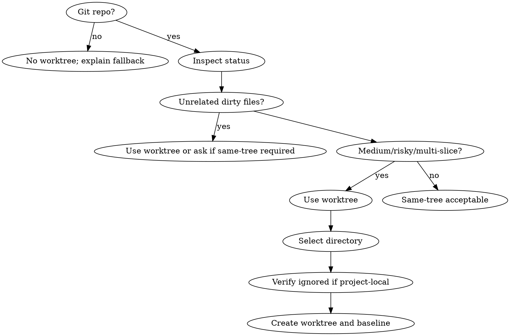

# Forge Using Git Worktrees

<EXTREMELY-IMPORTANT>
**REQUIRED GATE:** Check isolation before editing when the repo is dirty, the task is medium or larger, or the change spans multiple slices.

```text
NO ISOLATION DECISION AFTER EDITING STARTS
```

Systematic directory selection plus safety verification prevents overwriting user work and prevents accidentally committing worktree contents.
</EXTREMELY-IMPORTANT>

## Core Principle

Choose the isolation stance before editing:

```text
same-tree for tiny clean work
worktree for medium/risky/dirty work
subagent-split for independent isolated lanes
```

**DO NOT START EDITING FIRST** and decide isolation later.

## Use When

- Current repo has unrelated local changes.
- The work is medium or large, risky, behavior-changing, or multi-slice.
- Plan execution could conflict with user edits.
- A subagent or parallel lane needs isolated files.
- You need to preserve the main workspace for review, comparison, or user edits.
- A baseline command should be captured before implementation.

## Do Not Use When

- The task is tiny, mechanical, and the current tree is clean.
- The repo is not a git repo.
- The user explicitly requires same-tree edits after the risk is stated.
- The branch or worktree policy is controlled by the user and they gave a different instruction.

## Decision Flow



## Process

1. Inspect `git status --short`.
2. Identify whether dirty files are related to the requested task.
3. Choose one stance: `same-tree`, `worktree`, or `subagent-split`.
4. If using a worktree, create it under a safe project-local or configured workspace root.
5. **Run the gitignore safety check before editing.**
6. **Run the baseline command in the worktree before editing** when possible.
7. Keep the worktree path, branch, baseline result, and cleanup expectation in the handoff.

## Directory Selection

Use this priority order:

1. Existing project-local `.worktrees/`
2. Existing project-local `worktrees/`
3. Workspace-local guidance in `AGENTS.md`, repo docs, or project conventions
4. Configured external workspace root
5. Ask the user if no safe convention exists and the location matters

If both `.worktrees/` and `worktrees/` exist, prefer `.worktrees/`.

Prefer an external workspace root when the project has strict ignore rules or generated-file scanning that could accidentally pick up nested worktrees.

## Branch And Name Selection

Use a short, task-specific name:

- `codex/<topic>` for Codex-created branches unless the user asked for another prefix
- include the issue, plan slice, or feature label when available
- avoid spaces, timestamps-only names, and vague names like `work` or `fix`

The worktree directory name should match the branch or slice closely enough that later cleanup is obvious.

## Gitignore Safety Check

**Before using a project-local worktree path, verify the repo will not accidentally track the worktree contents.**

- Prefer a workspace root outside the repo when possible.
- If the worktree lives under the repo parent or a project-local helper directory, confirm the path is ignored by `.gitignore`, `.git/info/exclude`, or the global ignore file.
- Use `git check-ignore <path>` or inspect `.gitignore` directly. Do not assume a helper directory is already ignored.
- If the path is not ignored, either add the ignore rule first or choose a different worktree root.
- Never leave a worktree directory in a location where `git status` from the main repo can pick it up as untracked work.

If adding an ignore rule is required, treat that as a real repo change: state it, verify it, and include it in the final diff. **Do not silently modify ignore policy.**

## Create And Enter The Worktree

**Before creating:**

- confirm the current branch and target base
- confirm the target path does not already contain unrelated files
- confirm no existing worktree already uses the branch

Typical command shape:

```text
git worktree add <path> -b <branch> <base>
```

If the branch already exists and should be reused, do not force-create or overwrite. Inspect existing worktrees and ask or choose a new branch name.

After creating, enter the worktree and confirm:

- `git status --short`
- branch name
- repository root
- expected path

## Setup And Baseline

Run the lightest setup needed for the repo before implementation:

- install dependencies only if the worktree lacks them and the project expects local installs
- use existing lockfiles and repo scripts
- avoid introducing new dependencies or package manager changes during setup
- record setup failures separately from implementation failures

Run a baseline command when viable:

- targeted tests for the planned slice
- lint/typecheck/build if that is the normal proof path
- docs/content check for docs-only work
- smoke check when no harness exists

If baseline fails, **stop and report**:

- command run
- failure summary
- whether the failure appears pre-existing
- whether to debug baseline first or continue with explicit residual risk

**Do not bury baseline failure** under later implementation output.

## Forge Helper

When available from the installed orchestrator bundle:

```powershell
python scripts/prepare_worktree.py --workspace <workspace> --name <slice> --baseline-command "<baseline>"
```

The helper is optional. The contract is the same without it: explicit stance, safe directory, ignored project-local path, clean branch, baseline proof, and cleanup handoff.

## Handoff Packet

Record:

- isolation stance: `same-tree`, `worktree`, or `subagent-split`
- worktree path
- branch name and base
- dirty-state decision from the original workspace
- gitignore safety result
- setup and baseline result
- cleanup expectation: keep, merge, PR, or remove later

This packet lets `forge-session-management` resume safely and lets `forge-finishing-a-development-branch` decide cleanup without rediscovering context.

## Cleanup Safety

**Do not remove a worktree until:**

- changes are merged, intentionally discarded, or handed off
- no uncommitted work remains unless the user explicitly discards it
- branch/PR decision is clear
- the main workspace no longer depends on artifacts inside the worktree

Use `forge-finishing-a-development-branch` for final keep/merge/PR/discard decisions.

## Red Flags

| Rationalization | Reality |
| --- | --- |
| "The repo is dirty but unrelated." | Protect user edits with an explicit stance. |
| "I can remember which files are mine." | Worktree isolation is cheaper than accidental overwrite. |
| "Subagents can coordinate manually." | Parallel work needs disjoint write scopes or isolation. |
| "The helper directory is probably already ignored." | Worktree paths need an explicit gitignore safety check. |
| "Baseline is optional because we only need isolation." | Baseline separates pre-existing failures from new failures. |
| "I can delete the worktree after merge." | Cleanup still needs branch, diff, and uncommitted-state checks. |
| "The branch exists, just reuse it." | Existing branches may contain unrelated work. Inspect before reuse. |

## Integration

- Called by: `forge-executing-plans`, `forge-subagent-driven-development`, and `forge-dispatching-parallel-agents` when isolation risk is non-trivial.
- Calls next: return to the original implementation skill in the isolated worktree or branch.
- Pairs with: `forge-session-management` for recording the chosen stance and `forge-finishing-a-development-branch` for cleanup decisions.
