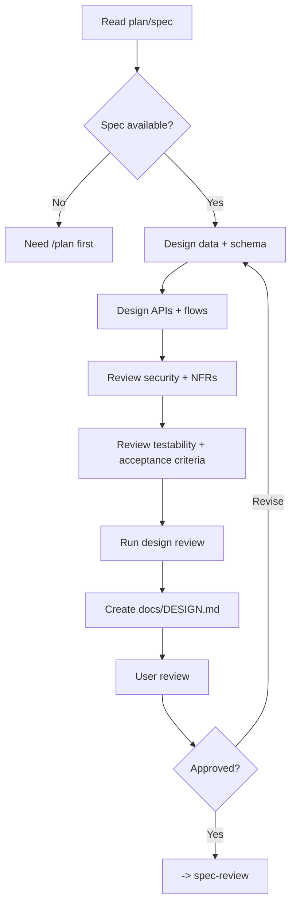

# Architect - System Design & Architecture

## The Iron Law

```text
NO LARGE IMPLEMENTATION WITHOUT DOCUMENTED ARCHITECTURE DECISIONS
```

> Planning defines what to build. Architecture defines how it should work.

<HARD-GATE>
Use this workflow for:
- large tasks
- complex data flows
- auth or permission-heavy changes
- major schema or migration work

Small and many medium tasks can skip `architect` when the plan already defines the system shape clearly enough.
</HARD-GATE>

## Process



## Data Design

### Schema Conventions
```text
- Tables should have `id`, `created_at`, and `updated_at`
- Add soft-delete support when the domain needs it
- Make foreign-key actions explicit
- Keep naming consistent
- Lock enum/status rules explicitly
```

### Index Design
```text
- Index foreign-key columns
- Index common WHERE / ORDER BY / JOIN paths
- Use partial or composite indexes where they change real query behavior
```

## Design Outputs

`docs/DESIGN.md` should cover:
1. database schema / data model
2. API endpoints / contracts
3. user flows / state flows
4. security design
5. non-functional requirements
6. compatibility / migration / rollout notes
7. observability / failure-handling notes
8. acceptance criteria / test cases

## ADR-Lite Records

Record major architectural decisions in a compact ADR format:

```text
ADR:
- Context: [...]
- Decision: [...]
- Why: [...]
- Alternatives rejected: [...]
- Compatibility / rollback concern: [...]
- Proof this design works: [...]
- Reopen only if: [...]
```

Rules:
- do not write "use X" without explaining why
- if you change contract, schema, ownership, or rollout shape, record the compatibility or rollback concern
- if you cannot explain how the design will be proven, the design is still too abstract

## Cross-Cutting Checklist

Before calling the design mature, check:
- `Security`: authn/authz, secrets, trust boundaries, validation
- `Compatibility`: versioning, consumer impact, migration windows, rollout sequencing
- `Data lifecycle`: create/update/delete, retention, cleanup, backfill, idempotency
- `Observability`: logs, metrics, traces, audit points
- `Failure handling`: retry, timeout, fallback, rollback, kill switch, operator action
- `Performance`: hotspots, query shape, indexes, caching, latency-sensitive paths
- `Ownership`: source of truth, consumers, coordinated updates
- `Testability`: first proof, edge-case proof, boundary checks, smoke path

Rules:
- you do not need a long write-up for every item
- any item inside the blast radius must have a clear answer
- if an unresolved item could break rollout or verification, the design is not ready

## Build Sequence & Boundaries

The design must make build order explicit enough to execute safely:
- what should be implemented first to unlock the next slice?
- which boundaries must stay stable throughout the build?
- which integrations need early verification?
- which slices are independent, and which are coupled?

Template:

```text
Build sequence:
- Slice 1: [...]
- Slice 2: [...]
- Early integration check: [...]
- Must-not-break boundary: [...]
```

## Design Review Loop

Before handing off to `spec-review`, reread the design in four passes:

1. `Data & lifecycle`: ownership, migrations, cleanup, retention
2. `Contract & integration`: APIs, events, schemas, public boundaries, compatibility
3. `Ops & failure`: logs, metrics, rollback, fallback, kill switch
4. `Testability`: acceptance criteria, first proof, edge cases, verification path

Rules:
- if any critical boundary is still ambiguous, revise the design before handoff
- user review does not replace self-review

## Verification Checklist

- [ ] Source spec is clear
- [ ] Data model and API contract are explicit
- [ ] Security / auth / validation were reviewed
- [ ] NFRs and major risks are recorded
- [ ] Build sequence and must-not-break boundaries are explicit
- [ ] ADR-lite records cover major decisions
- [ ] Cross-cutting review covered important boundaries
- [ ] Compatibility / rollback concern is recorded when applicable
- [ ] The design explains both implementation shape and proof

## Handover

```text
Architecture ready:
- System shape: [...]
- Key decisions: [...]
- Build order: [...]
- Must-not-break boundaries: [...]
- Verification shape: [...]
- Reopen only if: [...]
- Next workflow: spec-review
```

## Activation Announcement

```text
Forge: architect | define the system shape before large implementation
```

## Response Footer

When this skill is used to complete a task, record its exact skill name in the global final line:

`Skills used: architect`

When multiple Forge skills are used, list each used skill exactly once in the shared `Skills used:` line. When no Forge skill is used for the response, use `Skills used: none`. Keep that `Skills used:` line as the final non-empty line of the response and do not add anything after it.
