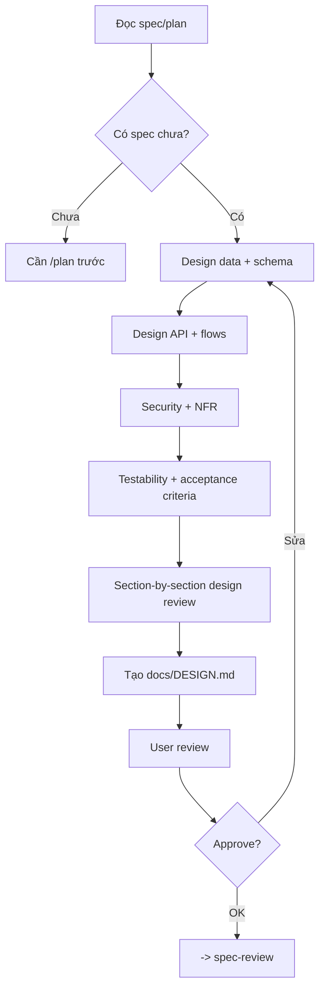

# Architect - System Design & Architecture

## The Iron Law

```
NO LARGE IMPLEMENTATION WITHOUT ARCHITECTURE DECISIONS DOCUMENTED
```

> Plan = biết làm gì. Design = biết làm như thế nào.

<HARD-GATE>
Áp dụng cho task large, data flow phức tạp, auth, hoặc database change lớn.
Task small/medium rõ ràng có thể bỏ qua architect nếu plan đã đủ.
</HARD-GATE>

---

## Process



## Data Design

### Schema Conventions
```
- Table có id, created_at, updated_at
- Chốt soft delete nếu domain cần
- FK actions rõ ràng
- Naming nhất quán
- Chốt enum/status rules
```

### Index Design
```
- Index FK columns
- Index cho WHERE / ORDER BY / JOIN
- Partial/composite index khi cần
```

## Design Outputs

`docs/DESIGN.md` nên có:
1. Database schema / data model
2. API endpoints / contracts
3. User flows / state flows
4. Security design
5. Non-functional requirements
6. Compatibility / migration / rollout notes
7. Observability / failure handling notes
8. Acceptance criteria / test cases

## ADR-Lite Records

Mỗi quyết định kiến trúc quan trọng nên có format ADR rút gọn:

```text
ADR:
- Context: [...]
- Decision: [...]
- Why: [...]
Alternatives rejected: [...]
Compatibility / rollback concern: [...]
Proof this design is working: [...]
Reopen only if: [...]
```

Rule:
- Không chỉ ghi "dùng X" mà không ghi vì sao
- Nếu quyết định làm thay đổi contract, schema, ownership, hoặc rollout shape, phải có `compatibility / rollback concern`
- Nếu không nêu được `proof this design is working`, design đang quá trừu tượng

## Cross-Cutting Checklist

Đọc nhanh checklist này trước khi coi design là đủ chín:

- `Security`: authn/authz, secrets, trust boundary, validation
- `Compatibility`: versioning, consumer impact, migration window, rollout sequencing
- `Data lifecycle`: create/update/delete, retention, cleanup, backfill, idempotency
- `Observability`: log gì, metric gì, trace hoặc audit point nào cần
- `Failure handling`: retry, timeout, fallback, rollback, kill switch, operator action
- `Performance`: hotspot, index/query shape, caching, throughput, latency-sensitive path
- `Ownership`: ai giữ source of truth, ai consume, ai phải update cùng lúc
- `Testability`: first proof, edge-case proof, boundary check, smoke path

Rule:
- Không cần biến mọi item thành tài liệu dài dòng, nhưng item nào chạm blast radius thật thì phải được trả lời
- Nếu một item còn bỏ ngỏ mà có thể làm hỏng rollout hoặc verification, chưa được coi design-ready

## Build Sequence & Boundaries

Design phải chỉ ra thứ tự thi công ở mức đủ dùng:
- phần nào làm trước để unlock phần sau
- boundary nào không được phá trong lúc thi công
- integration point nào phải verify sớm
- phần nào có thể làm độc lập, phần nào không

Template:

```text
Build sequence:
- Slice 1: [...]
- Slice 2: [...]
- Early integration check: [...]
- Must-not-break boundary: [...]
```

## Design Review Loop

Trước khi chuyển sang `spec-review`, đọc lại design theo 4 pass:

1. `Data & lifecycle`: trạng thái dữ liệu, ownership, migration, cleanup
2. `Contract & integration`: API/event/schema/public boundary và compatibility
3. `Ops & failure`: logs/metrics/rollback/fallback/kill switch nếu cần
4. `Testability`: acceptance criteria, first proof, edge cases, verification feasibility

Rule:
- Nếu một pass còn mơ hồ ở boundary trọng yếu, quay lại sửa design trước khi handoff
- `User review` không thay cho self-review; design phải tự đứng vững trước khi đem duyệt

## Verification Checklist

- [ ] Spec nguồn đã rõ ràng
- [ ] Data model và API contract đã chốt
- [ ] Security / auth / validation đã được xem
- [ ] NFR và risks đã được note
- [ ] Build sequence và must-not-break boundaries đã rõ
- [ ] ADR-lite records đủ cho các quyết định lớn
- [ ] Cross-cutting checklist đã được đọc cho các boundary quan trọng
- [ ] Compatibility / rollback concern đã được ghi khi applicable
- [ ] Design đủ test và đủ implement

## Handover

```
Architecture ready:
- Decisions: [...]
- Build sequence: [...]
- Must-not-break boundaries: [...]
- Risks: [...]
- Docs: [DESIGN.md]
- Spec-review: [required / not required + why]
- Next: [spec-review/build]
```

## Activation Announcement

```
Forge: architect | chốt quyết định kiến trúc trước implementation lớn
```
