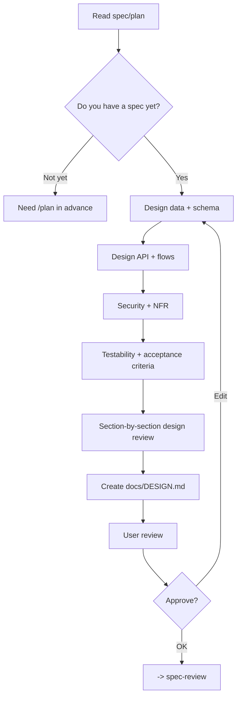

# Architect - System Design & Architecture

## The Iron Law

```
NO LARGE IMPLEMENTATION WITHOUT ARCHITECTURE DECISIONS DOCUMENTED
```

> Plan = know what to do. Design = know how to do it.

<HARD-GATE>
Applies to large tasks, complex data flows, auth, or large database changes.
Small/medium tasks can obviously ignore the architect if the plan is sufficient.
</HARD-GATE>

---

## Process



## Data Design

### Schema Conventions
```
- Table has id, created_at, updated_at
- Close soft delete if the domain needs it
- FK actions are clear
- Consistent naming
- Lock enum/status rules
```

### Index Design
```
- Index FK columns
- Index for WHERE / ORDER BY / JOIN
- Partial/composite index when needed
```

## Design Outputs

`docs/DESIGN.md` should have:
1. Database schema / data model
2. API endpoints / contracts
3. User flows / state flows
4. Security design
5. Non-functional requirements
6. Compatibility / migration / rollout notes
7. Observability / failure handling notes
8. Acceptance criteria / test cases

## ADR-Lite Records

Every major architectural decision should have a shortened ADR format:

```text
ADR:
- Context: [...]
- Decision: [...]
- Why: [...]
Alternatives rejected: [...]
Compatibility / rollback concern: [...]
Proof this design is working: [...]
Reopen only if: [...]
```

Rule:
- Don't just write "use X" without writing why
- If you decide to change the contract, schema, ownership, or rollout shape, there must be `compatibility / rollback concern`
- If `proof this design is working` cannot be stated, the design is too abstract

## Cross-Cutting Checklist

Quickly read this checklist before considering the design mature enough:

- `Security`: authn/authz, secrets, trust boundary, validation
- `Compatibility`: versioning, consumer impact, migration window, rollout sequencing
- `Data lifecycle`: create/update/delete, retention, cleanup, backfill, idempotency
- `Observability`: what log, what metrics, what trace or audit point are needed
- `Failure handling`: retry, timeout, fallback, rollback, kill switch, operator action
- `Performance`: hotspot, index/query shape, caching, throughput, latency-sensitive path
- `Ownership`: who keeps the source of truth, who consumes, who must update at the same time
- `Testability`: first proof, edge-case proof, boundary check, smoke path

Rule:
- There's no need to turn every item into a lengthy document, but any item that actually touches the blast radius must be answered
- If an item is left open that could disrupt rollout or verification, it is not considered design-ready

## Build Sequence & Boundaries

The design must indicate the construction order at a sufficient level:
- Which part should be done first to unlock the next part?
- Any boundary must not be destroyed during construction
- Any integration points must be verified soon
- Which parts can be done independently, which parts cannot

Templates:

```text
Build sequence:
- Slice 1: [...]
- Slice 2: [...]
- Early integration check: [...]
- Must-not-break boundary: [...]
```

## Design Review Loop

Before converting to `spec-review`, reread the design in 4 passes:

1. `Data & lifecycle`: data status, ownership, migration, cleanup
2. `Contract & integration`: API/event/schema/public boundary and compatibility
3. `Ops & failure`: logs/metrics/rollback/fallback/kill switch if needed
4. `Testability`: acceptance criteria, first proof, edge cases, verification considerations

Rule:
- If a pass is ambiguous at a critical boundary, go back and fix the design before handing off
- `User review` does not replace self-review; The design must stand on its own before being approved

## Verification Checklist

- [ ] Source spec is clear
- [ ] Data model and API contract have been finalized
- [ ] Security / auth / validation has been viewed
- [ ] NFR and risks have been noted
- [ ] Build sequence and must-not-break boundaries are clear
- [ ] ADR-lite records are enough for big decisions
- [ ] Cross-cutting checklist has been read for important boundaries
- [ ] Compatibility / rollback concern has been recorded when applicable
- [ ] Design has enough testing and enough implementation

## Handover

```
Architecture ready:
- Decisions: [...]
- Build sequence: [...]
- Must-not-break boundaries: [...]
- Risks: [...]
- Docs: [DESIGN.md]
- Spec-review: [required / not required + why]
- Next: [spec-review/build]
```

## Activation Announcement

```
Forge: architect | finalize architectural decisions before large implementations
```
