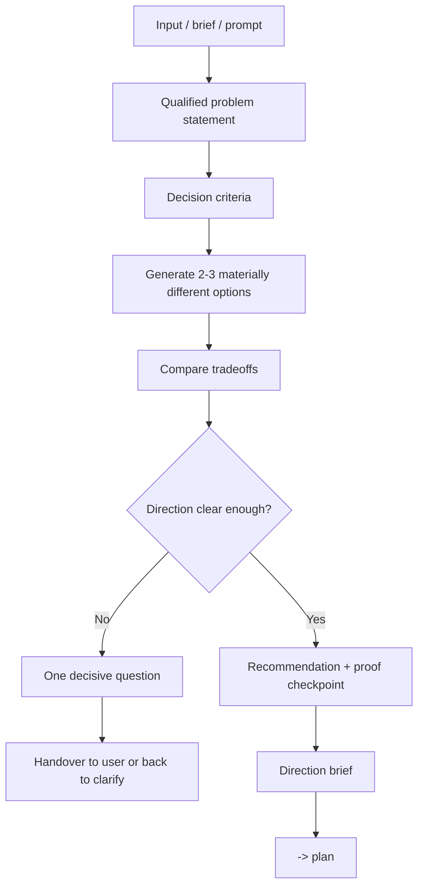

# Brainstorm - Direction Selection

## The Iron Law

```text
NO AMBIGUOUS MEDIUM/LARGE WORK WITHOUT CHOOSING A DIRECTION FIRST
```

> Brainstorm không phải để nở scope. Brainstorm chỉ để chọn hướng đủ rõ trước khi plan.

<HARD-GATE>
Áp dụng khi:
- task medium/large nhưng problem statement còn mơ hồ
- có 2+ hướng giải materially khác nhau
- user hỏi "nên chọn hướng nào", "so sánh options", "brainstorm", "explore"
- quyết định ban đầu sẽ làm thay đổi scope, UX shape, hoặc blast radius

Không áp dụng khi:
- task small, rõ ràng
- chỉ còn chuyển direction đã chốt thành phases/tasks
- chỉ thiếu implementation detail mà không thiếu strategic direction
</HARD-GATE>

## Completion Rule

Brainstorm chỉ được xem là xong khi rơi vào một trong hai trạng thái:

1. `Direction locked`: đã có hướng khuyến nghị đủ mạnh để đưa sang `plan`
2. `Decision blocked`: còn đúng **một** câu hỏi quyết định khiến chưa thể chốt

Không được kết thúc ở trạng thái:
- "cần cân nhắc thêm"
- "có vài hướng đều ổn"
- "để plan quyết định tiếp"

Nếu chưa chọn được hướng và vẫn còn nhiều hơn một open question, brainstorm chưa hoàn tất.

---

## Process



## Qualified Problem Statement

```text
For: [persona / team / workflow]
Who: [pain, unmet need, hoặc job-to-be-done]
That: [desired outcome, business impact, hoặc success signal]
```

Nếu không viết được 3 dòng này, chưa được đi tiếp.

## Decision Criteria

Chốt 3-5 tiêu chí để tránh chọn option theo cảm tính:

- Speed to ship
- Blast radius
- Maintainability
- UX clarity
- Migration safety
- Operational simplicity

Không cần dùng đủ tất cả; chọn cái nào thật sự quan trọng cho bài toán.

## Lightweight Scoring

Khi 2-3 options đều khả thi, chấm nhanh thay vì tranh luận dài:

| Tiêu chí | Cách đọc điểm |
|----------|---------------|
| Feasibility | `1` khó thực thi, `2` khả thi có caveat, `3` dễ thực thi với repo/team hiện tại |
| Impact | `1` tác động nhỏ, `2` cải thiện vừa, `3` tác động rõ lên outcome chính |
| Effort | `1` effort thấp, `2` effort vừa, `3` effort cao |

Template:

```text
Approach A
- Feasibility: [1-3]
- Impact: [1-3]
- Effort: [1-3]
- Read: [...]
```

Rule:
- Không biến scoring thành pseudo-science; đây chỉ là shortcut để chốt direction
- Ưu tiên option có `impact` đủ cao và `feasibility` tốt
- `effort` dùng để nhìn tradeoff, không tự động thắng/thua một mình
- Nếu scoring và decision criteria mâu thuẫn, giải thích ngắn gọn rồi chọn

## Decision Forcing Rules

- Tối đa 3 options. Nhiều hơn thường làm loãng quyết định.
- Mỗi option phải khác nhau về shape thật sự: rollout model, UX model, data flow, ownership, hoặc blast radius.
- Mỗi option phải nói rõ tradeoff chính đang chấp nhận, không chỉ liệt kê ưu/nhược điểm chung chung.
- Nếu một option chỉ là biến thể nhẹ của option khác, gộp lại.
- Mặc định ưu tiên hướng đơn giản hơn nếu nó vẫn đạt success signal và giảm blast radius.
- Nếu không đủ dữ kiện để chọn, không mở rộng research vô hạn; ghi lại đúng 1 câu hỏi quyết định cần user trả lời.

## Option Comparison

Tối thiểu 2 options khi:
- có hơn một hướng khả thi
- hoặc user đang muốn chọn hướng

Đây là nơi chính để Forge làm option comparison đầy đủ. Sau khi direction đã khóa, `plan` chỉ nên kế thừa chứ không lặp lại toàn bộ vòng so sánh này.

Template:

```text
Approach A - [tên]
- Shape: [...]
- Pros: [...]
- Risks: [...]

Approach B - [tên]
- Shape: [...]
- Pros: [...]
- Risks: [...]

Approach C - [optional]
- Shape: [...]
- Pros: [...]
- Risks: [...]

Recommendation:
- Choose: [A/B/C]
- Why: [ngắn gọn, theo decision criteria]
```

Rule:
- Options phải khác nhau về shape, không chỉ đổi tên
- Nếu 2 options gần như giống nhau, gộp lại
- Nếu chỉ có 1 hướng hợp lý thật, phải nói rõ vì sao các hướng khác không đáng xét

## Recommendation Quality

Mỗi recommendation phải trả lời được 4 ý sau:

```text
- Why now: vì sao hướng này hợp nhất với bài toán hiện tại
- Why not the others: vì sao các hướng còn lại không đáng chọn ngay lúc này
- First proof: milestone nhỏ nhất để chứng minh hướng này đúng
- Reversal signal: tín hiệu nào đủ mạnh để quay lại mở decision
```

Nếu thiếu một trong 4 ý trên, recommendation chưa đủ mạnh để handoff sang `plan`.

## Direction Brief

Output ngắn gọn trước khi handoff sang `plan`:

```text
Direction ready:
- Problem statement: [...]
- Decision criteria: [...]
- Options considered: [A/B/C]
- Recommended direction: [...]
- Key tradeoff accepted: [...]
- Why not the others: [...]
- First proof: [...]
- Revisit only if: [...]
- Open questions: [none hoặc 1 câu hỏi quyết định]
- Next: plan
```

## Anti-Patterns

- Brainstorm để kéo scope ra rộng hơn yêu cầu
- Liệt kê 5-7 options cho có vẻ nhiều mà không material difference
- Chọn option theo "nghe hay" thay vì decision criteria
- Brainstorm xong nhưng vẫn không dám recommend
- Handoff sang plan khi chưa có `why not the others` hoặc chưa có `first proof`

## Activation Announcement

```text
Forge Antigravity: brainstorm | chốt direction trước, rồi mới lập plan
```
