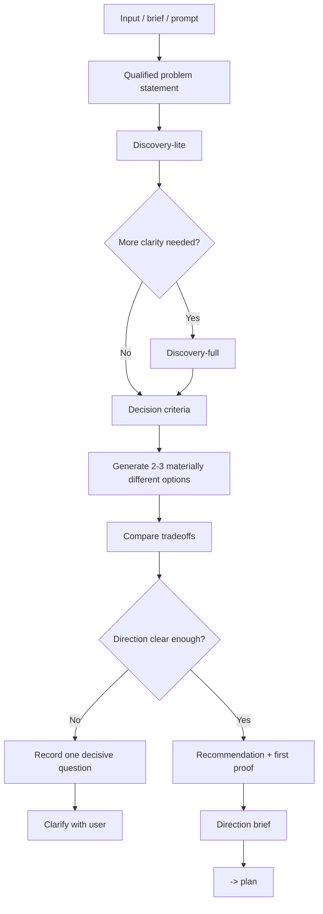

# Brainstorm - Direction Selection

## The Iron Law

```text
NO AMBIGUOUS MEDIUM/LARGE WORK WITHOUT CHOOSING A DIRECTION FIRST
```

> Brainstorm is for choosing a direction, not for expanding scope.

<HARD-GATE>
Use this workflow when:
- the task is medium or large and the problem statement is still vague
- the task is small but still contains a meaningful design, UX, or behavior choice
- there are 2+ materially different solutions
- the user asks to compare options, explore directions, or choose an approach
- the initial decision changes scope, UX shape, ownership, or blast radius

Do not use this workflow when:
- the task is small and clear
- the direction is already locked and only execution planning remains
- only implementation details are missing, not strategic direction
</HARD-GATE>

## Small Creative Work

Small does not mean unreviewed.

If the slice still changes behavior, UX, flow, or ownership, write a compact direction brief, get approval, and only then move into build. Keep the packet short, but do not skip the approval step just because the slice is small.

## Completion Rule

Brainstorm starts with `discovery-lite` and only escalates to `discovery-full` when the first pass still leaves boundary risk, conflicting options, or an unresolved decision that would change scope.

Brainstorm ends in exactly one of these states:

1. `direction-locked`: the recommendation is strong enough to move into `plan`
2. `decision-blocked`: exactly one unresolved question prevents a safe decision

Do not end with:
- "needs more thought"
- "several directions could work"
- "let the plan decide"

If more than one decision question remains open, the brainstorm is incomplete.
When blocked, surface exactly one precise clarification question instead of a list.

## Flat Readiness Checkpoint

Forge uses one flat build path for all behavioral build work. Brainstorm no longer hands off to a separate pre-build review fork; it must make the direction safe enough for `plan` to lock scope and proof.

Before handoff, check:
- the accepted tradeoff is explicit
- assumptions that would change scope are named
- security, migration, auth, payment, public-interface, or compatibility boundaries are not hidden
- the first proof can expose the main failure mode
- the reversal signal says when to reopen the decision instead of pushing uncertainty into build

If any item is still unresolved, do not downgrade the risk or rely on a later fork. Return `decision-blocked` with one decisive question, or escalate from `discovery-lite` to `discovery-full`.

## Process



## Qualified Problem Statement

```text
For: [persona / team / workflow]
Who: [pain, unmet need, or job-to-be-done]
That: [desired outcome, business impact, or success signal]
```

If you cannot write these three lines, you are not ready to compare options.

`discovery-lite` should make these lines crisp enough for a safe recommendation. `discovery-full` is for the cases where the first pass cannot safely lock scope, boundaries, or tradeoffs.

## Decision Criteria

Choose 3-5 criteria so the decision is grounded in tradeoffs instead of instinct.

Common criteria:
- speed to ship
- blast radius
- maintainability
- UX clarity
- migration safety
- operational simplicity

Pick only the criteria that matter for this problem.

## Lightweight Scoring

When 2-3 options are viable, use quick scoring instead of a long debate.

|Criteria | How to read scores|
|----------|-------------------|
|Feasibility | `1` hard with the current repo/team, `2` possible with caveats, `3` straightforward|
|Impact | `1` small impact, `2` moderate improvement, `3` strong effect on the main outcome|
|Effort | `1` low effort, `2` medium effort, `3` high effort|

Template:

```text
Approach A
- Feasibility: [1-3]
- Impact: [1-3]
- Effort: [1-3]
- Notes: [...]
```

Rules:
- do not turn scoring into pseudo-science
- prefer options with strong impact and acceptable feasibility
- use `effort` to compare tradeoffs, not as an automatic veto
- if the scores and the chosen direction differ, explain why

## Decision Rules

- compare at most 3 options
- each option must differ in real shape: rollout model, UX model, data flow, ownership, or blast radius
- each option must state its core tradeoff, not just generic pros and cons
- merge options that differ only superficially
- default toward the simpler direction if it still reaches the success signal and reduces blast radius
- if there is not enough information to decide, record exactly one user-facing decision question

## Options Comparison

Compare at least 2 options when:
- more than one direction is plausible
- or the user explicitly asks to choose between directions

This is the main place where Forge should compare options. Once the direction is locked, `plan` should inherit it instead of repeating the same comparison.

Template:

```text
Approach A - [name]
- Shape: [...]
- Pros: [...]
- Risks: [...]

Approach B - [name]
- Shape: [...]
- Pros: [...]
- Risks: [...]

Approach C - [optional]
- Shape: [...]
- Pros: [...]
- Risks: [...]

Recommendation:
- Choose: [A/B/C]
- Why: [briefly, using the decision criteria]
```

Rules:
- options must be genuinely different
- combine options that are nearly identical
- if there is only one reasonable direction, say explicitly why the others are not worth pursuing

## Recommendation Quality

Every recommendation must answer all four points below:

```text
- Why now: why this direction fits the current problem
- Why not the others: why the remaining options lose right now
- First proof: the smallest milestone that validates the direction
- Reversal signal: what would justify reopening the decision
```

If any of these are missing, the recommendation is not ready for handoff to `plan`.

## Direction Brief

Before handing off to `plan`, produce:

```text
Direction ready:
- Problem statement: [...]
- Decision criteria: [...]
- Options considered: [A/B/C]
- Recommended direction: [...]
- Key tradeoff accepted: [...]
- Boundary assumptions: [...]
- Why not the others: [...]
- First proof: [...]
- Revisit only if: [...]
- Open questions: [none or exactly 1]
- Next: plan
```

## Anti-Patterns

- using brainstorm to widen scope beyond the request
- listing many small variations instead of materially different options
- deferring the choice to `plan`
- calling a direction "good enough" without explaining the tradeoff
- reopening the same debate without new evidence

## Handover

If the direction is locked, hand off:

```text
Brainstorm complete:
- Chosen direction: [...]
- Why this direction wins now: [...]
- Plan-readiness handoff: [scope assumptions, boundary assumptions, proof expectation]
- First proof: [...]
- Reversal signal: [...]
- Next workflow: plan
```

If the decision is blocked, hand off:

```text
Decision blocked:
- Missing answer: [...]
- Why it matters: [...]
- Clarification needed: [one precise question]
- Next step: clarify with user
```

## Activation Announcement

```text
Forge: brainstorm | choose a direction before planning
```

## Response Footer

When this skill is used to complete a task, record its exact skill name in the global final line:

`Skills used: brainstorm`

When multiple Forge skills are used, list each used skill exactly once in the shared `Skills used:` line. When no Forge skill is used for the response, use `Skills used: none`. Keep that `Skills used:` line as the final non-empty line of the response and do not add anything after it.
