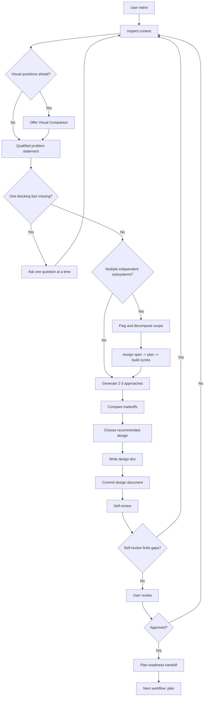

# Brainstorm - Design Doc Generator

## The Iron Law

```text
NO BEHAVIORAL BUILD OR VISUAL DESIGN WORK WITHOUT AN APPROVED DESIGN DOC FIRST
```

Brainstorm is Forge's full design doc generator. It converts unclear intent into an approved design, not just a quick direction note.

## Hard Gate

Use this workflow for:
- all behavioral build work
- all visual design or visualization work
- any task that changes UX, workflow, data flow, public behavior, boundaries, ownership, or rollout shape
- any request that asks for options, exploration, design, or tradeoff comparison

Do not use this workflow for:
- pure typo, formatting, rename, dependency, generated artifact, or mechanical maintenance work
- implementation after an approved design and plan already exist
- debugging where the next step is reproduction, unless the fix will require new behavior design

## Context First

Before proposing solutions:
- inspect the relevant files, docs, tests, commands, current artifacts, and existing user constraints
- restate the problem as a qualified problem statement
- identify the smallest missing fact that blocks the next design decision

Ask one question at a time. Do not batch a list of clarifications. If the user says "you decide", make a controlled assumption and label it in the design doc.

## Offer Visual Companion

When upcoming questions may involve mockups, layout, diagrams, architecture shapes, or visual comparisons, offer the Visual Companion before asking clarifying questions.

This offer MUST be its own message. Do not combine it with clarifying questions, context summaries, approach comparisons, or any other content.

Use this offer shape:

```text
Some of what we're working on might be easier to explain if I can show it in a browser. I can put together mockups, diagrams, comparisons, and other visuals as we go. Want to try it? This requires opening a local URL.
```

If the user declines, continue text-only brainstorming.

If the user accepts, decide per question: would the user understand this better by seeing it than reading it?

Start the local browser server with the bundled Forge tool:

```bash
tools/visual-companion/scripts/start-server.sh --project-dir <workspace>
```

On Windows PowerShell, use:

```powershell
powershell -ExecutionPolicy Bypass -File tools/visual-companion/scripts/start-server.ps1 -ProjectDir <workspace>
```

The server writes session files under:

```text
<workspace>/.forge-artifacts/visual-companion/<session-id>
```

Use the JSON `server-started` output as the source of truth:
- open `url` in the browser
- write each HTML screen or fragment into `screen_dir`
- read browser click choices from `state_dir/events`
- when returning to terminal-only work, write a waiting screen or stop the server with `stop-server.*`

Use the browser for:
- UI mockups, wireframes, visual hierarchy, spacing, side-by-side visual designs
- architecture diagrams, data flow diagrams, state machines, relationship maps
- visual comparisons where the user's answer depends on seeing the options

Use the terminal for:
- requirements and scope questions
- conceptual A/B/C choices
- tradeoff lists and technical decisions
- clarifying questions where the answer is words, not visual preference

The Visual Companion is a tool, not a mode. A visual topic is not automatically a visual question.

## Process



## Qualified Problem Statement

```text
For: [persona / team / workflow]
Who: [pain, unmet need, or job-to-be-done]
That: [desired outcome, business impact, or success signal]
```

If these three lines cannot be written from available context, ask one question at a time until they can.

## Scope Decomposition

Before approach generation, check whether the request describes multiple independent subsystems.

If it does:
- flag the scope as multi-subsystem before designing
- decompose it into named sub-projects with clear ownership boundaries
- give each sub-project its own spec -> plan -> build cycle when independent implementation is safer and its design section is approved
- identify shared contracts, ordering constraints, or coupling that prevent a clean split

Do not compare whole-system approaches until the decomposition is explicit. If the split changes the problem statement, revise it first.
Use this as the default rule: decompose before designing whenever multiple independent subsystems are present. If shared contracts are not locked, keep the related sub-projects in one approval group.

## Approach Generation

Compare 2-3 approaches when more than one real design shape exists.

Good approach differences include:
- different UX or interaction model
- different data flow or ownership boundary
- different migration or compatibility strategy
- different rollout or reversibility model
- different operational or security posture

Avoid fake alternatives that only rename the same design.

Template:

```text
Approach A - [name]
- Shape: [...]
- Benefits: [...]
- Risks: [...]
- Cost: [...]

Approach B - [name]
- Shape: [...]
- Benefits: [...]
- Risks: [...]
- Cost: [...]

Approach C - [optional]
- Shape: [...]
- Benefits: [...]
- Risks: [...]
- Cost: [...]

Recommendation:
- Choose: [A/B/C]
- Why this fits now: [...]
- Why not the others: [...]
```

## Optional Lenses

Brainstorm owns the default design doc. Other workflows are optional lenses, not required stages.

Use `visualize` as a lens when interaction, layout, visual hierarchy, mobile behavior, or companion mockups would make the design safer.

Use `architect` as a lens when system boundaries, data ownership, compatibility, migration, auth, payment, or public API shape need a deeper structural pass.

When a lens is useful:
- call it out in the design doc
- keep the primary route flat: `brainstorm -> plan -> build`
- do not insert the lens as a mandatory stage unless the user explicitly asks

## Flat Readiness Checkpoint

Forge uses one flat build path for all behavioral build work. Brainstorm no longer hands off to a separate pre-build review fork; it must make the design safe enough for `plan` to lock scope, slices, and proof.

Before handoff, confirm:
- the accepted tradeoff is explicit
- assumptions that would change scope are named
- security, migration, auth, payment, public-interface, or compatibility boundaries are not hidden
- the first proof can expose the main failure mode
- the reversal signal says when to reopen the design instead of pushing uncertainty into build

If any item is unresolved, continue design work or ask one precise question. Do not rely on `plan` or `build` to discover the missing design decision.

## Write Design Doc

Write design docs here:

```text
docs/specs/YYYY-MM-DD-<topic>-design.md
```

Use this structure:

```markdown
# [Feature Name] Design

## Problem

For: [...]
Who: [...]
That: [...]

## Context

- Existing behavior: [...]
- Constraints: [...]
- Relevant files/docs/tests: [...]
- Assumptions: [...]

## Goals

- [...]

## Non-Goals

- [...]

## Approaches Considered

### Approach A - [...]
- Shape: [...]
- Benefits: [...]
- Risks: [...]
- Cost: [...]

### Approach B - [...]
- Shape: [...]
- Benefits: [...]
- Risks: [...]
- Cost: [...]

### Approach C - [...]
- Shape: [...]
- Benefits: [...]
- Risks: [...]
- Cost: [...]

## Recommended Design

- Chosen approach: [...]
- Why this direction wins now: [...]
- Why not the others: [...]
- Accepted tradeoff: [...]

## Detailed Design

- User flow: [...]
- Data flow: [...]
- API/contract changes: [...]
- State/model changes: [...]
- Error states: [...]
- Security/privacy boundaries: [...]
- Migration/compatibility: [...]
- Rollout/reversibility: [...]

## Proof Plan

- First proof: [...]
- Test strategy: [...]
- Manual checks: [...]
- Reversal signal: [...]

## Open Questions

- None
```

For small behavioral work, keep sections compact, but still write the doc.

After writing and self-reviewing the file, commit the design document to git before user review. Keep the commit scoped to the design doc and directly related reference updates.

## Self-Review

Before user review, reread the design and answer:
- Does the design solve the stated problem?
- Are all material approaches represented or intentionally rejected?
- Are boundary, auth, payment, migration, public-interface, and compatibility risks explicit?
- Is the proof plan strong enough to catch the main failure mode?
- Is the design small enough for one implementation plan, or should it be split?

If self-review finds a gap, revise the design before asking for user review.

## User Review

After self-review, request user review with the smallest useful packet:

```text
Design ready for review:
- Design doc: docs/specs/YYYY-MM-DD-<topic>-design.md
- Git commit: [commit hash or pending if user requested no commit]
- Recommended design: [...]
- Accepted tradeoff: [...]
- First proof: [...]
- Reversal signal: [...]
- Please approve or request changes before plan.
```

Brainstorm ends in exactly one of these states:
- `design-approved`: user has approved the design and `plan` can start
- `design-blocked`: one precise design question must be answered before approval

For large designs, approval may happen section by section. Treat this as section-by-section approval: scale each review packet to the section's complexity, keep unresolved sections marked as blocked, and do not start `plan` for an unresolved section. An independent sub-project may enter its own `plan` only after its section is approved and any shared contracts it depends on are locked.

## Plan-Readiness Handoff

When approved, hand off:

```text
Brainstorm complete:
- State: design-approved
- Design doc: docs/specs/YYYY-MM-DD-<topic>-design.md
- Chosen design: [...]
- Plan-readiness handoff: [scope assumptions, boundary assumptions, proof expectation]
- First proof: [...]
- Reversal signal: [...]
- Optional design lenses: [none / visualize / architect]
- Next workflow: plan
```

When blocked, hand off:

```text
Brainstorm blocked:
- State: design-blocked
- Missing answer: [...]
- Why it matters: [...]
- Clarification needed: [one precise question]
- Next step: answer the question, then revise the design doc
```

## Anti-Patterns

- proposing solutions before reading context
- asking several questions at once
- combining the Visual Companion offer with any other content
- generating approaches before decomposing multiple independent subsystems
- skipping the design doc because the work is small
- treating section-by-section approval as permission to plan unfinished or contract-dependent sections
- treating `visualize` or `architect` as default stages instead of lenses
- deferring unresolved design decisions to `plan`
- hiding high-risk boundaries behind a flat route

## Activation Announcement

```text
Forge: brainstorm | generate and approve design before plan
```

## Response Footer

When this skill is used to complete a task, record its exact skill name in the global final line:

`Skills used: brainstorm`

When multiple Forge skills are used, list each used skill exactly once in the shared `Skills used:` line. When no Forge skill is used for the response, use `Skills used: none`. Keep that `Skills used:` line as the final non-empty line of the response and do not add anything after it.
