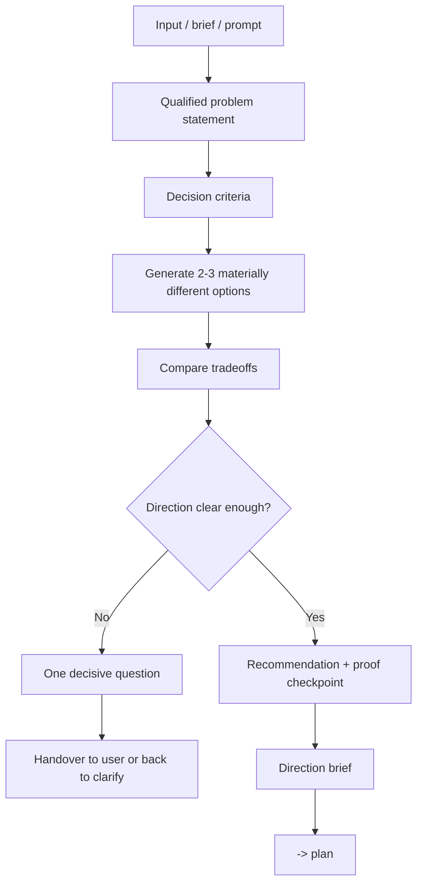

# Brainstorm - Direction Selection

## The Iron Law

```text
NO AMBIGUOUS MEDIUM/LARGE WORK WITHOUT CHOOSING A DIRECTION FIRST
```

> Brainstorm is not for scope expansion. Brainstorming is just to choose a clear enough direction before planning.

<HARD-GATE>
Applicable when:
- task medium/large but problem statement is still vague
- There are 2+ materially different solutions
- user asks "which direction should I choose", "compare options", "brainstorm", "explore"
- the initial decision will change the scope, UX shape, or blast radius

Not applicable when:
- small, clear task
- The only thing left to do is convert the finalized directions into phases/tasks
- only lacks implementation details but not lacks strategic direction
</HARD-GATE>

## Completion Rule

Brainstorm is only considered finished when it falls into one of two states:

1. `Direction locked`: there is a strong enough recommendation to move to `plan`
2. `Decision blocked`: there is still **one** decided question that cannot be finalized

Must not end in the state:
- "needs further consideration"
- "some directions are fine"
- "let the plan decide further"

If a direction has not been chosen and there is still more than one open question, the brainstorm is incomplete.

---

## Process



## Qualified Problem Statement

```text
For: [persona / team / workflow]
Who: [pain, unmet need, or job-to-be-done]
That: [desired outcome, business impact, or success signal]
```

If you can't write these 3 lines, you can't continue.

## Decision Criteria

Determine 3-5 criteria to avoid choosing options based on emotions:

- Speed ​​to ship
- Blast radius
- Maintainability
- UX clarity
- Migration safety
- Operational simplicity

You don't need to use everything; Choose which one is really important for the problem.

## Lightweight Scoring

When 2-3 options are feasible, give a quick score instead of a long debate:

|Criteria | How to read scores|
|----------|---------------|
|Feasibility | `1` is difficult to implement, `2` is possible with caveats, `3` is easy to implement with current repo/team|
|Impact | `1` small impact, `2` moderate improvement, `3` clear impact on main outcome|
|Effort | `1` low effort, `2` medium effort, `3` high effort|

Templates:

```text
Approach A
- Feasibility: [1-3]
- Impact: [1-3]
- Effort: [1-3]
- Read: [...]
```

Rule:
- Do not turn scoring into pseudo-science; This is just a shortcut to fix the directions
- Prioritize options with high enough `impact` and good `feasibility`
- `effort` is used to see winning tradeoff, not automatically/losing alone
- If scoring and decision criteria conflict, briefly explain and then choose

## Decision Forcing Rules

- Maximum 3 options. More often dilutes the decision.
- Each option must be different in actual shape: rollout model, UX model, data flow, ownership, or blast radius.
- Each option must clearly state the main tradeoff being accepted, not just list general pros/cons.
- If one option is just a slight variation of another option, combine it.
- By default, the simpler direction is preferred if it still reaches the success signal and reduces the blast radius.
- If there is not enough data to choose from, do not expand research indefinitely; Record exactly 1 decision question that needs the user to answer.

## Options Comparison

Minimum 2 options when:
- there is more than one possible direction
- or the user wants to choose a direction

This is the main place for Forge to do a full options comparison. Once the direction is locked, `plan` should just inherit and not repeat this entire round of comparisons.

Templates:

```text
Approach A - [name]
- Shape: [...]
- Pros: [...]
- Risks: [...]

Approach B - [name]
- Shape: [...]
- Pros: [...]
- Risks: [...]

Approach C - [optional]
- Shape: [...]
- Pros: [...]
- Risks: [...]

Recommendation:
- Choose: [A/B/C]
- Why: [briefly, according to decision criteria]
```

Rule:
- Options must be different in shape, not just renamed
- If 2 options are almost the same, combine them
- If there is only one reasonable direction, it must be clearly stated why the other directions are not worth considering

## Recommendation Quality

Each recommendation must answer the following 4 points:

```text
- Why now: why is this direction suitable for the current problem?
- Why not the others: why the remaining directions are not worth choosing right now
- First proof: smallest milestone to prove this direction is correct
- Reversal signal: which signal is strong enough to return to open decision
```

If one of the above 4 points is missing, the recommendation is not strong enough to handoff to `plan`.

## Direction Brief

Brief output before handoff to `plan`:

```text
Direction ready:
- Problem statement: [...]
- Decision criteria: [...]
- Options considered: [A/B/C]
- Recommended directions: [...]
- Key tradeoff accepted: [...]
- Why not the others: [...]
- First proof: [...]
- Revisit only if: [...]
- Open questions: [none or 1 decision question]
- Next: plan
```

## Anti-Patterns

- Brainstorm to stretch the scope wider than required
- List 5-7 options to make it seem like a lot without material difference
- Choose options according to "sounds good" instead of decision criteria
- Brainstormed but still don't dare recommend
- Handoff to plan when there is no `why not the others` or no `first proof`

## Activation Announcement

```text
Forge: brainstorm | Set directions first, then make a plan
```
