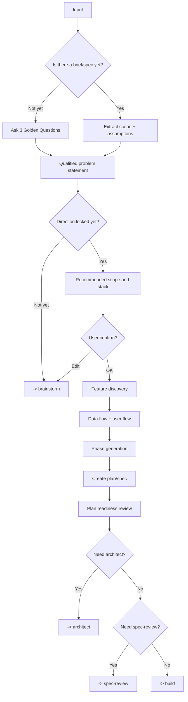

# Plan - Planning & Feature Discovery

## The Iron Law

```
NO MEDIUM/LARGE BUILD WITHOUT A CONFIRMED PLAN FIRST
```

<HARD-GATE>
For medium, large, or vague tasks:
- Do not invoke build skills without finalizing the scope and success criteria.
- The plan can be short, but must be clear enough so that the implementation does not guess.
- If entered from `brainstorm`, the plan must inherit the locked direction; Do not reopen debate options unless there is new evidence or a reversal signal has occurred.
- With large or medium/high-risk, the plan must clearly state whether `spec-review` is needed before building or not.

For small tasks, it's clear:
- No need for a full ceremony.
- Just need a short reset + verification plan then build.

Explicit quick path:
- `quick path` is just a hint to take a short path for task `small`, obviously, blast radius is low.
- This hint can come from a very short prompt, keyword like `quick`, or prefix `/quick`, but Forge does not assume the host must have its own slash command.
- If the task touches migration, contract, auth, public interface, or there are still many different materially paths, skip the quick path and return to the full path.
</HARD-GATE>

---

## Process



## 3 Golden Questions

```
1. Manage what?
2. Who uses it?
3. If you could only do one thing right, what would it be?
```

If the user wants "you to decide", he is allowed to make a controlled guess at the keyword, but must clearly state the assumption.

## Qualified Problem Statement

Use for medium/large or vague tasks to close the problem before finalizing the solution:

```text
For: [persona / team / workflow]
Who: [pain, unmet need, or job-to-be-done]
That: [desired outcome, business impact, or success signal]
```

For example:

```text
For: operations staff
Who: needs to handle repetitive tasks faster without having to open multiple screens
That: task completion time is reduced and operation errors are reduced
```

If the problem statement is still weak, do not jump into the generation phase.
If the problem statement is still not clear enough or the option tradeoffs are too large, return to `brainstorm` before continuing with the plan.
If you already have a good direction brief from `brainstorm`, use it as decision input instead of exploring from scratch.

## Proposal Shape

```
Recommended: [name]
Type: [web / mobile / backend / internal tool]
Core scope:
1. [...]
2. [...]
3. [...]
Stack suggests: [...]
Assumptions: [...]
```

## Direction Intake

`Plan` is not a complete redo of `brainstorm`.

Plan should only continue when one of two things happen:
- already has `direction brief` from `brainstorm`
- or brief/spec/user input has direction locked clearly enough, no longer 2+ materially different directions

Rules:
- If you enter `plan` and there is still a real debate about the approach, return to `brainstorm`
- `Plan` is allowed to summarize the chosen approach, but should not rerun the full option comparison + scoring loop
- If `brainstorm` already has `reversal signal`, only reopen direction when that signal actually occurs or there is new evidence that materially changes the tradeoff

## Feature Discovery

Always check:
- Auth / roles
- Validation / error states
- Search / filter / pagination
- Import / export / audit trail
- Offline / concurrency / approval flow if the domain is at risk

## Phase Generation

|Complexity | Pattern|
|------------|---------|
|**small** | Skip planning, just restore scope + verification|
|**medium** | Setup -> core backend/data -> UI/integration -> test/review|
|**large** | Discovery -> architecture -> implementation phases -> integration -> deploy prep|

Phase >20 tasks -> smaller split.

## Implementation-Ready Plan Packet

With task `medium/large`, the plan must not stop at the "reasonable idea" level. It should be enough that the implementation doesn't have to guess the important part.

Each plan should lock in at least:
- `Source of truth`: which brief/spec/direction is being used
- `File or surface map`: module, boundary, contract, or main file will be touched
- `Task slices`: each slice has a clear goal and can be verified independently
- `Acceptance & proof`: each slice is proven by which test/check
- `Dependencies & order`: order to do and what to expect
- `Reopen conditions`: when to return to `brainstorm`, `plan`, or `architect`

Short templates:

```text
Implementation-ready packet:
- Sources: [...]
- File/surface map: [...]
- Slice 1: [goal] | Files/boundary: [...] | Proof: [...]
- Slice 2: [goal] | Files/boundary: [...] | Proof: [...]
- Dependencies/order: [...]
- Reopen only if: [...]
```

Rule:
- If the implementer still has to guess the main scope, sequence, or proof file, the plan is not ready
- Do not force all files to be listed correctly when the repo is too early; but must indicate boundaries and change surfaces
- If the plan is too large to describe in a short packet, divide it into smaller phases

## Plan Review Loop

Before handoff to `architect`, `spec-review`, or `build`, reread the plan like a reviewer:

### Pass 1: Scope & Sequence
- Is the scope in/out locked?
- Can Phases be built step by step or are they mixing many concerns?
- Are there any slices that must be done at the same time because the contract is unclear?

### Pass 2: Proof & Risk
- Does each slice have a corresponding proof/check?
- Are boundaries, migration, auth, public interface being taken too lightly?
- Is there any assumption that if wrong will ruin the whole plan?

Rules:
- `large`, `high-risk`, `public interface`, `migration`, `auth/payment`: plan review loop is required
- If after 2 rounds of review the plan still hasn't locked the sequence or proof, go back to `brainstorm` or `architect`, don't push the build forward by feeling.
- Plan review does not replace `spec-review`; It is a cleaning step before going to that gate

## Output Files

Priority to stay at:

```
docs/plans/[YYYY-MM-DD]-[feature]-plan.md
docs/specs/[feature]-spec.md
```

Plan should have:
- Qualified problem statement
- Options considered (if task is medium/large)
- Problem / goal
- Scope in/out
- File/surface map
- Task slices with proof per slice
- Risks / assumptions
- Spec-review need: [required / not required + why]
- Phases / tasks
- Verification strategy

## Handover

Before moving on to build or architect, summarize:
```
Plan ready:
- Problem statement: [...]
- Chosen approach: [...]
- Why this direction now: [...]
- File/surface map: [...]
- Task slices: [...]
- First proof milestone: [...]
- Revisit only if: [...]
- Spec-review: [required / not required + why]
- Scope: [...]
- Risks: [...]
- Outputs: [plan/spec files]
- Next: [architect/spec-review/build]
```

## Activation Announcement

```
Forge: plan | lock scope, assumptions, verification before build
```
