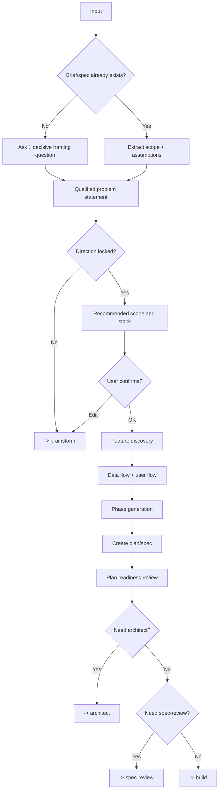

# Plan - Planning & Feature Discovery

## The Iron Law

```text
NO MEDIUM/LARGE BUILD WITHOUT A CONFIRMED PLAN FIRST
```

<HARD-GATE>
For medium, large, or vague tasks:
- do not move into `build` until scope and success criteria are clear
- the plan may be short, but it must be specific enough to prevent guesswork
- if the task came from `brainstorm`, inherit the locked direction unless new evidence forces a reversal
- call out whether `spec-review` is required before build

For small, clear tasks:
- skip formal phase generation
- do a quick scope reset plus a verification plan, then build only after a compact approval
- if the slice is creative or behavior-changing, keep the packet short but still get explicit sign-off before build

Quick path:
- use it only for clearly small, low-risk work
- it may be triggered by a short prompt, `quick`, or `/quick`
- do not use it for migration, contract, auth, public interface, or multi-direction work
</HARD-GATE>

## Process



## Framing Question Discipline

```text
Ask one decisive question at a time:
- What are we building or managing?
- Who uses it?
- If only one thing works perfectly, what must it be?
```

Rules:
- ask the smallest question that unlocks the next planning decision
- if the user says "you decide", you may make a controlled assumption, but you must state it explicitly
- do not batch multiple open clarification questions into one handoff

## Qualified Problem Statement

Use this for medium, large, or vague work:

```text
For: [persona / team / workflow]
Who: [pain, unmet need, or job-to-be-done]
That: [desired outcome, business impact, or success signal]
```

Do not move into phase generation until this statement is clear enough to constrain the solution.

## Proposal Shape

```text
Recommended: [name]
Type: [web / mobile / backend / internal tool]
Core scope:
1. [...]
2. [...]
3. [...]
Suggested stack: [...]
Assumptions: [...]
```

## Quick Approval

For small creative work, the plan may be just one compact packet. It still needs the same essentials: chosen direction, exact scope, baseline proof, and explicit approval before build.

## Direction Intake

`Plan` is not a second brainstorm.

Continue only when one of these is true:
- a `direction brief` already exists from `brainstorm`
- or the brief/spec/user input already locks the direction clearly enough

Rules:
- if the approach is still genuinely contested, go back to `brainstorm`
- plan may summarize the chosen approach, but should not rerun a full option comparison
- only reopen a locked direction when the reversal signal fires or new evidence changes the tradeoff materially

## Feature Discovery

Always check:
- auth and roles
- validation and error states
- search, filter, and pagination
- import, export, and audit trail
- offline, concurrency, and approval flows where the domain makes them risky

## Phase Generation

|Complexity | Pattern|
|------------|--------|
|**small** | Skip formal planning; restore scope and verification only|
|**medium** | Setup -> core backend/data -> UI/integration -> test/review|
|**large** | Discovery -> architecture -> implementation phases -> integration -> deploy prep|

If a phase grows beyond 20 tasks, split it.

## Implementation-Ready Plan Packet

For medium and large work, the plan must be concrete enough that implementation does not have to guess.

Lock at least:
- `Source of truth`: which brief/spec/direction is authoritative
- `File or surface map`: the exact files, modules, boundaries, or contracts likely to change
- `Baseline`: the current command or check that proves the slice is starting from a known state
- `Task slices`: each slice has a clear goal and an independent proof
- `Acceptance & proof`: which test or check proves each slice
- `Out of scope`: what not to touch in this slice
- `Dependencies & order`: what must happen first and what follows
- `Reopen conditions`: when to return to `brainstorm`, `plan`, or `architect`

Template:

```text
Implementation-ready packet:
- Sources: [...]
- File/surface map: [...]
- Baseline: [...]
- Slice 1: [goal] | Files/boundary: [...] | Proof: [...]
- Slice 2: [goal] | Files/boundary: [...] | Proof: [...]
- Out of scope: [...]
- Dependencies/order: [...]
- Reopen only if: [...]
```

Rules:
- if the implementer still has to guess the main scope, sequence, or proof, the plan is not ready
- you do not need a perfect file list early on, but you do need clear boundaries
- if the plan is too large for a compact packet, split it into phases
- if the requirements still feel vague, run `python scripts/generate_requirements_checklist.py ...` before handoff

## Plan Review Loop

Before handing off to `architect`, `spec-review`, or `build`, reread the plan like a reviewer.

### Pass 1: Scope & Sequence
- Is scope in/out clearly locked?
- Can the work be built slice by slice?
- Are there any slices that secretly depend on each other because the contract is still unclear?

### Pass 2: Proof & Risk
- Does each slice have a real proof/check?
- Are migration, auth, public interface, or boundary risks understated?
- Is there any assumption that would invalidate the whole plan if wrong?

Rules:
- this review loop is required for large work and for public-interface, migration, auth, or payment changes
- if two review passes still cannot lock sequence or proof, go back to `brainstorm` or `architect`
- plan review does not replace `spec-review`
- if packet readiness is unclear, run `python scripts/check_spec_packet.py --source <plan-or-spec>` and surface only the first clarification question

## Output Files

Prefer:

```text
docs/plans/[YYYY-MM-DD]-[feature]-plan.md
docs/specs/[feature]-spec.md
```

A plan should include:
- qualified problem statement
- options considered for medium/large work
- goal and success signal
- scope in/out
- file/surface map
- task slices with proof per slice
- risks and assumptions
- spec-review requirement: required / not required + why
- phases/tasks
- verification strategy

## Handover

Before moving to `build` or `architect`, summarize:

```text
Plan ready:
- Problem statement: [...]
- Chosen approach: [...]
- Why this direction now: [...]
- Scope in/out: [...]
- Task slices: [...]
- Verification strategy: [...]
- Reopen only if: [...]
- Next workflow: [architect / spec-review / build]
```

## Activation Announcement

```text
Forge: plan | lock scope, slices, and proof before build
```
