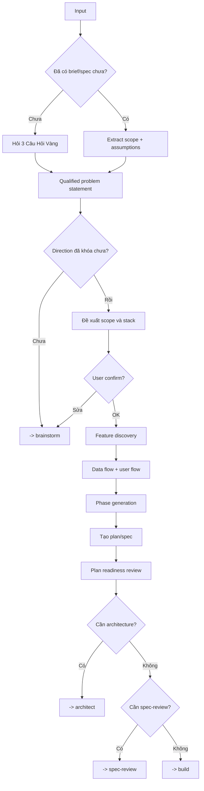

# Plan - Planning & Feature Discovery

## The Iron Law

```
NO MEDIUM/LARGE BUILD WITHOUT A CONFIRMED PLAN FIRST
```

<HARD-GATE>
Với task medium, large, hoặc mơ hồ:
- Không invoke build skill khi chưa chốt scope và success criteria.
- Plan có thể ngắn, nhưng phải đủ rõ để implementation không đoán mò.
- Nếu đã vào từ `brainstorm`, plan phải kế thừa direction đã chốt; không mở lại debate options trừ khi có evidence mới hoặc reversal signal đã xảy ra.
- Với large hoặc medium/high-risk, plan phải nói rõ có cần `spec-review` trước khi build hay không.

Với task small, rõ ràng:
- Không cần ceremony đầy đủ.
- Chỉ cần restate ngắn + verification plan rồi build.

Explicit quick path:
- `quick path` chỉ là hint để đi đường ngắn cho task `small`, rõ ràng, blast radius thấp.
- Hint này có thể đến từ prompt rất ngắn, từ khóa như `quick`, hoặc prefix `/quick`, nhưng Forge không giả định host phải có slash command riêng cho nó.
- Nếu task chạm migration, contract, auth, public interface, hoặc vẫn còn nhiều hướng materially khác nhau, bỏ qua quick path và quay về path đầy đủ.
</HARD-GATE>

---

## Process



## 3 Câu Hỏi Vàng

```
1. Quản lý cái gì?
2. Ai dùng nó?
3. Nếu chỉ làm đúng 1 việc, việc đó là gì?
```

Nếu user muốn "em quyết định giúp", được phép đoán có kiểm soát từ keyword, nhưng phải ghi rõ assumption.

## Qualified Problem Statement

Dùng cho task medium/large hoặc mơ hồ để chốt vấn đề trước khi chốt giải pháp:

```text
For: [persona / team / workflow]
Who: [pain, unmet need, hoặc job-to-be-done]
That: [desired outcome, business impact, hoặc success signal]
```

Ví dụ:

```text
For: nhân viên vận hành
Who: cần xử lý tác vụ lặp lại nhanh hơn mà không phải mở nhiều màn hình
That: thời gian hoàn tất tác vụ giảm và lỗi thao tác giảm
```

Nếu problem statement còn yếu, chưa được nhảy vào phase generation.
Nếu problem statement vẫn chưa đủ rõ hoặc option tradeoffs còn quá lớn, quay lại `brainstorm` trước khi tiếp tục plan.
Nếu đã có direction brief tốt từ `brainstorm`, dùng nó làm decision input thay vì khám phá lại từ đầu.

## Proposal Shape

```
Đề xuất: [tên]
Loại: [web / mobile / backend / internal tool]
Core scope:
1. [...]
2. [...]
3. [...]
Stack gợi ý: [...]
Assumptions: [...]
```

## Direction Intake

`Plan` không phải nơi làm lại đầy đủ việc của `brainstorm`.

Plan chỉ nên đi tiếp khi có một trong hai điều:
- đã có `direction brief` từ `brainstorm`
- hoặc brief/spec/user input đã khóa direction đủ rõ, không còn 2+ hướng materially khác nhau

Rules:
- Nếu vào `plan` mà vẫn còn debate thật sự về approach, quay lại `brainstorm`
- `Plan` được phép tóm tắt chosen approach, nhưng không nên chạy lại full option comparison + scoring loop
- Nếu `brainstorm` đã có `reversal signal`, chỉ reopen direction khi signal đó thật sự xảy ra hoặc có evidence mới materially làm đổi tradeoff

## Feature Discovery

Always check:
- Auth / roles
- Validation / error states
- Search / filter / pagination
- Import / export / audit trail
- Offline / concurrency / approval flow nếu domain có nguy cơ

## Phase Generation

| Complexity | Pattern |
|------------|---------|
| **small** | Skip planning, chỉ restate scope + verification |
| **medium** | Setup -> core backend/data -> UI/integration -> test/review |
| **large** | Discovery -> architecture -> implementation phases -> integration -> deploy prep |

Phase >20 tasks -> split nhỏ hơn.

## Implementation-Ready Plan Packet

Với task `medium/large`, plan không được dừng ở mức "ý tưởng hợp lý". Nó phải đủ để implementation không phải đoán phần quan trọng.

Mỗi plan nên khóa tối thiểu:
- `Source of truth`: brief/spec/direction nào đang được dùng
- `File or surface map`: module, boundary, contract, hoặc file chính sẽ bị chạm
- `Task slices`: mỗi slice có mục tiêu rõ và có thể verify độc lập
- `Acceptance & proof`: mỗi slice chứng minh xong bằng test/check nào
- `Dependencies & order`: thứ tự phải làm và thứ gì chờ thứ gì
- `Reopen conditions`: khi nào phải quay lại `brainstorm`, `plan`, hoặc `architect`

Template ngắn:

```text
Implementation-ready packet:
- Sources: [...]
- File/surface map: [...]
- Slice 1: [goal] | Files/boundary: [...] | Proof: [...]
- Slice 2: [goal] | Files/boundary: [...] | Proof: [...]
- Dependencies/order: [...]
- Reopen only if: [...]
```

Rule:
- Nếu implementer vẫn phải đoán file scope, sequence, hoặc proof chính, plan chưa ready
- Không ép liệt kê mọi file chính xác khi repo còn quá sớm; nhưng phải chỉ ra được boundary và change surfaces
- Nếu plan quá lớn để mô tả trong một packet ngắn, chia lại thành phases nhỏ hơn

## Plan Review Loop

Trước khi handoff sang `architect`, `spec-review`, hoặc `build`, đọc lại plan như một reviewer:

### Pass 1: Scope & Sequence
- Scope in/out đã khóa chưa?
- Phases có build được từng bước hay đang trộn nhiều concern?
- Có slice nào buộc phải làm cùng lúc vì contract chưa rõ không?

### Pass 2: Proof & Risk
- Mỗi slice đã có proof/check tương ứng chưa?
- Boundary, migration, auth, public interface có bị xem quá nhẹ không?
- Có assumption nào nếu sai sẽ phá vỡ cả plan không?

Rules:
- `large`, `high-risk`, `public interface`, `migration`, `auth/payment`: plan review loop là bắt buộc
- Nếu sau 2 vòng review mà plan vẫn chưa khóa được sequence hoặc proof, quay lại `brainstorm` hoặc `architect`, không đẩy build đi tiếp bằng cảm giác
- Plan review không thay thế `spec-review`; nó là bước làm sạch trước khi tới gate đó

## Output Files

Ưu tiên lưu tại:

```
docs/plans/[YYYY-MM-DD]-[feature]-plan.md
docs/specs/[feature]-spec.md
```

Plan nên có:
- Qualified problem statement
- Options considered (nếu task medium/large)
- Problem / goal
- Scope in / out
- File/surface map
- Task slices với proof per slice
- Risks / assumptions
- Spec-review need: [required / not required + why]
- Phases / tasks
- Verification strategy

## Handover

Trước khi chuyển sang build hoặc architect, tóm tắt:
```
Plan ready:
- Problem statement: [...]
- Chosen approach: [...]
- Why this direction now: [...]
- File/surface map: [...]
- Task slices: [...]
- First proof milestone: [...]
- Revisit only if: [...]
- Spec-review: [required / not required + why]
- Scope: [...]
- Risks: [...]
- Outputs: [plan/spec files]
- Next: [architect/spec-review/build]
```

## Activation Announcement

```
Forge: plan | chốt scope, assumptions, verification trước khi build
```
