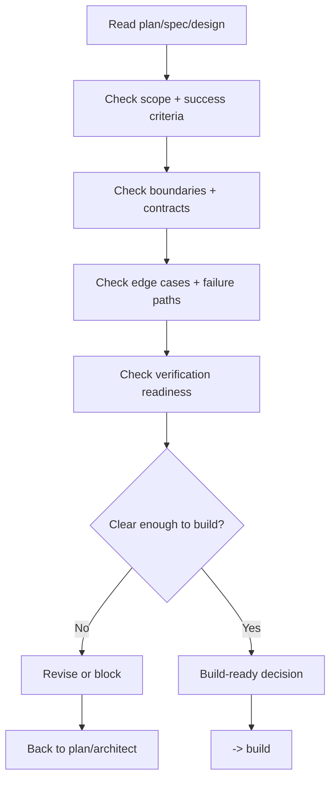

# Spec Review - Implementation Readiness

## The Iron Law

```text
NO HIGH-RISK BUILD WITHOUT A BUILD-READINESS REVIEW FIRST
```

> `plan` defines what to build. `architect` defines how it should work. `spec-review` is the risk gate that decides whether the packet is clear enough to implement safely.

<HARD-GATE>
Use this workflow when:
- the task is `large`
- the task is `medium` and touches contract, schema, migration, auth, payment, webhook, public API, or another high-risk boundary
- the direction/spec changed materially and implementation drift is now likely
- the packet is unclear enough that an implementer would have to guess the boundary, even if the task sounds small

Do not use this workflow when:
- the task is `small`, clear, and narrowly scoped
- the change is minor text/style/config work with no behavior or contract impact

If `spec-review` returns `revise` or `blocked`, do not proceed to `build`.
Cap the `revise` loop at `3` rounds for the same packet; round `4` becomes `blocked`.
This is the pre-build readiness review. It is different from the post-build `spec-compliance` lane.

For solo-profile work, treat `spec-review` as the explicit boundary check before implementation, not as a size-based formality.
</HARD-GATE>

## Process



## Review Lenses

### 1. Scope & Outcome
- Is scope in/out clear?
- Are success criteria measurable?
- Are assumptions still being deferred to implementation?

### 2. Contract & Compatibility
- Which API/schema/event/consumer boundary changes?
- Is the compatibility window explicit?
- Which callers or consumers must update in lockstep?
- If the packet touches data flow, jobs, or webhooks, what migration/backfill/replay window must stay safe?
- Is the transport boundary still thin enough that business logic will stay in services instead of leaking into handlers?

### 3. Failure Paths & Ops
- Are major error states and operator actions covered?
- Is rollback, fallback, or a kill switch needed?
- Are any irreversible steps still missing a guardrail?
- Is retry/replay/idempotency explicit for async work, related writes, or side effects?
- Are observability and audit signals clear enough to investigate the changed boundary in production?

### 4. Verification Readiness
- Is there a concrete failing test or reproduction path?
- Are acceptance checks close enough to the blast radius?
- What would remain unverified if implementation started now?
- If packet readiness is fuzzy, run `python scripts/check_spec_packet.py --source <plan-or-spec>` and keep only the first clarification question

### 5. Risk Gate Fit
- Does the packet need a risk gate because it crosses a contract, boundary, or release surface?
- Is the first implementation slice specific enough to avoid drift?
- Would a solo-dev implementation be forced to infer policy from chat memory?

## Build-Readiness Decisions

|Decision | Use when|
|----------|---------|
|`go` | Scope, boundaries, edge cases, and verification are clear enough to build|
|`revise` | The direction is sound, but specific gaps must be fixed before implementation|
|`blocked` | Major gaps remain in shape, ownership, rollback, or success criteria|

Rules:
- use `go` only when the implementer does not need to guess the important parts
- `revise` must list the exact deltas required
- use `blocked` when coding now would likely cause drift or major rework
- if the only blocker is missing user intent, `blocked` should carry one precise clarification question, not a questionnaire

## Review Loop Discipline

`spec-review` is an implementation-independent lane.

Rules:
- if the host supports reviewer lanes or subagents, prefer an independent spec-reviewer
- otherwise, still run spec-review as a distinct pass after `plan` or `architect`
- allow at most `3` `revise` rounds for the same packet
- every revision round must call out concrete deltas, not vague feedback
- round `4+` becomes `blocked` and returns upstream

Template:

```text
Spec-review iteration:
- Iteration: [1/3]
- Decision: [go / revise / blocked]
- Exact deltas required: [...]
- Re-review after: [...]
```

If the answer depends on public surface, release surface, or unclear packet shape, keep the gate conservative and return `revise` until the boundary is explicit.

## What Must Be Explicit Before `go`

- current source of truth: which plan/spec/design packet is authoritative
- first implementation slice
- first file/surface/boundary map
- baseline verification path
- exact boundary change
- caller/consumer sequencing for any contract change
- transaction or idempotency stance for related writes, retries, or replay
- acceptance criteria to prove
- proof/check required before declaring the slice complete
- key edge cases to preserve
- observability, rollback, or operator notes for flows with blast radius
- worktree bootstrap or other isolation plan when build will run in `worktree`
- reopen conditions

## Implementation-Ready Packet Check

`Go` means more than "the idea is reasonable". It means the work can start without guessing the critical parts.

Review this packet shape:

```text
Implementation-ready:
- Sources: [...]
- First slice: [...]
- File/surface map: [...]
- Baseline verification path: [...]
- Proof before progress: [...]
- Worktree bootstrap / isolation plan: [...]
- Must-preserve edges: [...]
- Reopen only if: [...]
```

Rules:
- if you cannot name the first slice, the build is likely to drift immediately
- if the build will use `worktree` but the bootstrap plan is still implicit, the decision cannot be `go`
- if you cannot name the proof before progress, verification will get pushed to the end
- if the boundary map is ambiguous for contracts, schema, or public interfaces, the decision cannot be `go`

## Spec Review Checklist

- [ ] Problem statement and direction are clear
- [ ] Scope in/out is explicit
- [ ] Affected boundaries/contracts are stated
- [ ] Caller/consumer sequencing and compatibility window are explicit when contracts move
- [ ] First slice and file/surface map are specific enough to start build
- [ ] Edge cases, failure paths, and rollback concerns are covered
- [ ] Transaction/idempotency and observability notes exist for backend or async boundaries
- [ ] Verification strategy is close enough to the blast radius
- [ ] Decision is explicit: `go`, `revise`, or `blocked`
- [ ] If not `go`, the correct step back to `plan` or `architect` is named

## Output

```text
Spec review:
- Review iteration: [n/3]
- Sources: [plan/spec/design files]
- Decision: [go / revise / blocked]
- Exact deltas required: [...]
- First slice: [...]
- Proof before progress: [...]
- Reopen only if: [...]
```

## Activation Announcement

```text
Forge: spec-review | confirm build readiness before implementation
```

## Response Footer

When this skill is used to complete a task, record its exact skill name in the global final line:

`Skills used: spec-review`

When multiple Forge skills are used, list each used skill exactly once in the shared `Skills used:` line. When no Forge skill is used for the response, use `Skills used: none`. Keep that `Skills used:` line as the final non-empty line of the response and do not add anything after it.
