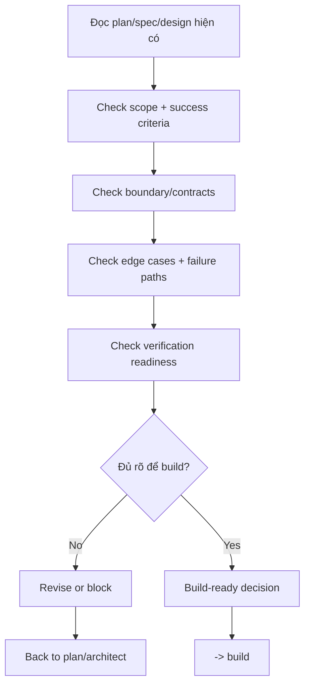

# Spec Review - Implementation Readiness

## The Iron Law

```text
NO HIGH-RISK BUILD WITHOUT A BUILD-READINESS REVIEW FIRST
```

> `plan` chốt làm gì. `architect` chốt làm như thế nào. `spec-review` chốt đã đủ rõ để thi công chưa.

<HARD-GATE>
Áp dụng khi:
- task `large`
- task `medium` nhưng chạm contract, schema, migration, auth, payment, webhook, public API, integration boundary, hoặc blast radius cao
- direction/spec vừa đổi mạnh sau brainstorm/architect và có nguy cơ implementation hiểu sai

Không áp dụng khi:
- task `small`, rõ ràng, blast radius hẹp
- chỉ sửa text/style/config nhỏ không đổi behavior hay contract

Nếu `spec-review` trả về `revise` hoặc `blocked`, không được nhảy vào `build`.
`Revise` không được lặp vô hạn. Mặc định tối đa `3` vòng revise cho cùng một spec packet; quá ngưỡng này phải chuyển `blocked` và quay upstream.
</HARD-GATE>

## Process



## Review Lenses

### 1. Scope & Outcome
- Scope in/out đã đủ rõ chưa?
- Success criteria có đo được không?
- Có assumption nào vẫn đang "để build tự hiểu" không?

### 2. Contract & Compatibility
- API/schema/event/consumer boundary nào bị đổi?
- Compatibility window có rõ không?
- Caller/consumer nào phải update cùng lúc?

### 3. Failure Paths & Ops
- Error states chính đã được nghĩ tới chưa?
- Rollback, fallback, hoặc kill switch có cần không?
- Có bước nào irreversible mà chưa có guardrail không?

### 4. Verification Readiness
- Failing test/repro path đã nghĩ tới chưa?
- Acceptance checks có đủ gần blast radius không?
- Có phần nào sẽ không verify được nếu nhảy vào code ngay?

## Build-Readiness Decisions

| Decision | Dùng khi |
|----------|----------|
| `go` | Scope, contracts, edge cases, và verification đã đủ rõ để build |
| `revise` | Hướng đúng nhưng còn thiếu vài chỗ cụ thể cần bổ sung trước khi build |
| `blocked` | Còn lỗ hổng lớn về shape, ownership, rollback, hoặc success criteria |

Rule:
- `go` chỉ dùng khi implementation team không phải đoán phần quan trọng
- `revise` phải chỉ ra đúng phần cần bổ sung
- `blocked` dùng khi nếu code ngay sẽ rất dễ drift hoặc tạo rework lớn

## Review Loop Discipline

`Spec-review` là lane độc lập với implementation, không phải phần mở rộng của implementer.

Rules:
- Nếu host hỗ trợ subagent/reviewer lane, ưu tiên dùng spec-reviewer lane độc lập
- Nếu host không hỗ trợ, vẫn phải chạy spec-review như một pass riêng sau plan/architect
- Tối đa `3` vòng `revise` cho cùng một spec packet
- Mỗi vòng revise phải chỉ ra delta cụ thể để sửa; không được lặp lại feedback mơ hồ
- Vòng `4` trở đi -> `blocked` và quay lại `plan` hoặc `architect`

Iteration template:

```text
Spec-review iteration:
- Iteration: [1/3]
- Decision: [go / revise / blocked]
- Exact deltas required: [...]
- Re-review after: [...]
```

## What Must Be Explicit

Trước khi `go`, spec-review phải nhìn thấy rõ:
- nguồn truth hiện tại: plan/spec/design nào đang dùng
- first implementation slice là gì
- file/surface map hoặc boundary map nào sẽ bị chạm đầu tiên
- boundary đổi ở đâu
- acceptance criteria nào sẽ chứng minh xong
- proof/check nào phải xuất hiện trước khi nói slice đầu đã xong
- edge case chính nào phải giữ
- khi nào được reopen spec

## Implementation-Ready Packet Check

`Go` không chỉ có nghĩa là "ý đúng". Nó phải có nghĩa là "thi công được mà không đoán phần quan trọng".

Spec-review nên kiểm tra packet ngắn sau:

```text
Implementation-ready:
- Sources: [...]
- First slice: [...]
- File/surface map: [...]
- Proof before progress: [...]
- Must-preserve edges: [...]
- Reopen only if: [...]
```

Rules:
- Nếu chưa nói được `first slice`, build rất dễ drift ngay từ edit đầu
- Nếu chưa nói được `proof before progress`, verification sẽ bị đẩy về cuối
- Nếu boundary map còn mơ hồ ở contract/schema/public interface, decision không thể là `go`

## Spec Review Checklist

- [ ] Problem statement và chosen direction đã rõ
- [ ] Scope in/out không còn mơ hồ
- [ ] Boundary/contracts bị ảnh hưởng đã được nêu
- [ ] First slice và file/surface map đủ rõ để bắt đầu build
- [ ] Edge cases, failure paths, hoặc rollback concerns đã được chạm tới
- [ ] Verification strategy đủ gần với blast radius
- [ ] Có decision `go / revise / blocked`
- [ ] Nếu chưa `go`, đã chỉ ra đúng bước quay lại `plan` hay `architect`

## Output

```text
Spec review:
- Review iteration: [n/3]
- Sources: [plan/spec/design files]
- Decision: [go / revise / blocked]
- Build-ready because: [...]
- Missing or weak spots: [...]
- Edge cases to preserve: [...]
- Verification must prove: [...]
- Reopen only if: [...]
- Next: [build / plan / architect]
```

## Activation Announcement

```text
Forge Antigravity: spec-review | chốt build-readiness trước khi vào implementation rủi ro cao
```
