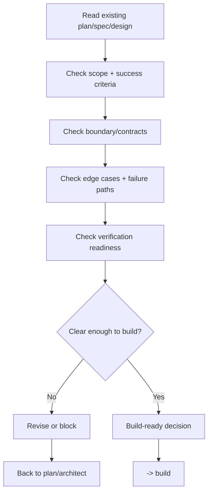

# Spec Review - Implementation Readiness

## The Iron Law

```text
NO HIGH-RISK BUILD WITHOUT A BUILD-READINESS REVIEW FIRST
```

> What does `plan` do? `architect` how to do it. `spec-review` Is the latch clear enough for construction?

<HARD-GATE>
Applicable when:
- task `large`
- task `medium` but touches contract, schema, migration, auth, payment, webhook, public API, integration boundary, or high blast radius
- direction/spec has just changed drastically after brainstorm/architect and there is a risk of implementation misunderstanding

Not applicable when:
- task `small`, clear, narrow blast radius
- Only minor text/style/config changes, no behavior or contract changes

If `spec-review` returns `revise` or `blocked`, do not jump to `build`.
`Revise` cannot loop indefinitely. Default maximum `3` revision rounds for the same spec packet; If you exceed this threshold, you must switch `blocked` and turn upstream.
</HARD-GATE>

## Process



## Review Lenses

### 1. Scope & Outcome
- Is the scope in/out clear enough?
- Are success criteria measurable?
- Are there any assumptions that are still "left to build to understand"?

### 2. Contract & Compatibility
- Which API/schema/event/consumer boundary was changed?
- Is the Compatibility window clear?
- Which caller/consumer must update at the same time?

### 3. Failure Paths & Ops
- Have major error states been thought about?
- Is rollback, fallback, or kill switch necessary?
- Are there any irreversible steps that don't have a guardrail?

### 4. Verification Readiness
- Have you thought about failing test/repro path yet?
- Are acceptance checks close enough to the blast radius?
- Are there any parts that won't be verified if you jump into the code right away?

## Build-Readiness Decisions

|Decision | Use when|
|----------|----------|
|`go` | Scope, contracts, edge cases, and verification are clear enough to build|
|`revise` | The direction is correct but there are still some specific areas missing that need to be added before building|
|`blocked` | There are big gaps in shape, ownership, rollback, or success criteria|

Rule:
- `go` is only used when the implementation team does not have to guess important parts
- `revise` must indicate the correct part to be added
- `blocked` is used when if you code right away, it will be easy to drift or create a large rework

## Review Loop Discipline

`Spec-review` is an implementation-independent lane, not an implementer extension.

Rules:
- If the host supports subagent/reviewer lane, priority should be given to using an independent spec-reviewer lane
- If the host does not support it, you still have to run spec-review as a separate pass after plan/architect
- Maximum `3` round `revise` for the same spec packet
- Each revision round must indicate the specific delta to be corrected; Do not repeat vague feedback
- Round `4` onwards -> `blocked` and back to `plan` or `architect`

Iteration template:

```text
Spec-review iteration:
- Iteration: [1/3]
- Decision: [go / revise / blocked]
- Exact deltas required: [...]
- Re-review after: [...]
```

## What Must Be Explicit

Before `go`, spec-review must clearly see:
- Current source of truth: which plan/spec/design is being used
- What is first implementation slice?
- Which file/surface map or boundary map will be touched first
- Where does the boundary change?
- Which acceptance criteria will be proven?
- What proof/check must appear before saying the first slice is done?
- Which main edge case must be kept?
- When will the spec be reopened?

## Implementation-Ready Packet Check

`Go` doesn't just mean "correct idea". It should mean "can be constructed without guessing the important part".

Spec-review should examine the following short packets:

```text
Implementation-ready:
- Sources: [...]
- First slice: [...]
- File/surface map: [...]
- Proof before progress: [...]
- Must-preserve edges: [...]
- Reopen only if: [...]
```

Rules:
- If you can't say `first slice` yet, the build is very easy to drift right from the first edit
- If you cannot say `proof before progress`, verification will be pushed to the end
- If the boundary map is ambiguous in the contract/schema/public interface, the decision cannot be `go`

## Spec Review Checklist

- [ ] Problem statement and chosen direction are clear
- [ ] Scope in/out is no longer ambiguous
- [ ] Affected boundaries/contracts are stated
- [ ] First slice and file/surface map are clear enough to start building
- [ ] Edge cases, failure paths, or rollback concerns have been reached
- [ ] Verification strategy is close enough to blast radius
- [ ] Yes decision `go / revise / blocked`
- [ ] If not `go`, the correct step back to `plan` or `architect` is indicated

## Output

```text
Spec review:
- Review iteration: [n/3]
- Sources: [plan/spec/design files]
- Decision: [go / revise / blocked]
- Build-ready because: [...]
- Missing or weak spots: [...]
- Edge cases to preserve: [...]
- Verification must prove: [...]
- Reopen only if: [...]
- Next: [build / plan / architect]
```

## Activation Announcement

```text
Forge: spec-review | Lock build-readiness before entering high-risk implementation
```
