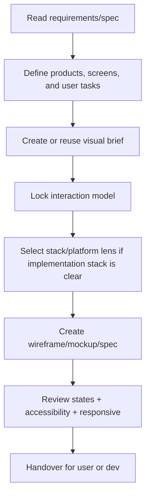

# Visualize - UI/UX Design

## The Iron Law

```
DO NOT CODE UI BEFORE THE INTERACTION MODEL IS CLEAR
```

## First Artifact

```
NO MEDIUM/LARGE VISUALIZE TASK WITHOUT A VISUAL BRIEF.
```

Visual brief must be finalized first:
- product/screen goal
- visual direction and tone
- screen map or interaction flow
- component/state matrix
- responsive/platform constraints
- accessibility and motion boundaries

If the brief is not available:

```powershell
python ../../scripts/generate_ui_brief.py "Task summary" --mode visualize --stack generic-web --platform web
```

Read `../../references/ui-briefs.md` if you want to persist `MASTER.md` + page override for multiple screens.
If using persisted brief, validate as quickly as:

```powershell
python ../../scripts/check_ui_brief.py .forge-artifacts/ui-briefs/<project-slug>/visualize --mode visualize --screen <screen>
```

If the task concept spans a long time or multiple screens:

```powershell
python ../../scripts/track_ui_progress.py "Task summary" --mode visualize --stage interaction-model --status active
```

If a persisted brief already exists and `forge-design` is installed, you can materialize a review packet before mockup handoff:

```powershell
python ../../scripts/invoke_runtime_tool.py forge-design render-brief .forge-artifacts/ui-briefs/<project-slug>/visualize --screen <screen>
```

If `forge-browse` is also available, capture the packet into review evidence instead of leaving it as an unverified HTML artifact.

## Process



## Deliverables

Depending on the task, the output can be:
- visual brief
- text wireframe
- screen notes
- component/state matrix
- design spec for dev
- mockup using design tool if available

## Stack & Platform Lens

If the request is tied to the implementation stack, select the closest profile in `../../references/frontend-stack-profiles.md` before giving directions.

For example:
- web dashboard unknown stack -> `generic-web`
- Vite/React app -> `react-vite`
- tablet/webview POS -> `mobile-webview`

If the user wants more visual directions, palette/typography exploration, or the direction is too open, look at `../../references/ui-escalation.md` and consider loading `$ui-ux-pro-max`.
Quick examples to increase specificity: `../../references/ui-good-bad-examples.md`
Heuristics for touch/dense-data/dashboard UI: `../../references/ui-heuristics.md`

## Design Spec Template

```markdown
# Design Specs: [Screen]

## Layout
[text wireframe or description]

## Visual Direction
- Tone: [...]
- Key hierarchy: [...]
- Tokens or visual constraints: [...]

## Components
|Component | Type | States | Notes|
|-----------|------|--------|-------|

## Interactions
- Tap/click [element] -> [action]
- Error/loading/empty states -> [behavior]
- Motion boundaries -> [allowed / avoid]

## Responsive / Platform
- Mobile: [...]
- Tablet/Desktop: [...]
- Safe-area or keyboard notes: [...]

## Accessibility
- Focus / labels / keyboard / contrast / reduced-motion notes
```

## Fast Anti-Patterns

Reject quickly if you see:
- design only has happy path, no system states
- Directions are too general so developers have to guess themselves
- assume desktop hover for touch-heavy flow
- Motion is beautiful but confuses hierarchy or accessibility
- screen spec says nothing about responsive/platform constraints

Shared delivery checklist: `../../references/ui-quality-checklist.md`
Specific examples: `../../references/ui-good-bad-examples.md`

## Good / Bad Examples

### Interaction model clarity

Bad:

```text
"New, modern, more beautiful dashboard."
```

Problem:
- dev doesn't know hierarchy
- don't know which states are important
- don't know where the primary action is

Good:

```text
"Dashboard prioritizes 5 main KPIs in the first row, filters are on top, secondary insights are in the second row."
```

### Dense data planning

Bad:

```text
Cram every metric, chart, filter, and CTA into the same fold.
```

Good:

```text
Divide information into clusters of 5-9 main items, secondary actions go into tabs or overflow.
```

### Touch-heavy assumption

Bad:

```text
Primary actions are only available in hover menus.
```

Good:

```text
The primary action is always present, hover is just an enhancement for pointer devices.
```

## Cross-Platform Checklist

- [ ] Visual brief already exists or has been reused validly
- [ ] If using persisted brief, `check_ui_brief.py` does not fail
- [ ] If the task is long, the progress artifact has been updated
- [ ] Screen goal and interaction model clearly
- [ ] States: default/loading/empty/error was stated
- [ ] Breakpoints / platform constraints have been viewed
- [ ] Touch targets / safe-area / keyboard notes available if relevant
- [ ] Motion should only be used when it does not harm readability or accessibility
- [ ] Dense-data / dashboard / touch-heavy heuristics were seen if the task was of that type
- [ ] Handoff is clear enough so developers don't have to guess the visual direction

## Handover

```text
Visualize reports:
- Brief: [new/reused + path if available]
- Progress: [path if available]
- Screens: [...]
- Interaction model: [...]
- Visual direction: [...]
- Assets/specs: [...]
- Open questions: [...]
```

## Activation Announcement

```text
Forge: visualize | create/reuse visual brief first, then finalize spec/mockup
```
