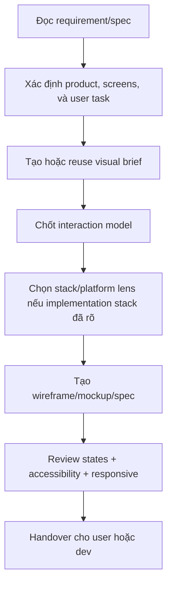

# Visualize - UI/UX Design

## The Iron Law

```
DO NOT CODE UI BEFORE THE INTERACTION MODEL IS CLEAR
```

## First Artifact

```
NO MEDIUM/LARGE VISUALIZE TASK WITHOUT A VISUAL BRIEF.
```

Visual brief phải chốt trước:
- product/screen goal
- visual direction và tone
- screen map hoặc interaction flow
- component/state matrix
- responsive/platform constraints
- accessibility và motion boundaries

Nếu brief chưa có:

```powershell
python ../../scripts/generate_ui_brief.py "Task summary" --mode visualize --stack generic-web --platform web
```

Đọc `../../references/ui-briefs.md` nếu muốn persist `MASTER.md` + page override cho nhiều màn hình.
Nếu dùng persisted brief, validate nhanh bằng:

```powershell
python ../../scripts/check_ui_brief.py .forge-artifacts/ui-briefs/<project-slug>/visualize --mode visualize --screen <screen>
```

Nếu task concept kéo dài hoặc nhiều màn hình:

```powershell
python ../../scripts/track_ui_progress.py "Task summary" --mode visualize --stage interaction-model --status active
```

## Process



## Deliverables

Tùy task, output có thể là:
- visual brief
- text wireframe
- screen notes
- component/state matrix
- design spec cho dev
- mockup bằng design tool nếu có

## Stack & Platform Lens

Nếu request gắn chặt vào implementation stack, chọn profile gần nhất trong `../../references/frontend-stack-profiles.md` trước khi đưa ra direction.

Ví dụ:
- dashboard web chưa rõ stack -> `generic-web`
- Vite/React app -> `react-vite`
- tablet/webview POS -> `mobile-webview`

Nếu user muốn nhiều visual directions, palette/typography exploration, hoặc direction còn quá mở, xem `../../references/ui-escalation.md` và cân nhắc load thêm `$ui-ux-pro-max`.
Examples nhanh để tăng độ cụ thể: `../../references/ui-good-bad-examples.md`
Heuristics cho touch/dense-data/dashboard UI: `../../references/ui-heuristics.md`

## Design Spec Template

```markdown
# Design Specs: [Screen]

## Layout
[text wireframe hoặc mô tả]

## Visual Direction
- Tone: [...]
- Key hierarchy: [...]
- Tokens or visual constraints: [...]

## Components
| Component | Type | States | Notes |
|-----------|------|--------|-------|

## Interactions
- Tap/click [element] -> [action]
- Error/loading/empty states -> [behavior]
- Motion boundaries -> [allowed / avoid]

## Responsive / Platform
- Mobile: [...]
- Tablet/Desktop: [...]
- Safe-area or keyboard notes: [...]

## Accessibility
- Focus / labels / keyboard / contrast / reduced-motion notes
```

## Fast Anti-Patterns

Reject nhanh nếu thấy:
- design chỉ có happy path, không có states hệ thống
- direction quá chung chung nên dev phải tự đoán
- assume desktop hover cho touch-heavy flow
- motion đẹp nhưng làm rối hierarchy hoặc accessibility
- screen spec không nói gì về responsive/platform constraints

Checklist delivery dùng chung: `../../references/ui-quality-checklist.md`
Examples cụ thể: `../../references/ui-good-bad-examples.md`

## Good / Bad Examples

### Interaction model clarity

Bad:

```text
"Dashboard mới, hiện đại, đẹp hơn."
```

Vấn đề:
- dev không biết hierarchy
- không biết state nào quan trọng
- không biết primary action ở đâu

Good:

```text
"Dashboard ưu tiên 5 KPI chính ở fold đầu, filters nằm trên cùng, secondary insights xuống row thứ hai."
```

### Dense data planning

Bad:

```text
Nhét mọi metric, chart, filter, CTA vào cùng một màn hình đầu tiên.
```

Good:

```text
Chia thông tin thành clusters 5-9 item chính, secondary actions đi vào tabs hoặc overflow.
```

### Touch-heavy assumption

Bad:

```text
Primary action chỉ có trong hover menu.
```

Good:

```text
Primary action luôn hiện diện, hover chỉ là enhancement cho pointer devices.
```

## Cross-Platform Checklist

- [ ] Visual brief đã có hoặc đã reuse hợp lệ
- [ ] Nếu dùng persisted brief, `check_ui_brief.py` không fail
- [ ] Nếu task dài, progress artifact đã được update
- [ ] Screen goal và interaction model rõ
- [ ] States: default/loading/empty/error đã được nêu
- [ ] Breakpoints / platform constraints đã được xem
- [ ] Touch targets / safe-area / keyboard notes có nếu liên quan
- [ ] Motion chỉ dùng khi không làm hại readability hoặc accessibility
- [ ] Dense-data / dashboard / touch-heavy heuristics đã được xem nếu task thuộc loại đó
- [ ] Handoff đủ rõ để dev không phải đoán visual direction

## Handover

```text
Visualize report:
- Brief: [new/reused + path nếu có]
- Progress: [path nếu có]
- Screens: [...]
- Interaction model: [...]
- Visual direction: [...]
- Assets/specs: [...]
- Open questions: [...]
```

## Activation Announcement

```text
Forge: visualize | tạo/reuse visual brief trước, rồi mới chốt spec/mockup
```
