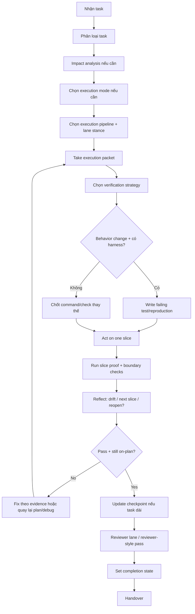

# Build - Code Implementation

## The Iron Law

```
NO BEHAVIORAL CHANGE WITHOUT DEFINING VERIFICATION FIRST
```

<HARD-GATE>
- Medium/large tasks: phải có impact analysis trước khi edit.
- Large tasks: phải chọn execution mode trước khi code hàng loạt.
- Medium/large hoặc high-risk work: phải chốt execution pipeline trước khi sửa rộng.
- High-risk hoặc dirty-repo work: phải chốt isolation stance (`same tree`, `worktree`, hoặc host-supported subagent split) trước khi sửa rộng.
- Large/high-risk implementation: nếu `spec-review` applicable, build chỉ bắt đầu khi readiness là `go`.
- Behavioral changes: ưu tiên failing test hoặc reproduction trước khi sửa.
- Nếu không có harness khả thi, phải nói rõ vì sao và dùng cách verify mạnh nhất còn lại.
- Không claim "xong" khi chưa có bằng chứng mới.
</HARD-GATE>

---

## Process Flow



## Task Classes

| Loại task | Cách verify trước khi sửa |
|-----------|---------------------------|
| Feature / bugfix có test harness | Failing test hoặc reproduction |
| Feature / bugfix không có harness | Manual reproduction rõ ràng, failing command, hoặc smoke path |
| Config / build script / release chore | Build, lint, typecheck, diff, hoặc command mục tiêu |
| Docs only | Link / path / content check, không giả vờ có test |

## Impact Analysis (bắt buộc cho medium/large)

Trả lời trước khi code:
1. Files nào bị ảnh hưởng?
2. Callers/consumers nào phải update?
3. Edge cases nào dễ vỡ?
4. Cần thêm hoặc sửa verification nào?
5. Nếu scope >3 files hoặc có assumption lớn -> báo user trước khi edit

## Execution Packet Intake

Trước khi sửa `medium/large`, build phải chốt slice đang thi công:

```text
Execution packet:
- Sources: [plan/spec/design/spec-review]
- Current slice: [...]
- Files/boundaries in scope now: [...]
- Proof before progress: [...]
- Out of scope for this slice: [...]
- Reopen if: [...]
```

Rules:
- Không edit khi chưa chốt `current slice`
- Không gom nhiều slice vào một lượt edit chỉ vì "đang tiện"
- Nếu cần chạm file/boundary ngoài packet để cứu thiết kế, dừng và reopen `plan`, `architect`, hoặc `spec-review`

## Execution Mode Selection

Chọn mode trước khi code medium/large để tránh vừa làm vừa đổi chiến thuật:

| Mode | Dùng khi | Tránh khi |
|------|----------|-----------|
| `single-track` | Một critical path chính, thay đổi coupled, cần giữ context chặt | Có nhiều workstream độc lập thật sự |
| `checkpoint-batch` | Large task có nhiều bước nối tiếp, cần chia checkpoint rõ | Tác vụ quá nhỏ hoặc quá coupled để tách batch |
| `parallel-safe` | Có nhiều lát cắt độc lập, interface/boundary đã rõ | Chưa chốt contract hoặc blast radius chồng chéo |

Rule:
- `small` -> gần như luôn `single-track`
- `medium` -> mặc định `single-track`, chỉ nâng lên `checkpoint-batch` khi có 2+ mốc giao rõ
- `large` -> bắt buộc chọn một mode
- Nếu nghi ngờ có an toàn để song song hay không, quay về `single-track`

Nếu task kéo dài, ghi checkpoint artifact bằng script `scripts/track_execution_progress.py`.
Muốn xem mode chooser và completion states gọn hơn, đọc `references/execution-delivery.md`.

## Execution Pipeline Selection

Pipeline là cách Forge tách implement/spec/quality lanes để tránh vừa code vừa tự hợp thức hóa.

| Pipeline | Dùng khi | Lanes |
|----------|----------|-------|
| `single-lane` | Small hoặc medium low-risk | `implementer` |
| `implementer-quality` | Medium/large với spec đủ rõ nhưng vẫn cần review lane độc lập | `implementer` -> `quality-reviewer` |
| `implementer-spec-quality` | `spec-review` applicable hoặc build high-risk | `implementer` -> `spec-reviewer` -> `quality-reviewer` |

Rules:
- `BUILD` có `spec-review` -> mặc định nghiêng về `implementer-spec-quality`
- `large` hoặc profile mạnh hơn `standard` -> tối thiểu phải có `quality-reviewer`
- Host có subagents -> lane có thể chạy độc lập
- Host không có subagents -> vẫn phải chạy tuần tự theo lane, không gộp suy nghĩ lại thành một pass duy nhất

## Lane Model Stance

Forge dùng tier trừu tượng thay vì hardcode model vendor:

| Lane | Default tier |
|------|--------------|
| `navigator` | `cheap` |
| `implementer` | `standard` |
| `spec-reviewer` | `capable` |
| `quality-reviewer` | `standard` |

Rules:
- `large` -> implement/review lanes nghiêng lên `capable`
- `release-critical`, `migration-critical`, `external-interface`, `regression-recovery` -> lane review liên quan phải lên `capable`
- Nếu task chỉ là bounded low-risk slice, giữ lane rẻ hơn là lựa chọn đúng

## Isolation Recommendation

Với multi-step `large` hoặc `high-risk` work, chốt isolation stance trước khi bắt đầu:

| Stance | Dùng khi |
|--------|----------|
| `same-tree` | Task đủ nhỏ hoặc repo sạch, blast radius thấp |
| `worktree` | Repo đang bẩn, task rủi ro cao, hoặc cần cô lập change set |
| `subagent-split` | Host hỗ trợ subagents và task có nhiều lát cắt rõ boundary |

Rule:
- Nếu repo đang dirty và task không nhỏ -> ưu tiên `worktree`
- Nếu boundary chưa rõ -> không dùng `subagent-split`
- Nếu đã chọn `subagent-split`, phải có chain status hoặc checkpoint đủ rõ để hợp nhất kết quả

## Spec-Review Dependency

`Spec-review` là gate trước build khi:
- task `large`
- task `medium` nhưng có contract/schema/migration/auth/payment/public interface/high-risk boundary

Build không được tự “coi như spec đã đủ” nếu:
- plan còn ghi assumption mở
- architect vừa đổi system shape lớn
- verification strategy còn thiếu cho boundary quan trọng

## Verification Strategy

### Nếu có harness
- Write failing test cho behavior cần đổi
- Verify test fail đúng lý do
- Implement tối thiểu
- Run lại test liên quan và checks cần thiết

### Nếu không có harness
- Ghi rõ lý do không dùng test được
- Tạo reproduction/check cụ thể trước khi sửa
- Sau khi sửa, chạy lại đúng reproduction/check đó

### Verification ladder
- `Slice proof`: check nhỏ nhất chứng minh slice hiện tại đúng
- `Boundary check`: thêm khi slice chạm contract, schema, integration, auth, migration, hoặc external interface
- `Broader suite`: thêm khi blast radius rộng, release-critical, hoặc vừa có regression

Rule:
- Không nhảy thẳng lên suite lớn để che việc thiếu slice proof
- Không dừng ở slice proof khi boundary vừa bị đổi rõ ràng

### Fast-Fail Order
- 1. Packet + proof-before-progress locked
- 2. Failing test hoặc reproduction captured
- 3. Slice proof pass
- 4. Boundary check pass nếu có contract/schema/integration blast radius
- 5. Reviewer lane hoặc reviewer-style pass
- 6. Quality gate / completion claim

Không dùng suite lớn hoặc câu "đã build pass" để bỏ qua bước 1-3.

### Tuyệt đối không làm
- Nói "task này nhỏ quá khỏi test"
- Báo đã test-first khi thực tế không có test
- Sửa xong rồi mới nghĩ cách verify

## Anti-Rationalization

| Bào chữa | Sự thật |
|----------|---------|
| "Cần explore trước rồi mới viết test/repro" | Explore có thể cần, nhưng verification strategy cho behavior change vẫn phải chốt trước khi sửa |
| "TDD không practical trong repo này" | Nếu harness dùng được thì bỏ RED phải có lý do kỹ thuật cụ thể, không phải cảm giác |
| "Giữ code cũ để tham khảo nên sửa tạm đã" | Tham khảo không thay thế cho reproduction/test; phải biết chính xác behavior nào đang đổi |
| "Khó test nên skip cho nhanh" | Khi test khó, chuyển sang reproduction/check thay thế mạnh hơn chứ không bỏ verify |
| "Fix xong rồi thêm test sau" | Test-after dễ hợp thức hóa code đã viết, không chứng minh được intent ban đầu |
| "Plan rõ rồi cứ code một lèo" | Large work vẫn cần execution mode và checkpoint để tránh drift hoặc bỏ sót handoff state |

Code examples:

Bad:

```text
"Em sửa trước cho nhanh, lát nghĩ cách test."
```

Good:

```text
"Verification trước khi sửa: reproduce bằng [command/scenario]. Sau đó mới đổi code và rerun đúng check đó."
```

## Reason -> Act -> Verify -> Reflect

Với mọi slice không nhỏ:

1. `Reason` -> đọc packet hiện tại, nhắc lại proof và boundary
2. `Act` -> sửa phần nhỏ nhất đủ để tiến lên
3. `Verify` -> chạy đúng proof/check đã chốt cho slice
4. `Reflect` -> ghi lại drift, next slice, blocker, hoặc signal phải reopen upstream

Rules:
- Không tích lũy nhiều thay đổi chưa verify rồi mới test một lần
- Nếu verify fail vì lý do ngoài dự kiến, phản xạ đầu tiên là đọc lại packet và impact analysis
- `Reflect` phải quyết định rõ: tiếp slice tiếp theo, sửa lại slice hiện tại, hay quay upstream

---

## Two-Stage Review

### Stage 1: Requirement Compliance
- Đúng scope user yêu cầu?
- Có assumptions nào chưa nói ra?
- Có thừa feature hoặc bỏ sót requirement?

### Stage 2: Code Quality
- Naming và structure có dễ đọc?
- Error handling / validation đã đủ?
- Consumers / imports / types còn hợp lệ?
- Verification đã đủ mức cho blast radius?

Nếu execution pipeline có `quality-reviewer`, pass này phải đọc như một lane riêng, không chỉ là tự nhìn lại code trong cùng nhịp implement.

## Drift / Reopen Rules

Build phải dừng và quay upstream khi:
- slice hiện tại cần thêm boundary hoặc file ngoài packet một cách material
- plan/spec-design vừa lộ assumption sai
- verify fail lặp lại 3 vòng mà chưa rõ root cause
- hoàn thành một slice nhưng next slice làm thay đổi chosen direction

Route gợi ý:
- drift về shape / scope / sequencing -> quay lại `plan`
- drift về contract / schema / architecture -> quay lại `architect` hoặc `spec-review`
- drift về behavior không hiểu nổi -> sang `debug`

## Completion States

Trước khi handover, build phải gán rõ một state:

| State | Nghĩa là gì |
|-------|-------------|
| `in-progress` | Chưa đủ bằng chứng để handoff |
| `ready-for-review` | Đã verify phần mình làm và chờ review/inspection cuối |
| `ready-for-merge` | Chỉ dùng khi scope nhỏ, verification mạnh, và không còn finding/blocker đã biết |
| `blocked-by-residual-risk` | Có risk/blocker đủ lớn nên chưa được coi là done |

Không được dùng câu mơ hồ kiểu "gần xong", "cơ bản ổn", "chắc merge được".

## Verification Checklist

- [ ] Đã chốt verification strategy trước khi edit
- [ ] Task medium/large đã có impact analysis
- [ ] Task medium/large đã chọn execution mode phù hợp
- [ ] High-risk work đã có isolation recommendation rõ
- [ ] Task medium/large đã có execution packet cho slice hiện tại
- [ ] Nếu applicable, spec-review đã trả về `go`
- [ ] Behavioral change đã có failing test/reproduction hoặc lý do không có harness
- [ ] Slice proof đã được chạy trước khi đi tiếp slice sau
- [ ] Task dài đã cập nhật checkpoint hoặc nói rõ vì sao không cần
- [ ] Checks liên quan đã được chạy lại sau khi sửa
- [ ] Output đã đọc, không chỉ chạy lệnh cho có
- [ ] Đã reviewer-style pass sau cùng
- [ ] Completion state đã explicit
- [ ] Đã note rõ phần chưa verify được (nếu có)

## Language / Runtime Integration

```
- Tôn trọng toolchain và package/build system hiện có của repo
- Giữ contract/interface explicit theo khả năng của ngôn ngữ và framework đang dùng
- Validate input ở boundary, dù repo là dynamic hay strongly typed
- Nếu đổi contract, update callers/adapters cùng lúc
- Nếu repo map rõ sang Python/Java/Go/.NET và có companion skill phù hợp, load companion đó cho idiom/framework detail
- Nếu không có companion skill, vẫn thực hiện bằng Forge workflows hiện có; không dừng lại chỉ vì thiếu runtime-specific layer
- Forge vẫn giữ verification strategy, evidence gate, và residual-risk reporting
```

## Handover

```
Build report:
- Scope: [...]
- Execution mode: [single-track/checkpoint-batch/parallel-safe]
- Execution pipeline: [single-lane/implementer-quality/implementer-spec-quality]
- Isolation stance: [same-tree/worktree/subagent-split]
- Lane model stance: [implementer=standard, spec-reviewer=capable, quality-reviewer=standard]
- Spec-review: [go/n-a]
- Current/last slice: [...]
- Progress checkpoint: [artifact path hoặc n/a]
- Files changed: [...]
- Verified: [command/check] -> [kết quả]
- Evidence response: [I verified: ... / I investigated: ... / Clarification needed: ...]
- Completion state: [ready-for-review/ready-for-merge/blocked-by-residual-risk]
- Unverified: [...]
- Residual risk: [...]
```

## Activation Announcement

```
Forge Antigravity: build | verification-first, impact analysis trước khi sửa
```
