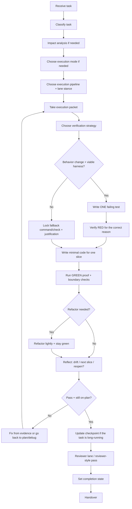

# Build - Code Implementation

## The Iron Law

```
NO BEHAVIORAL CHANGE WITHOUT A FAILING TEST FIRST
```

<HARD-GATE>
- Before any behavior-changing edit, run a process precheck: repo state, plan/spec/change artifact, and the baseline verification path.
- Behavioral changes with a viable harness: one failing test MUST exist and fail for the correct reason before implementation code.
- Small creative work still needs an approved quick plan/design packet before build.
- Medium/large tasks: must have impact analysis before editing.
- Large tasks: must select execution mode before batch coding.
- Medium/large work: must close the execution pipeline before expanding.
- Medium+ work in a dirty repo should default toward `worktree` and a clean baseline before modifying.
- Dirty-repo or multi-slice work: isolation stance must be locked (`same tree`, `worktree`, or host-supported subagent split`) before modifying.
- Code written before a failing test: delete it and start from RED.
- "Keep as reference" is not an exception. Delete means delete.
- If there is no viable harness, you must explicitly justify why and lock the strongest remaining verification method before editing.
- Do not claim "done" without new evidence.
</HARD-GATE>

---

## Process Flow



## Task Classes

|Task type | How to verify before editing|
|-----------|---------------------------|
|Feature / bugfix has test harness | One failing test first, and RED verified for the correct reason|
|Feature / bugfix without harness | Explicit no-harness justification plus manual reproduction, failing command, or smoke path|
|Config / build script / release chore | Build, lint, typecheck, diff, or target command|
|Docs only | Link / path / content check, do not pretend to have a test|

## Impact Analysis (required for medium/large)

Answer before coding:
1. Which files are affected?
2. Which callers/consumers must update?
3. Which edge cases are fragile?
4. What verification needs to be added or edited?
5. If the scope is >3 files or there is a large assumption -> notify the user before editing

## Execution Packet Intake

Before editing `medium/large`, the build must close the slice under construction:

```text
Execution packet:
- Packet ID: [...]
- Packet mode: [standard / fast-lane]
- Parent packet: [...]
- Sources: [plan/spec/design]
- Goal: [...]
- Current slice: [...]
- Baseline: [...]
- Exact files / path scope: [...]
- Owned files / write scope: [...]
- Depends on packets: [...]
- Unblocks packets: [...]
- Merge target / strategy: [...]
- Overlap risk / write-scope conflicts: [...]
- Review readiness / merge readiness / completion gate: [...]
- Verification to rerun: [...]
- Browser QA classification: [not-needed / optional-accelerator / required-for-this-packet]
- Proof before progress: [...]
- Out of scope for this slice: [...]
- Reopen if: [...]
```

Rules:
- Do not edit until `current slice` is finalized
- Do not edit until the baseline command or check is named.
- Don't combine multiple slices into one edit just because it's "convenient".
- If you need to touch a file/boundary outside the packet to save the design, stop and reopen `plan` or `architect`
- `track_execution_progress.py` is the canonical packet record for medium/large build work; summaries and dispatch wrappers should read from that packet instead of inventing a second schema

## Fast Lane Contract V1

Fast lane is a light packet mode for truly small bounded slices, not a second execution system.

Eligibility:

- bounded blast radius
- narrow owned write scope
- no packet graph dependency or merge choreography needed
- no release-tail or deployment boundary

Required fast lane fields:

- `packet_id`, `packet_mode`, `label`, `goal`, `status`
- `exact_files_or_paths_in_scope`, `owned_files_or_write_scope`
- `baseline_or_clean_start_proof`, `proof_before_progress`, `verification_to_rerun`
- `residual_risk`, `next_steps`

Rules:

- fast lane cannot skip baseline proof, verification rerun, or residual-risk capture
- fast lane state still persists through `track_execution_progress.py`
- if dependency/overlap risk appears, escalate to standard packet mode instead of patching around missing graph fields

## Execution Mode Selection

Choose mode before coding medium/large to avoid changing tactics at the same time:

|Mode | Use when | Avoid when|
|------|----------|-----------|
|`single-track` | A major critical path, coupled change, needs to keep the context tight | There are many truly independent workstreams|
|`checkpoint-batch` | Large tasks have many sequential steps, need to clearly divide checkpoints The task is too small or too coupled to split the batch|
|`parallel-safe` | There are many independent slices, the interface/boundary is clear The contract has not been finalized or the blast radius overlaps|

Rule:
- `small` -> almost always `single-track`
- `medium` -> default `single-track`, only raised to `checkpoint-batch` when there are 2+ clear intersections
- `large` -> forced to select a mode
- If in doubt whether it is safe to parallelize or not, return to `single-track`
- If the repo is dirty or the slice is behavior-changing, favor `worktree` and a clean baseline before modifying.

If the task is long, log the checkpoint artifact with script `scripts/track_execution_progress.py`.
To see the mode chooser and complete states more concisely, read `references/execution-delivery.md`.

## Execution Pipeline Selection

Pipeline is Forge's way of separating implementation from review without reintroducing a separate pre-build risk fork.

|Pipelines | Use when | Lanes|
|----------|----------|-------|
|`single-lane` | Small bounded slices | `implementer`|
|`implementer-quality` | Medium/large build work that still needs an independent review lane | `implementer` -> `quality-reviewer`|

Rules:
- `large` or stronger profile `standard` -> must have at least `quality-reviewer`
- Host has subagents -> lane can run independently
- Host does not have subagents -> still has to run sequentially in lanes, not combining thoughts into a single pass
- Reviewer lanes must close the slice explicitly before the implementer moves on.

## Lane Model Stance

Forge uses an abstract tier instead of a hard-coded vendor model:

|Lane | Default tier|
|------|--------------|
|`navigator` | `cheap`|
|`implementer` | `standard`|
|`quality-reviewer` | `standard`|

Rules:
- `large` -> implement/review tilted lanes `capable`
- `release-critical`, `migration-critical`, `external-interface`, `regression-recovery` -> related review lane must go to `capable`
- If the task is just a bounded slice, keeping the cheaper lane is the right choice
- Medium+ slices with behavior changes should favor the stronger review lane when the baseline is not trivial.

## Isolation Recommendation

For multi-step `large` work or any dirty-repo behavioral change, lock the isolation stance before starting:

|Stance | Use when|
|--------|----------|
|`same-tree` | Small enough task or clean repo, bounded blast radius|
|`worktree` | The repo is dirty or the change set needs to be isolated|
|`subagent-split` | Host supports subagents and tasks with many clear boundary slices|

Rule:
- If the repo is dirty and the task is not small -> prioritize `worktree`
- If the task is medium+ and behavior-changing, prefer `worktree` unless the scope is already isolated and the baseline is clean.
- If the boundary is unclear -> do not use `subagent-split`
- If `subagent-split` is selected, there must be a clear enough chain status or checkpoint to merge the results

When `worktree` is selected, bootstrap it explicitly:

```powershell
python scripts/prepare_worktree.py --workspace <workspace> --name <slice> --baseline-command "<baseline>"
```

The packet should keep:
- worktree path
- ignore-safety proof for project-local worktree roots
- baseline result from that isolated tree

## Subagent Split Packet

When building actually uses `subagent-split`, each subagent must receive packets on its own instead of just saying "go read the code and do it":

```text
Delegation packets:
- Packet ID / parent packet: [...]
- Slice goal: [...]
- Owned files / write scope: [...]
- Depends on packets: [...]
- Shared reads allowed: [...]
- Proof before progress: [...]
- Verification to rerun before handoff: [...]
- Browser QA classification/scope/status: [...]
- Return with: [status, changed files, verification, residual risk]
```

Rules:
- Use a fresh worker for each slice or review lane. Do not reuse stale context after the packet changes materially.
- Do not assign overlapping write scopes between two subagents
- If the repo is dirty or the blast radius is broad, consider `worktree` before `subagent-split`
- If the packet does not clearly state proof or ownership, return `plan` or `architect` instead of blind dispatch

## Flat Build Contract

Forge no longer inserts a separate pre-build review stage for boundary-sensitive work.

Build should not be considered ready just because the plan exists:
- The plan cannot leave open assumptions that force policy guesses during implementation
- The architect cannot hand off a design that still leaves the system shape ambiguous
- verification strategy cannot be missing for important boundaries

## Verification Strategy

For the strict reset rules and anti-rationalization language, read `references/tdd-discipline.md`.

### With a viable harness: RED -> GREEN -> REFACTOR

#### RED
- Write one failing test for one behavior that must change
- Verify the test fails for the correct reason before implementation code exists
- Stop if the failure is vague or caused by the wrong setup

#### GREEN
- Write the minimum implementation required to pass that same proof
- Rerun the same proof first, then the needed boundary or relevant checks

#### REFACTOR
- Only after GREEN is real
- Clean up lightly and keep the same proof green

Rules:
- Code written before RED must be deleted and restarted from RED
- "Keep as reference" is not an exception
- Do not bundle multiple behaviors into one RED just to move faster

### Without harness
- Clearly state the reason why the harness cannot be used
- Create specific reproduction/check before editing and lock it as the fallback proof
- After editing, run the correct reproduction/check again
- Tests-after is not an equivalent substitute when a viable harness existed

### Verification ladder
- `Slice proof`: smallest check that proves the current slice is correct
- `Boundary check`: added when slice touches contract, schema, integration, auth, migration, or external interface
- `Broader suite`: added when blast radius is wide, release-critical, or just has regression

Rule:
- Don't jump straight into the big suite to cover up the lack of slice proof
- Do not stop at slice proof when the boundary has just been clearly changed

### Fast-Fail Order
- 1. Packet + proof-before-progress locked
- 2. One failing test captured and RED verified, or explicit no-harness fallback locked
- 3. Minimal GREEN implementation pass
- 4. Refactor pass stays green if refactor happened
- 5. Boundary check pass if there is contract/schema/integration blast radius
- 6. Reviewer lane or reviewer-style pass
- 7. Quality gate / completion claim

Do not use large suites or the phrase "built pass" to skip steps 1-3.

### Absolutely do not do it
- Say "this task is too small to test"
- Write implementation code first and call it "reference"
- Reported test-first when in reality RED was never observed
- After editing, then think about how to verify
- Use a big suite result to hide missing RED

## Anti-Rationalization

|Defense | Truth|
|----------|---------|
|"Need to explore first before writing test/repro" | Explore may be needed, but with a viable harness RED is still required before implementation|
|"Tests after achieve same goals" | Tests-after asks "what does this code do?" Tests-first asks "what should this code do?"|
|"Keep as reference, write tests first" | You'll adapt it. Delete means delete.|
|"Already manually tested" | Ad-hoc checks are not systematic proof|
|"TDD will slow me down" | Debugging unknown behavior is usually slower than a clean RED/GREEN/REFACTOR loop|
|"Deleting X hours is wasteful" | That is sunk cost fallacy, not evidence|
|"TDD is not practical in this repo" | If the harness can be used, there must be a specific technical reason for removing RED, not a feeling|
|"It's difficult to test so skip quickly" | When testing is difficult, switch to a stronger reproduction/check instead of giving up verification|
|"Fix it, then add more tests later" | Test-after easily validates the written code, but cannot prove the original intent|
|"Plan clearly, just code at once" | Planning does not replace RED/GREEN/REFACTOR or the execution packet|
|"Big suite pass is enough" | Large suites do not replace slice-level RED on the behavior that just changed|

Code examples:

Bad:

```text
"I'll patch it first to move faster, then think about how to test it."
```

Good:

```text
"RED first: run [test] and fail for [signal]. Then write the minimum code, rerun the same proof, and only then widen checks."
```

## Reason -> Act -> Verify -> Reflect

For all non-small slices:

1. `Reason` -> read current packet, repeat proof and boundary
2. `Act` -> fix the smallest part enough to move forward
3. `Verify` -> runs the correct proof/check for the slice
4. `Reflect` -> recorded drift, next slice, blocker, or signal must reopen upstream

Rules:
- Do not accumulate many unverified changes before testing them once
- If verification fails for unexpected reasons, the first response is to re-read the packet and do impact analysis
- `Reflect` must decide clearly: continue with the next slice, edit the current slice, or go upstream

---

## Two-Stage Review

### Stage 1: Spec Compliance
- Correct scope the user requested?
- Are there any unstated assumptions?
- Are there excess features or missing requirements?

### Stage 2: Code Quality
- Is the naming and structure easy to read?
- Error handling / validation enough?
- Consumers / imports / types still valid?
- Verification is enough for blast radius?

If the execution pipeline has `quality-reviewer`, this pass must be read as a separate lane, not just looking at the code itself in the same execution rhythm.
If the host supports subagents, the reviewer lane should receive a shortened controller packet: scope, evidence, changed files/diff, and the specific review question. Do not force the reviewer to reconstruct intent from the full session.

## Drift / Reopen Rules

Build must stop and turn upstream when:
- The current slice needs to physically add a boundary or file outside the packet
- plan/spec-design just revealed the wrong assumption
- verify failure repeats 3 rounds without clear root cause
- completes a slice but the next slice changes the chosen direction

Suggested routes:
- drift to shape / scope / sequencing -> return to `plan`
- drift about contract / schema / architecture -> return to `architect`
- drift towards incomprehensible behavior -> to `debug`

## Completion States

Before handover, the build must clearly assign a state:

|State | What does it mean?|
|-------|-------------|
|`in-progress` | Not enough evidence to handoff|
|`ready-for-review` | Verified my work and waiting for final review/inspection|
|`ready-for-merge` | Only use when scope is small, verification is strong, and there are no known finding/blockers|
|`blocked-by-residual-risk` | There is a large enough risk/blocker so it is not considered done|

Do not use vague sentences like "almost done", "basically okay", "probably can be merged".

## Verification Checklist

- [ ] Verification strategy has been finalized before editing
- [ ] Task medium/large already has impact analysis
- [ ] Task medium/large has selected the appropriate execution mode
- [ ] Dirty-repo or multi-slice work has clear isolation recommendation
- [ ] Task medium/large already has an execution packet for the current slice
- [ ] Behavioral change had one failing test first, or an explicit no-harness justification
- [ ] Any pre-RED implementation code was deleted instead of adapted
- [ ] Slice proof has been run before proceeding to the next slice
- [ ] Long task has updated checkpoint or clearly stated why it is not needed
- [ ] Related checks have been rerun after correction
- [ ] Read output, don't just run the command for the sake of it
- [ ] Reviewer-style pass is final
- [ ] Completion state is explicit
- [ ] Clearly noted the part that cannot be verified (if any)

## Backend Implementation Guardrails

Use this lens whenever the slice touches API, job, event, migration, or data-change work:

- Medium/large backend slices should create or reuse a scoped backend brief or checklist in `docs/specs/` or `.forge-artifacts/backend-briefs/` before broad edits.
- Keep the service shape explicit: validate input -> authorize when needed -> business logic -> persistence -> map back to transport.
- Keep business logic out of controllers, handlers, and transport adapters even when the slice is small.
- Make contract and compatibility explicit: caller/consumer lockstep updates, compatibility window, migration/backfill sequencing, and expand-contract stance when needed.
- For related writes, retries, or async recovery, state the transaction boundary and idempotency stance before coding.
- Leave enough observability for real failures: logs, metrics, traces, or audit notes should explain how to investigate the changed path.
- Treat backend integrity as part of the boundary check: callers stay safe, validation stays at the boundary, migration risk is named, and no hidden coupling is introduced across services/jobs/webhooks.

## UI Implementation Guardrails

Use this lens whenever the slice ships UI implementation instead of only a mockup/spec:

- Preserve the existing design system, tokens, spacing, and typography before inventing a new visual direction.
- Lock the state model before polish: default, loading, empty, error, disabled, and success states must be intentionally covered for medium/large UI slices.
- Keep affordances stable: do not rely on hover for primary actions on touch surfaces, avoid layout-shift hover effects, and keep touch targets large enough when touch is relevant.
- Verify responsive/platform constraints plus focus, contrast, labels, and reduced-motion behavior close to the blast radius of the changed UI.
- When the slice is UI-heavy, multi-step, or browser-sensitive, classify browser QA explicitly and use it as part of slice proof instead of relying only on static inspection.

## Language / Runtime Integration

```
- Respect the repo's existing toolchain and package/build system
- Keep contracts/interfaces explicit according to the capabilities of the language and framework in use
- Validate input at the boundary, whether the repo is dynamic or strongly typed
- If you change a contract, update callers/adapters at the same time
- If the repo clearly maps to Python/Java/Go/.NET and a suitable companion skill exists, load that companion for idiom/framework detail
- If no companion skill exists, continue with the existing Forge workflows. Do not stop just because a runtime-specific layer is missing.
- Forge still owns verification strategy, evidence gates, and residual-risk reporting
```

## Handover

```
Build report:
- Scope: [...]
- Execution mode: [single-track/checkpoint-batch/parallel-safe]
- Execution pipeline: [single-lane/implementer-quality]
- Isolation stance: [same-tree/worktree/subagent-split]
- Lane model stance: [implementer=standard, quality-reviewer=standard]
- Current/last slice: [...]
- Progress checkpoint: [artifact path or n/a]
- Files changed: [...]
- Verified: [command/check] -> [result]
- Backend brief / UI brief: [path or n/a]
- Evidence response: [I verified:... / I investigated:... / Clarification needed:...]
- Completion state: [ready-for-review/ready-for-merge/blocked-by-residual-risk]
- Unverified: [...]
- Residual risk: [...]
```

## Activation Announcement

```
Forge: build | verification-first, impact analysis before editing
```

## Response Footer

When this skill is used to complete a task, record its exact skill name in the global final line:

`Skills used: build`

When multiple Forge skills are used, list each used skill exactly once in the shared `Skills used:` line. When no Forge skill is used for the response, use `Skills used: none`. Keep that `Skills used:` line as the final non-empty line of the response and do not add anything after it.
