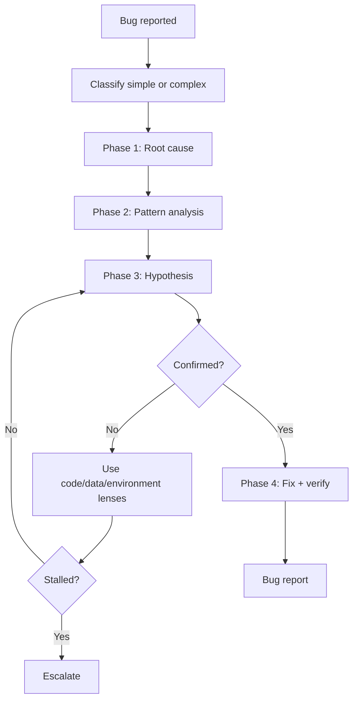

# Debug - Systematic Debugging

## The Iron Law

```
NO FIXES WITHOUT ROOT-CAUSE INVESTIGATION FIRST
```

<HARD-GATE>
- Không propose fix trước khi hoàn thành root-cause investigation.
- Không fix nhiều thứ cùng lúc.
- Large/high-risk/regression debug: phải chốt execution pipeline trước khi sửa rộng.
- Ưu tiên failing test hoặc reproduction trước khi sửa.
- Nếu không có harness, phải có equivalent evidence sau fix.
- Sau 3 lần fix/hypothesis fail hoặc khi bug vượt boundary rõ ràng, dừng patching và escalate sang plan/architect thay vì thử tiếp theo cảm tính.
</HARD-GATE>

---

## The Four Phases



### Phase 1: Root Cause Investigation
1. Đọc toàn bộ error, logs, stack trace
2. Tái hiện bug bằng các bước rõ ràng
3. Kiểm recent changes, config, dependency, data inputs
4. Trace data flow đến tận nguồn

### Phase 2: Pattern Analysis
1. Tìm code tương tự đang chạy đúng
2. So sánh broken vs working
3. Hiểu dependency và state cần có

### Phase 3: Hypothesis & Testing
```
Giả thuyết: [...]
Bằng chứng: [...]
Kiểm tra tối thiểu: [...]
```

Mỗi lần chỉ test 1 biến.

### Phase 4: Implementation
1. Tạo failing test hoặc reproduction nếu có thể
2. Sửa tại root cause
3. Verify lại bằng đúng test/reproduction/check đó
4. Run thêm checks liên quan để chặn regression

## Bug Classification

| Mức | Tiêu chí | Hành động |
|-----|----------|-----------|
| **Nhỏ** | <=2 files, blast radius nhỏ | Full debug flow nhưng report ngắn |
| **Lớn** | >=3 files, đổi logic/data flow | Debug -> plan -> fix -> verify |

Nghi ngờ nhỏ hay lớn -> mặc định **lớn**.

## Debug Pipeline Selection

Khi bug đủ lớn, có regression, hoặc chạm boundary quan trọng, debug không được trộn root-cause, implement, và tự review vào cùng một pass mờ.

| Pipeline | Dùng khi | Lanes |
|----------|----------|-------|
| `single-lane` | Bug nhỏ, reproduction rõ, blast radius thấp | `implementer` |
| `implementer-quality` | Regression, hotfix, hoặc bug medium/large cần lane review độc lập | `implementer` -> `quality-reviewer` |

Rules:
- `DEBUG` large/high-risk/regression -> tối thiểu `implementer` -> `quality-reviewer`
- `implementer` chịu trách nhiệm reproduction, root-cause proof, minimal fix, và focused verify
- `quality-reviewer` chịu trách nhiệm challenge root cause, kiểm evidence response contract, và chốt containment/regression stance
- Nếu investigation cho thấy bug thực chất là contract/system-shape issue, dừng debug loop và route sang `plan` hoặc `architect`

## Lane Model Stance

| Lane | Default tier |
|------|--------------|
| `implementer` | `standard` |
| `quality-reviewer` | `standard` |

Rules:
- `regression-recovery` hoặc `large` -> cả hai lanes nghiêng lên `capable`
- Nếu task chỉ là reproduction nhỏ, single file, single boundary -> `single-lane` vẫn hợp lệ
- Nếu host không có subagents, vẫn phải chạy theo hai lanes tuần tự; không hợp nhất suy nghĩ của reviewer vào implement pass

## Boundary Instrumentation

Với bug qua nhiều component, service, hoặc runtime:

- Chỉ thêm instrumentation trả lời đúng giả thuyết hiện tại
- Ưu tiên boundary logs/checks ở input, output, cache, queue, API contract, DB write/read
- Không rải log khắp nơi rồi "xem thử có gì lạ"
- Sau khi confirm root cause, xóa instrumentation tạm

## Three Lenses When Stuck

Nếu hypothesis đầu chưa ra:

| Lens | Câu hỏi chính |
|------|---------------|
| Code | Logic/branch/contract nào đang sai? |
| Data | Input, persisted data, migration, cache, hoặc state nào không đúng? |
| Environment | Config, secret, account, dependency, clock, network, hoặc runtime nào khác kỳ vọng? |

Đổi lens trước khi thử thêm một fix khác cùng kiểu.

## Stall Detector & Escalation

Dấu hiệu đang stalled:
- 2-3 hypotheses liên tiếp không confirm
- 3 fix attempts fail hoặc tạo triệu chứng mới
- Bug vượt nhiều boundary mà chưa có owner/contract rõ
- Reproduction không ổn định nên không chứng minh được tiến bộ

Khi stalled:
1. Dừng thử fix tiếp
2. Ghi rõ đã loại trừ gì
3. Chốt lens nào còn nghi ngờ nhất
4. Route sang `plan` hoặc `architect` nếu nghi ngờ vấn đề là contract, ownership, hoặc system shape

Nếu stalled mà team chưa rõ bước ra tiếp theo, đọc `references/failure-recovery-playbooks.md`.

## Evidence Response Contract

Khi debug trả lời về fix, giữ code, hoặc yêu cầu clarify, phải bám contract này:

```text
- I verified: [fresh evidence]. Correct because [reason]. Fixed: [change].
- I investigated: [evidence]. Current code stays because [reason].
- Clarification needed: [single precise question].
```

Rules:
- `fresh evidence` phải đến từ reproduction, logs, trace, test, hoặc command vừa chạy
- nếu fix root cause, phải nêu rõ reproduction nào hết fail
- nếu chưa sửa, phải nêu rõ vì sao chưa sửa hoặc vì sao code hiện tại vẫn đúng

Reject nhanh:
- Good catch! Fixed.
- Em thử đổi X xem sao.
- Chắc ổn rồi.

## Anti-Rationalization

| Bào chữa | Sự thật |
|----------|---------|
| "Thử đổi X xem sao" | Đoán mò không phải debug |
| "Sửa nhanh rồi điều tra sau" | Càng dễ lặp lại sai pattern |
| "Manual click thấy hết lỗi rồi" | Chưa đủ nếu không lặp lại được |
| "3 lần fix vẫn fail thì cố gắng thêm" | 3 lần thất bại -> dừng lại và xem pattern |
| "Log thêm khắp nơi rồi sẽ rõ" | Instrumentation phải trả lời một hypothesis cụ thể, không phải rải lưới mù |

Code examples:

Bad:

```text
"Em thử đổi cache key xem có hết lỗi không."
```

Good:

```text
"Giả thuyết hiện tại: cache key sai giữa tenant A/B. Evidence cần lấy: request key, stored key, và payload tại boundary cache."
```

## Verification Checklist

- [ ] Root cause được xác định, không chỉ triệu chứng
- [ ] Nếu bug large/high-risk/regression, execution pipeline đã được chốt
- [ ] Có failing test/reproduction hoặc lý do vì sao không có
- [ ] Fix đúng tại root cause
- [ ] Đã verify sau fix
- [ ] Đã chạy thêm checks liên quan
- [ ] Evidence response contract đã được giữ
- [ ] Nếu stalled, đã escalate thay vì tiếp tục đoán mò
- [ ] Đã xóa debug logs tạm

## Bug Report Template

```
Bug report:
- Hiện tượng: [...]
- Classification: [nhỏ/lớn]
- Execution pipeline: [single-lane / implementer-quality]
- Lane model stance: [implementer=...; quality-reviewer=...]
- Root cause: [...]
- Lens cuối cùng có ích: [code/data/environment]
- Đã sửa: [...]
- Verified: [command/check] -> [kết quả]
- Evidence response: [I verified: ... / I investigated: ... / Clarification needed: ...]
- Escalation: [none / plan / architect]
- Prevention: [...]
```

## Activation Announcement

```
Forge Antigravity: debug | root cause trước, fix sau
```
