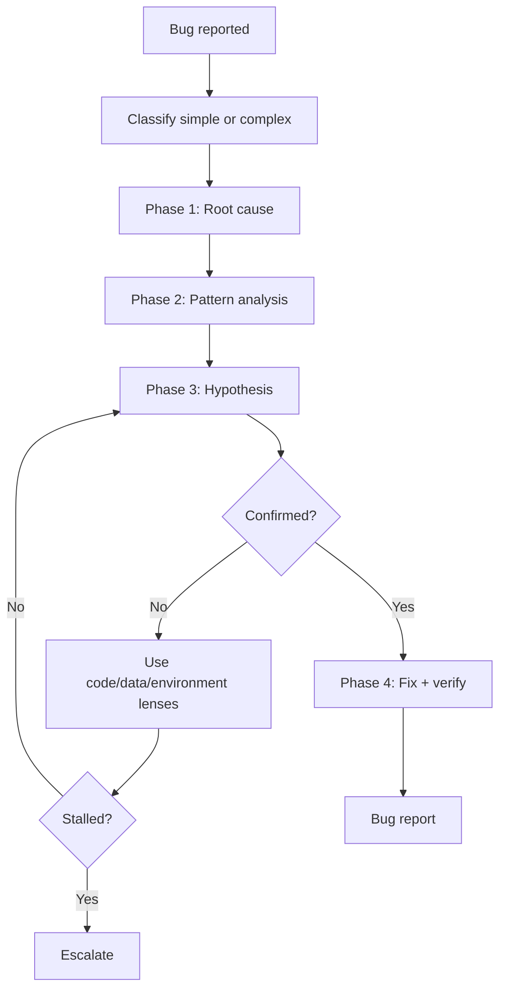

# Debug - Systematic Debugging

## The Iron Law

```
NO FIXES WITHOUT ROOT-CAUSE INVESTIGATION FIRST
```

<HARD-GATE>
- Do not propose fix before completing root-cause investigation.
- Don't fix many things at the same time.
- For dirty repos or medium/high-risk regressions, lock a worktree and a baseline reproduction before editing.
- Large/high-risk/regression debug: must close the execution pipeline before extensive editing.
- Prioritize failing test or reproduction before editing.
- If there is no harness, there must be equivalent evidence after the fix.
- After 3 failed fixes/hypothesis or when the bug clearly crosses the boundary, stop patching and escalate to plan/architect instead of trying the next feeling.
</HARD-GATE>

---

## The Four Phases



### Phase 1: Root Cause Investigation
1. Read all errors, logs, stack trace
2. Reproduce the bug with clear steps
3. Check recent changes, config, dependencies, data inputs
4. Trace data flow to the source

### Phase 2: Pattern Analysis
1. Find similar code that is running correctly
2. Compare broken vs working
3. Understand the dependencies and state required

### Phase 3: Hypothesis & Testing
```
Hypothesis: [...]
Proof: [...]
Minimum inspection: [...]
```

Only test 1 variable at a time.

### Phase 4: Implementation
1. Create failing test or reproduce if possible
2. Fix at the root cause
3. Verify again with the same test/reproduction/check
4. Run additional related checks to prevent regression

## Bug Classification

|Level | Criteria | Action|
|-----|----------|-----------|
|**Small** | <=2 files, small blast radius | Full debug flow but short report|
|**Large** | >=3 files, change logic/data flow | Debug -> plan -> fix -> verify|

Small or large doubt -> default **large**.

For large regressions, capture the clean baseline and choose `worktree` unless there is a clear reason not to.

## Debug Pipeline Selection

When the bug is large enough, has regression, or hits an important boundary, debugging should not mix root-cause, implementation, and self-review into the same opaque pass.

|Pipelines | Use when | Lanes|
|----------|----------|-------|
|`single-lane` | Small bug, clear reproduction, low blast radius | `implementer`|
|`implementer-quality` | Regression, hotfix, or medium/large bug needs independent review lane | `implementer` -> `quality-reviewer`|

Rules:
- `DEBUG` large/high-risk/regression -> minimum `implementer` -> `quality-reviewer`
- `implementer` is responsible for reproduction, root-cause proof, minimal fix, and focused verification
- `quality-reviewer` is responsible for challenging the root cause, checking evidence of contract response, and finalizing containment/regression stance
- If investigation shows that the bug is actually a contract/system-shape issue, stop the debug loop and route to `plan` or `architect`
- If the bug is UI or workflow-sensitive, mark browser QA in the packet explicitly instead of bolting browser checks on after the fix

## Lane Model Stance

|Lane | Default tier|
|------|--------------|
|`implementer` | `standard`|
|`quality-reviewer` | `standard`|

Rules:
- `regression-recovery` or `large` -> both lanes tilt up `capable`
- If the task is just a small reproduction, single file, single boundary -> `single-lane` is still valid
- If the host does not support subagents, still run the work as two sequential lanes. Do not blend reviewer reasoning into the implementation pass.

## Boundary Instrumentation

For bugs across multiple components, services, or runtime:

- Only add instrumentation that correctly answers the current hypothesis
- Prioritize boundary logs/checks in input, output, cache, queue, API contract, DB write/read
- Don't spread logs everywhere and "see what's strange"
- After confirming root cause, delete temporary instrumentation

## Three Lenses When Stuck

If the first hypothesis is not output:

|Lens | Main question|
|------|---------------|
|Code | Which logic/branch/contract is wrong?|
|Data | Which input, persisted data, migration, cache, or state is incorrect?|
|Environment | Config, secret, account, dependency, clock, network, or other runtime requirements?|

Change lenses before trying another fix of the same type.

## Stall Detector & Escalation

Signs of being stalled:
- 2-3 consecutive hypotheses are not confirmed
- 3 fix failed attempts or create new symptoms
- Bug crosses many boundaries without a clear owner/contract
- Reproduction is unstable so progress cannot be demonstrated

When stalled:
1. Stop trying to fix it again
2. Clearly state what has been excluded
3. Which lens attachment is the most doubtful?
4. Route to `plan` or `architect` if you suspect the problem is contract, ownership, or system shape

If stalled but the team is not clear on the next step, read `references/failure-recovery-playbooks.md`.

## Evidence Response Contract

When debugging replies about fixes, code retention, or clarification requests, this contract must be adhered to:

```text
- I verified: [fresh evidence]. Correct because [reason]. Fixed: [change].
- I evaluated: [evidence]. The current code stays because [reason].
- Clarification needed: [single precise question].
```

Rules:
- `fresh evidence` must come from reproduction, logs, trace, test, or the command just run
- If you fix the root cause, you must clearly state which reproductions failed
- If not corrected, must clearly state why it has not been corrected or why the current code is still correct

Quick Reject:
- Good catch. I fixed it.
- Let's try changing X and see.
- It's probably okay.

## Anti-Rationalization

|Defense | Truth|
|----------|---------|
|"Let's try changing X" | Guessing is not debugging|
|"Fix quickly and investigate later" | It's easier to repeat the wrong pattern|
|"Manual click shows all errors" | It's not enough if you can't repeat it|
|"If it still fails 3 times, try again" | 3 failed attempts -> stop and see the pattern|
| "Log more everywhere and it will become clear" | Instrumentation must answer a specific hypothesis, not blind casting

Code examples:

Bad:

```text
"I'll try changing the cache key to see if the error goes away."
```

Good:

```text
"Current hypothesis: wrong cache key between tenant A/B. Evidence to get: request key, stored key, and payload at boundary cache."
```

## Verification Checklist

- [ ] Root cause identified, not just symptoms
- [ ] If the bug is large/high-risk/regression, the execution pipeline has been finalized
- [ ] Is there a failing test/reproduction or the reason why there is not
- [ ] Correct fix at root cause
- [ ] Verified after fixing
- [ ] Additional related checks have been run
- [ ] Evidence response contract has been held
- [ ] If stalled, escalated instead of continuing to guess
- [ ] Deleted temporary debug logs

## Bug Report Template

```
Bug reports:
- Phenomena: [...]
- Classification: [small/large]
- Execution pipeline: [single-lane / implementer-quality]
- Lane model stance: [implementer=...; quality-reviewer=...]
- Packet ID / current slice: [...]
- Root cause: [...]
- Lens finally helps: [code/data/environment]
- Fixed: [...]
- Verified: [command/check] -> [result]
- Verification to rerun / browser QA if applicable: [...]
- Evidence response: [I verified:... / I investigated:... / Clarification needed:...]
- Escalation: [none / plan / architect]
- Prevention: [...]
```

## Activation Announcement

```
Forge: debug | Root cause first, fix later
```

## Response Footer

When this skill is used to complete a task, include this exact English line in a footer block at the end of the response:

`Used skill: debug.`

Keep that footer block as the last block of the response. If multiple skills are used, include one exact `Used skill:` line per unique skill and do not add anything after the footer block.