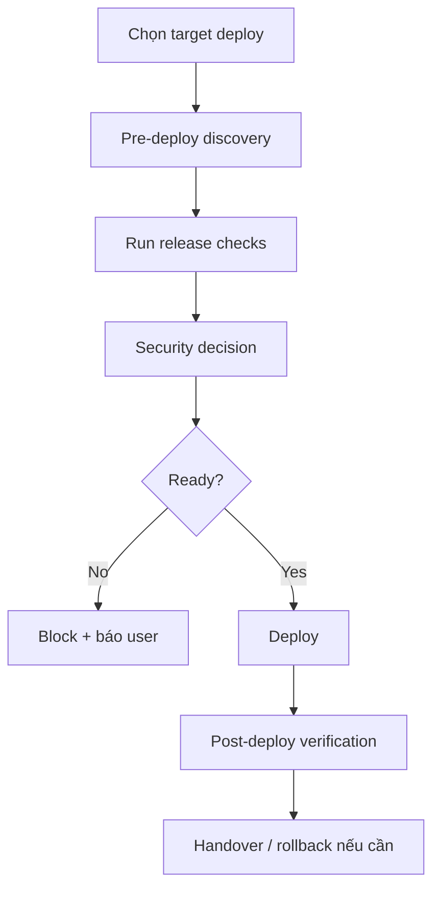

# Deploy - Deployment & Operations

## The Iron Law

```
NO DEPLOY WITHOUT VERIFIED QUALITY GATES
```

<HARD-GATE>
- Không deploy nếu build hoặc release checks đang fail.
- Không deploy production nếu còn unresolved critical/high security issue.
- Không deploy nếu env/config chưa đủ cho target môi trường.
- Không dựa vào `session.json` hay note tay để thay cho evidence thật.
- Không deploy nếu chưa verify đúng identity, account, project, và target environment.
</HARD-GATE>

---

## Process



## Deploy Discovery

```
1. Mục đích? local demo / staging / production
2. Hosting? Vercel / Railway / Render / server riêng
3. Domain và env nào đang dùng?
4. Có rollback path rõ ràng chưa?
```

## Identity & Target Check

Trước mọi deploy, chốt đúng:

```text
- Git identity / remote đúng repo và branch chưa?
- Cloud account / project / tenant đúng target chưa?
- Database / backend project đúng environment chưa?
- Env file / secret scope / region đúng chưa?
```

Nếu có bất kỳ nghi ngờ nào về identity hoặc target, block deploy trước khi chạy lệnh.

## Ordered Release Gates

Chạy theo thứ tự. Gate fail -> stop, fix, rồi quay lại từ gate bị ảnh hưởng sớm nhất.

| Gate | Mục tiêu | Ví dụ evidence |
|------|----------|----------------|
| `Gate 0` | Target + identity đúng | git remote/branch, account/project/env check |
| `Gate 1` | Secrets/config/env đúng | env vars, secret scope, feature flags |
| `Gate 2` | Fast-fail sanity pass | syntax/config parse -> type/lint -> build entry |
| `Gate 3` | Test/check phù hợp pass | targeted tests, suite, smoke command |
| `Gate 4` | Release artifact/package đúng | dist/assets, migration bundle, manifest |
| `Gate 5` | Deploy đúng target | release id, URL, provider output |
| `Gate 6` | Post-deploy smoke pass | health/auth/main flow/logs |

Không được lấy kết quả test cũ để bỏ qua gate sanity hoặc artifact verification.

Gate 2 nên chạy theo thứ tự:
1. syntax/config parse
2. type/lint fast-fail
3. build entry hoặc artifact assembly

Nếu fail ở bước sớm, không nhảy sang test chỉ để "xem còn fail gì nữa".

## Pre-Deploy Checklist

```
- Build/release command pass
- Test/check phù hợp với target deploy đã pass
- Không có skipped/disabled check nào cho phần bị ảnh hưởng mà chưa được note
- Security review đã xong
- Env vars / secrets / config đầy đủ
- Debug mode / dev credentials / mock flags đã tắt
- Rollback path đã rõ
```

Bất kỳ mục nào fail -> block deploy.
Checklist này không thay thế ordered gates; nó là view tóm tắt của cùng một quyết định.

## Production Readiness

### SEO
```
- Title/description
- Open Graph
- sitemap / robots
- canonical URLs nếu cần
```

### Analytics
```
- Tracking code đúng environment
- Event quan trọng có được kiểm tra
```

### Legal & Ops
```
- Privacy / Terms nếu public app cần
- Monitoring / error tracking
- Backup strategy nếu có data
```

## Post-Deploy Verification

```
- Trang chủ / health endpoint load được
- Auth và luồng chính chạy được
- Mobile / desktop render đúng nếu có UI
- SSL / domain / redirect đúng
- Logs / monitoring không báo lỗi mới
```

## Rollback Protocol

| Tình huống | Hành động đầu tiên | Mức khẩn |
|------------|--------------------|----------|
| White screen / app không boot | Rollback release ngay, rồi mới điều tra | Critical |
| Auth/API flow hỏng hoàn toàn | Rollback hoặc disable route/flag nếu rollback chậm hơn | High |
| Broken translation / asset / styling lớn | Rollback nếu chặn flow chính, nếu không hotfix khẩn với smoke lại | Medium |
| Partial feature bug có blast radius hẹp | Disable flag / isolate / hotfix có kiểm soát | Medium |
| Monitoring noisy nhưng flow chính còn chạy | Observe ngắn, xác định signal thật, rồi quyết định rollback hay fix-forward | Low/Medium |

Nếu rollout fail mà chưa rõ xử lý tiếp ra sao, đọc `references/failure-recovery-playbooks.md`.

## Anti-Rationalization

| Bào chữa | Sự thật |
|----------|---------|
| "Tests pass rồi, gate sanity chắc khỏi cần" | Test pass trước đó không chứng minh build entry, syntax, hay artifact hiện tại còn đúng |
| "Test fail nhưng không liên quan" | Phải chứng minh bằng evidence, không bằng cảm giác |
| "Chỉ deploy staging nên khỏi cần review" | Staging sai vẫn làm mất thời gian debug và test |
| "Config thiếu bổ sung sau" | Deploy với env thiếu là cách nhanh nhất để tạo incident |
| "Rollback tính sau" | Không có rollback = release rủi ro cao |

Code examples:

Bad:

```text
"CI pass hôm qua rồi, deploy luôn đi."
```

Good:

```text
"Gate 2 và Gate 4 cần rerun cho release hiện tại: sanity/build artifact phải có evidence mới trước khi deploy."
```

## Verification Checklist

- [ ] Target deploy đã được xác định
- [ ] Identity / account / project / env đã được verify
- [ ] Ordered release gates đã chạy theo thứ tự
- [ ] Pre-deploy checks đã chạy
- [ ] Security decision đã rõ ràng
- [ ] Post-deploy verification đã chạy
- [ ] Rollback path đã sẵn sàng hoặc đã dùng nếu cần

## Complexity Scaling

| Level | Approach |
|-------|----------|
| **small** | Demo/staging deploy + smoke checks |
| **medium** | Full pre-check + smoke + monitoring check |
| **large/prod** | Full pre-check + security + rollback + post-deploy checklist |

## Handover

```
Deploy report:
- Target: [...]
- Identity check: [...]
- Gates passed: [0..6]
- URL / release id: [...]
- Verified: [checks]
- Outstanding risk: [...]
- Rollback: [path]
```

## Activation Announcement

```
Forge: deploy | pre-check, security decision, rồi mới rollout
```
