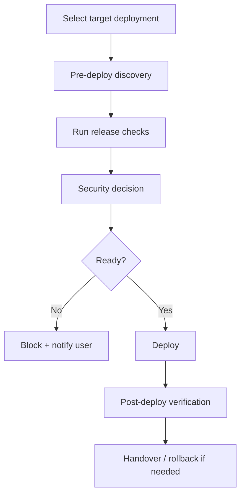

# Deploy - Deployment & Operations

## The Iron Law

```
NO DEPLOY WITHOUT VERIFIED QUALITY GATES
```

<HARD-GATE>
- Do not deploy if build or release checks are failing.
- Do not deploy to production if there is an unresolved critical/high security issue.
- Do not deploy if env/config is not enough for the target environment.
- Do not rely on `session.json` or handwritten notes as a substitute for real evidence.
- Do not deploy without properly verifying identity, account, project, and target environment.
- For solo-profile release-sensitive work, do not deploy until `review-pack` has been used and the final pass is explicitly a `self-review`.
</HARD-GATE>

---

## Process



## Deploy Discovery

```
1. Purpose? local demo / staging / production
2. Hosting? Vercel / Railway / Render / dedicated server
3. Which domain and environment are in use?
4. Is there a clear rollback path?
```

## Identity & Target Check

Before every deployment, confirm:

```text
- Is Git identity / remote the correct repo and branch?
- Is Cloud account / project / tenant the correct target?
- Is the database / backend project environment in the right environment?
- Env file / secret scope / region correct?
```

If there is any doubt about identity or target, block deploy before running the command.

## Ordered Release Gates

Run in order. Gate failure -> stop, fix, then return from the earliest affected gate.

|Gate | Goal | For example evidence|
|------|----------|----------------|
|`Gate 0` | Target + identity true | git remote/branch, account/project/env check|
|`Gate 1` | Secrets/config/env correct | env vars, secret scope, feature flags|
|`Gate 2` | Fast-fail sanity pass | syntax/config parse -> type/lint -> build entry|
|`Gate 3` | Test/check appropriate pass | targeted tests, suite, smoke command|
|`Gate 4` | Release artifact/package correct | dist/assets, migration bundle, manifest|
|`Gate 5` | Deploy to the correct target | release id, URL, provider output|
|`Gate 6` | Post-deploy smoke pass | health/auth/main flow/logs|

Do not use old test results to bypass gate sanity or artifact verification.

Gate 2 should run in this order:
1. syntax/config parse
2. type/lint fast-fail
3. build entry or artifact assembly

If an early step fails, don't jump to testing just to "see what else fails".

## Pre-Deploy Checklist

```
- Build/release command pass
- Relevant tests/checks for the target deployment have passed
- There are no skipped/disabled checks for the affected area without an explicit note
- Security review is complete
- Env vars /secrets /config are complete
- Debug mode / dev credentials / mock flags are off
- Rollback path is clear
```

Any item fails -> block deployment.
This checklist does not replace the ordered gates. It summarizes the same decision.

## Solo Release Tail

For solo-internal and solo-public releases, keep the tail explicit:

1. `review-pack`
2. `self-review`
3. `quality-gate`
4. `deploy`

If the slice is public-facing or release-sensitive, treat the tail as mandatory evidence, not as optional hygiene.

## Production Readiness

### SEO
```
- Title/description
- Open Graph
- sitemap/robots
- canonical URLs if needed
```

### Analytics
```
- Tracking code is in the correct environment
- Important events have been verified
```

### Legal & Ops
```
- Privacy / Terms if the public app requires them
- Monitoring / error tracking
- Backup strategy if data exists
```

## Post-Deploy Verification

```
- Home page / health endpoint loads successfully
- Auth and the main flow of work
- Mobile / desktop render correctly if UI exists
- SSL/domain/redirect are correct
- Logs / monitoring show no new errors
```

## Rollback Protocol

|Situation | First Action | Urgency level|
|------------|--------------------|----------|
|White screen / app does not boot | Rollback release immediately, then investigate | Critical|
|Auth/API flow is completely broken | Rollback or disable route/flag if rollback is slower | High|
|Broken translation / assets / styling large | Rollback if main flow is blocked, otherwise hotfix urgently and smoke again | Medium|
|Partial feature bug has narrow blast radius | Disable flag / isolate / controlled hotfix | Medium|
|Monitoring noisy but main flow is still running | Short Observe, determine the real signal, then decide to rollback or fix-forward | Low/Medium|

If the rollout fails and it's unclear what to do next, read `references/failure-recovery-playbooks.md`.

## Anti-Rationalization

|Defense | Truth|
|----------|---------|
|"Tests passed, gate sanity probably won't be needed" | The previous test pass does not prove that the current build entry, syntax, or artifact is still correct|
| "Test failed but not relevant" | Must prove with evidence, not with feelings
| "Just deploy to staging so no need to review" | Wrong staging still wastes time debugging and testing
|"Config is missing the following addition" | Deploying with missing env is the fastest way to create an incident|
|"Rollback calculated later" | No rollback = high risk release|

Code examples:

Bad:

```text
"CI passed yesterday, deploy now."
```

Good:

```text
"Gate 2 and Gate 4 need to be rerun for current release: sanity/build artifact must have new evidence before deploying."
```

## Verification Checklist

- [ ] Target deployment has been determined
- [ ] Identity / account / project / env has been verified
- [ ] Ordered release gates have been running in order
- [ ] Pre-deploy checks have been run
- [ ] Security decision is clear
- [ ] Post-deploy verification has run
- [ ] Rollback path is ready or used if needed

## Complexity Scaling

|Level | Approach|
|-------|----------|
|**small** | Demo/staging deploy + smoke checks|
|**medium** | Full pre-check + smoke + monitoring check|
|**large/prod** | Full pre-check + security + rollback + post-deploy checklist|

## Handover

```
Deploy report:
- Target: [...]
- Identity check: [...]
- Gates passed: [0..6]
- URL/release id: [...]
- Verified: [checks]
- Outstanding risks: [...]
- Rollback: [path]
```

## Activation Announcement

```
Forge: deploy | pre-check, security decision, then rollout
```

## Response Footer

When this skill is used to complete a task, include this exact English line in a footer block at the end of the response:

`Used skill: deploy.`

Keep that footer block as the last block of the response. If multiple skills are used, include one exact `Used skill:` line per unique skill and do not add anything after the footer block.