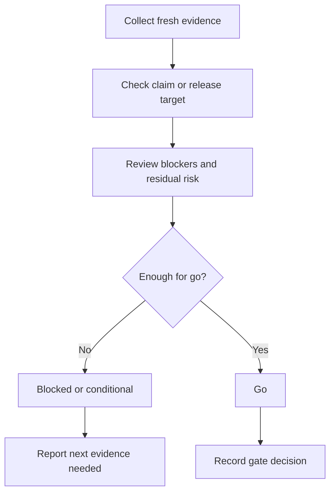

# Quality Gate - Verify Before Claim

## The Iron Law

```
NO CLAIMS, HANDOFFS, OR DEPLOYS WITHOUT A FRESH GO / NO-GO DECISION
```

<HARD-GATE>
- Không dùng kết quả cũ, cảm giác, hay "đã pass trước đó" để thay cho gate hiện tại.
- Không nói `done`, `ready`, `ship`, `merge`, hoặc `deploy` nếu chưa chốt gate decision.
- Gate fail -> stop, report blocker, và nói rõ cần evidence gì tiếp theo.
- Với `release-critical` flow, `conditional` không đủ để production deploy.
- Nếu flow rõ ràng thuộc profile mạnh hơn `standard`, không được review nó như `standard`.
</HARD-GATE>

## Scope

Dùng khi cần gom các bằng chứng đã có từ `build`, `test`, `review`, `secure`, `deploy` thành một quyết định cuối:
- `go`
- `conditional`
- `blocked`

## Gate Profiles

| Profile | Dùng khi |
|---------|----------|
| `standard` | Task bình thường, nội bộ, hoặc non-release-critical |
| `release-critical` | Production deploy, migration nhạy cảm, auth/payment, public incident-prone flow |
| `migration-critical` | Schema/data move/backfill/policy change có sequencing hoặc rollback concern |
| `external-interface` | Public API/webhook/integration/consumer-facing contract change |
| `regression-recovery` | Hotfix, recovery, hoặc regression vừa xảy ra cần containment rõ |

Với `release-critical`, gate phải đọc tối thiểu:
- build/type/lint/smoke evidence mới
- test evidence mới
- review disposition
- security decision
- deploy target readiness và rollback path

## Profile Selection Rules

- `standard`: chỉ dùng khi change không chạm release risk, migration, hay external interface
- `release-critical`: ưu tiên cho production rollout, payment/auth, và các flow từng có incident
- `migration-critical`: dùng cho schema/data/policy changes, kể cả khi chưa deploy production ngay
- `external-interface`: dùng khi caller/consumer ngoài boundary hiện tại sẽ bị ảnh hưởng
- `regression-recovery`: dùng khi mục tiêu là khôi phục behavior đúng sau incident/regression
- Profile mạnh hơn `standard` chỉ được chọn khi prompt hoặc repo signals có evidence tương ứng; intent một mình không đủ để nâng profile

Nếu flow chạm nhiều profile, chọn profile có blast radius cao hơn làm profile chính cho gate hiện tại.

## Gate Inputs

Đọc từ artifact thật hoặc command output mới:
- Verification/test output
- Review disposition
- Security decision
- Deploy target readiness
- Residual risk notes

## Evidence Response Contract

Mọi claim hoàn thành, phản hồi feedback, hoặc kết luận gate phải bám theo contract này:

```text
- I verified: [fresh evidence]. Correct because [reason]. Fixed: [change].
- I investigated: [evidence]. Current code stays because [reason].
- Clarification needed: [single precise question].
```

Required fields:
- fresh evidence
- reason hoặc disposition
- change/no-change stance

Reject nhanh các câu:
- Good catch! Fixed.
- Looks good now.
- Should be fixed.
- Probably fine.

Contract này là global cho `build`, `debug`, `test`, `review`, và `deploy`, không chỉ riêng quality gate.

## Canonical Rationalizations To Reject

8 rationalizations dưới đây phải bị xem như tín hiệu gate yếu:

1. `Good catch! Fixed.`
2. `Should be fine now.`
3. `CI passed earlier.`
4. `I did not run the exact check, but the change is small.`
5. `Test fail but it looks unrelated.`
6. `Could not reproduce, so it is probably okay.`
7. `Spec is basically clear, implementation can figure it out.`
8. `Merge first, follow up later.`

Nếu kết luận hiện tại dựa vào một trong các câu trên, decision không được là `go`.

## Required Evidence By Profile

### `standard`
- Focused verification hoặc smoke evidence
- Review/residual-risk note nếu task không nhỏ
- Claim target rõ

### `release-critical`
- Identity/target check
- Secrets/config/env validation
- Fresh sanity/build + test evidence
- Rollback path và post-deploy smoke readiness

### `migration-critical`
- Compatibility hoặc sequencing note
- Migration/backfill verification
- Rollback/backout path
- Consumer impact hoặc cutoff plan

### `external-interface`
- Contract diff hoặc compatibility note
- Caller/consumer update note
- Boundary verification hoặc smoke check từ phía consumer

### `regression-recovery`
- Fresh failing reproduction
- Root-cause note
- Targeted regression verification
- Containment hoặc rollback stance

## Process



## Decisions

| Decision | Dùng khi |
|----------|----------|
| `go` | Evidence mới đủ mạnh, không còn blocker quan trọng |
| `conditional` | Có thể đi tiếp nhưng phải note rõ risk hoặc follow-up bắt buộc |
| `blocked` | Thiếu evidence hoặc blocker/risk còn quá lớn |

Rule:
- `standard` flow có thể chấp nhận `conditional` nếu user hiểu residual risk
- `release-critical` flow muốn deploy production thì phải là `go`
- `migration-critical` flow có bước irreversible thì `conditional` không đủ cho production data move
- Nếu thiếu một gate bắt buộc cho `release-critical`, decision mặc định là `blocked`

## Release-Critical Ordered Gates

Khi profile là `release-critical`, đọc và chốt tuần tự:

1. Identity/target đúng
2. Config/secrets/env đúng
3. Sanity/build entry pass
4. Tests/checks pass
5. Review disposition sạch hoặc risk đã resolve
6. Security decision cho release
7. Rollback path và post-deploy smoke readiness

Gate fail ở bước nào thì report ngay bước đó, không nhảy sang gate sau để "xem tiếp".

Khi blocked mà chưa rõ đường ra, đọc `references/failure-recovery-playbooks.md`.

## Gate Checklist

- [ ] Evidence là mới, không phải kết quả cũ
- [ ] Verification phù hợp với blast radius
- [ ] Review/security disposition đã rõ nếu task chạm tới
- [ ] Residual risk đã được đọc, không chỉ copy lại
- [ ] Evidence response contract đã được giữ, không dùng performative agreement
- [ ] Gate decision đã explicit
- [ ] Nếu release-critical, ordered gates đã được đọc đủ và `go` là thật sự justified
- [ ] Profile đang dùng thật sự khớp blast radius của flow

## Output

```text
Quality gate:
- Profile: [standard / release-critical / migration-critical / external-interface / regression-recovery]
- Target claim: [done / ready-for-review / ready-for-merge / deploy]
- Evidence read: [...]
- Evidence response: [I verified: ... / I investigated: ... / Clarification needed: ...]
- Decision: [go / conditional / blocked]
- Why: [...]
- Next evidence needed: [...]
```

## Activation Announcement

```text
Forge Antigravity: quality-gate | chốt go/no-go bằng evidence mới
```
