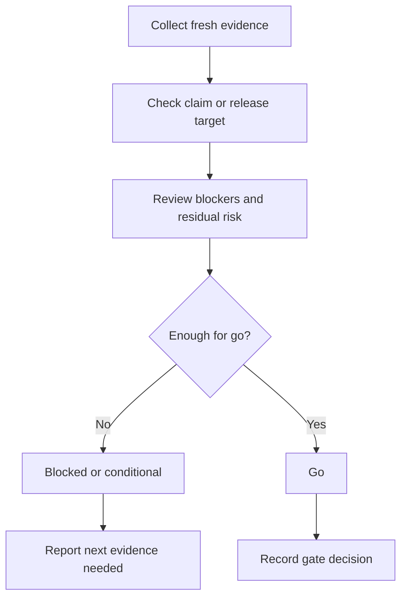

# Quality Gate - Verify Before Claim

## The Iron Law

```
NO CLAIMS, HANDOFFS, OR DEPLOYS WITHOUT A FRESH GO / NO-GO DECISION
```

<HARD-GATE>
- Do not use old results, feelings, or "previously passed" results to replace the current gate.
- Do not say `done`, `ready`, `ship`, `merge`, or `deploy` if the gate decision has not been finalized.
- Gate failure -> stop, report blocker, and state clearly what evidence is next needed.
- With `release-critical` flow, `conditional` is not enough for production deployment.
- If the flow clearly belongs to a stronger profile than `standard`, do not review it as `standard`.
- For solo-profile release-sensitive work, include the `review-pack`/`self-review` tail before the final go/no-go call.
</HARD-GATE>

## Scope

Used when you need to gather the evidence from `build`, `test`, `review`, `secure`, `deploy` into a final decision:
- `go`
- `conditional`
- `blocked`

## Gate Profiles

|Profile | Use when|
|---------|----------|
|`standard` | Normal, internal, or non-release-critical task|
|`release-critical` | Production deployment, sensitive migration, auth/payment, public incident-prone flow|
|`migration-critical` | Schema/data move/backfill/policy change has sequencing or rollback concerns|
|`external-interface` | Public API/webhook/integration/consumer-facing contract change|
|`regression-recovery` | Hotfix, recovery, or regression that has just occurred needs clear containment|

With `release-critical`, gate must read at least:
- new build/type/lint/smoke evidence
- test new evidence
- review disposition
- security decision
- deploy target readiness and rollback path

## Profile Selection Rules

- `standard`: only used when the change does not touch release risk, migration, or external interface
- `release-critical`: prioritize production rollout, payment/auth, and flows that have had incidents
- `migration-critical`: used for schema/data/policy changes, even if not deployed to production immediately
- `external-interface`: used when callers/consumers outside the current boundary will be affected
- `regression-recovery`: used when the goal is to restore correct behavior after an incident/regression
- Profiles stronger than `standard` are only selected when prompted or repo signals have corresponding evidence; Intent alone is not enough to raise profile

If the flow touches multiple profiles, select the profile with the higher blast radius as the main profile for the current gate.

## Gate Inputs

Read from real artifact or new command output:
- Verification/test output
- Verify-change artifact for medium or large build work
- Review disposition
- Security decision
- Deploy target readiness
- Residual risk notes

## Durable Artifacts

Fresh command output is necessary, but medium+ or behavior-changing work also needs a durable process artifact before it can be marked ready:
- plan, spec, or design packet
- change artifact or execution checkpoint
- verify-change artifact before final merge/deploy claims on active change work
- workflow-state record when the work has already been tracked there
- review pack or disposition artifact when the slice is entering handoff
- stage-state record with explicit `pending`, `required`, `active`, `completed`, `skipped`, or `blocked` values when workflow-state is used

Do not mark a medium+ slice ready from command output alone.

## Evidence Response Contract

All completed claims, feedback, or gate conclusions must follow this contract:

```text
- I verified: [fresh evidence]. Correct because [reason]. Fixed: [change].
- I evaluated: [evidence]. The current code stays because [reason].
- Clarification needed: [single precise question].
```

Required fields:
- fresh evidence
- reason or disposition
- change/no-change stance

Quickly reject sentences:
- Good catch. I fixed it.
- Looks good now.
- Should be fixed.
- Probably fine.

This contract is global for `build`, `debug`, `test`, `review`, and `deploy`, not just quality gate.

## Canonical Rationalizations To Reject

The following 8 rationalizations should be considered weak gate signals:

1. `Good catch. I fixed it.`
2. `Should be fine now.`
3. `CI passed earlier.`
4. `I did not run the exact check, but the change is small.`
5. `Test fail but it looks unrelated.`
6. `Could not reproduce, so it is probably okay.`
7. `Spec is basically clear, implementation can figure it out.`
8. `Merge first, follow up later.`

If the current conclusion is based on one of the above statements, the decision cannot be `go`.

## Required Evidence By Profile

### `standard`
- Focused verification or smoke evidence
- Durable process artifact when the slice is medium+ or behavior-changing
- Review/residual-risk note if the task is not small
- Claim target clearly

### `release-critical`
- Identity/target check
- Secrets/config/env validation
- Fresh sanity/build + test evidence
- Rollback path and post-deploy smoke readiness

### `migration-critical`
- Compatibility or sequencing note
- Migration/backfill verification
- Rollback/backout path
- Consumer impact or cutoff plan

### `external-interface`
- Contract difference or compatibility note
- Caller/consumer update note
- Boundary verification or smoke check from the consumer

### `regression-recovery`
- Fresh failing reproduction
- Root cause note
- Targeted regression verification
- Containment or rollback stance

### Solo profile overlay
- `solo-internal` and `solo-public` reuse the evidence rules above, but require the reviewer tail to be `review-pack` -> `self-review` when the slice is release-sensitive
- profile selection still follows blast radius; solo profile changes the handoff shape, not the evidence bar

## Process

Deterministic recorder:

```powershell
python scripts/record_quality_gate.py --workspace <workspace> --profile standard --target-claim ready-for-merge --decision conditional --evidence "pytest tests/test_checkout.py" --response "I verified: ..." --why "..." --next-evidence "Run merge-readiness smoke" --persist --output-dir <workspace>
```



## Decisions

|Decision | Use when|
|----------|----------|
|`go` | The new Evidence is strong enough, there are no more important blockers|
| `conditional` | You can continue but must clearly note the risks or follow-up is mandatory
|`blocked` | Lack of evidence or blocker/risk is too big|

Rule:
- `standard` flow can accept `conditional` if the user understands residual risk
- `release-critical` flow to deploy to production must be `go`
- `migration-critical` flow has an irreversible step, so `conditional` is not enough for production data move
- If a required gate is missing for `release-critical`, the default decision is `blocked`

## Release-Critical Ordered Gates

When the profile is `release-critical`, read and confirm each item in sequence:

1. Identity/target is correct
2. Config/secrets/env is correct
3. Sanity/build entry pass
4. Tests/checks pass
5. Review disposition clean or risk resolved
6. Security decision for release
7. Rollback path and post-deploy smoke readiness

If a gate fails at any step, report that step immediately, do not jump to the next gate to "continue watching".

When blocked but the way out is unclear, read `references/failure-recovery-playbooks.md`.

## Gate Checklist

- [ ] Evidence is new, not old results
- [ ] Verification matches blast radius
- [ ] Review/security disposition is clear if the task is reached
- [ ] Residual risk was read, not just copied
- [ ] A durable process artifact exists for medium+ or behavior-changing work
- [ ] Evidence response contract has been kept, no empty agreement is used
- [ ] Gate decision is explicit
- [ ] If release-critical, ordered gates have been fully read and `go` is truly justified
- [ ] The profile being used actually matches the blast radius of the flow

## Output

```text
Quality gates:
- Profile: [standard / release-critical / migration-critical / external-interface / regression-recovery]
- Target claim: [done / ready-for-review / ready-for-merge / deploy]
- Evidence read: [...]
- Evidence response: [I verified:... / I investigated:... / Clarification needed:...]
- Decision: [go / conditional / blocked]
- Why: [...]
- Next evidence needed: [...]
```

If persisted, the gate should refresh:

```text
.forge-artifacts/quality-gates/<project-slug>/
.forge-artifacts/workflow-state/<project-slug>/latest.json
.forge-artifacts/workflow-state/<project-slug>/events.jsonl
```

## Activation Announcement

```text
Forge: quality-gate | close go/no-go with new evidence
```
