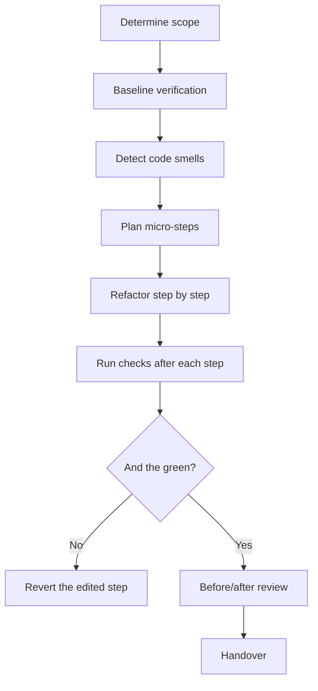

# Refactor - Safe Refactoring

## The Iron Law

```
NO REFACTOR WITHOUT BASELINE AND AFTER VERIFICATION
```

<HARD-GATE>
- Business logic must remain the same.
- Do not mix refactor with feature work if the scope has not been finalized.
- If there is no baseline verification, you need to create a baseline before continuing.
</HARD-GATE>

---

## Process



## Code Smells

|Smell | Signs | Action|
|-------|----------|-----------|
|Long Function | >50 lines | Function separation|
|Deep Nesting | >3 levels | Early return / flatten|
|Large File | >500 lines | Split modules|
|Duplication | Copy-paste | Extract helper|
|Vague Names | `data`, `x`, `obj` | Rename clearly|
|Dead Code | No one called | Secure Erase|
|Magic Numbers | Confusing numbers | Extract constant|

## Anti-Rationalization

|Defense | Truth|
|----------|---------|
|"Conveniently edit more logic" | That's no longer a refactor|
|"No need for baseline, I probably won't change my behavior" | Maybe feeling doesn't replace evidence|
|"Too many micro-steps, combine them quickly" | Combined refactors are the most likely to cause regression|

Code examples:

Bad:

```text
"I'll refactor this and then fix that behavior."
```

Good:

```text
"Scope refactor: separate the module and change the name more clearly, the baseline remains the same. The other behavior change is a separate task if still needed."
```

## Verification Checklist

- [ ] Baseline checks passed
- [ ] Each micro-step is verified
- [ ] Checks after refactor have passed
- [ ] Logic / public behavior remains unchanged
- [ ] Removed debug temp / dead scaffolding

## Complexity Scaling

|Level | Approach|
|-------|----------|
|**small** | 1-2 micro-steps + targeted checks|
|**medium** | Split into many micro-steps + final review|
|**large** | Need separate plan, worktree/branch if necessary, verify after each phase|

## Handover

```
Refactor report:
- Scope: [...]
- Smells addressed: [...]
- Verified: [checks]
- Behavior changed?: no / note if yes
```

## Activation Announcement

```
Forge: refactor | baseline first, verify after every micro-step
```
