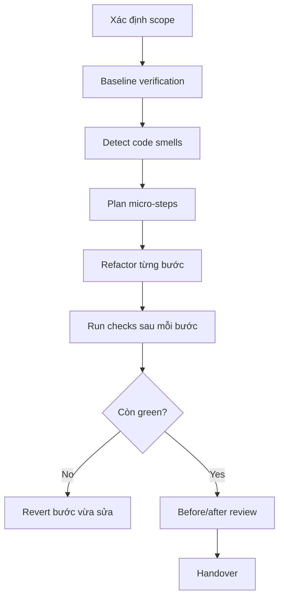

# Refactor - Safe Refactoring

## The Iron Law

```
NO REFACTOR WITHOUT BASELINE AND AFTER VERIFICATION
```

<HARD-GATE>
- Logic nghiệp vụ phải giữ nguyên.
- Không trộn refactor với feature work nếu chưa chốt scope.
- Nếu không có baseline verification, cần tạo baseline trước khi đi tiếp.
</HARD-GATE>

---

## Process



## Code Smells

| Smell | Dấu hiệu | Hành động |
|-------|----------|-----------|
| Long Function | >50 dòng | Tách hàm |
| Deep Nesting | >3 cấp | Early return / flatten |
| Large File | >500 dòng | Tách module |
| Duplication | Copy-paste | Extract helper |
| Vague Names | `data`, `x`, `obj` | Rename rõ nghĩa |
| Dead Code | Không ai gọi | Xóa an toàn |
| Magic Numbers | Số khó hiểu | Extract constant |

## Anti-Rationalization

| Bào chữa | Sự thật |
|----------|---------|
| "Tiện tay sửa thêm logic luôn" | Đó không còn là refactor nữa |
| "Không cần baseline, em chắc không đổi behavior" | Chắc cảm giác không thay cho evidence |
| "Micro-step nhiều quá, gộp cho nhanh" | Refactor gộp dễ gây regression nhất |

Code examples:

Bad:

```text
"Em refactor luôn chỗ này rồi tiện fix behavior kia."
```

Good:

```text
"Scope refactor: tách module và đổi tên rõ hơn, baseline giữ nguyên. Behavior change kia là task riêng nếu còn cần."
```

## Verification Checklist

- [ ] Baseline checks đã pass
- [ ] Mỗi micro-step đều được verify
- [ ] Checks sau refactor đã pass
- [ ] Logic / public behavior không đổi
- [ ] Đã xóa debug temp / dead scaffolding

## Complexity Scaling

| Level | Approach |
|-------|----------|
| **small** | 1-2 micro-steps + targeted checks |
| **medium** | Tách thành nhiều micro-steps + review sau cùng |
| **large** | Cần plan riêng, worktree/branch nếu cần, verify sau mỗi phase |

## Handover

```
Refactor report:
- Scope: [...]
- Smells addressed: [...]
- Verified: [checks]
- Behavior changed?: no / note nếu có
```

## Activation Announcement

```
Forge: refactor | baseline trước, verify sau mỗi micro-step
```
