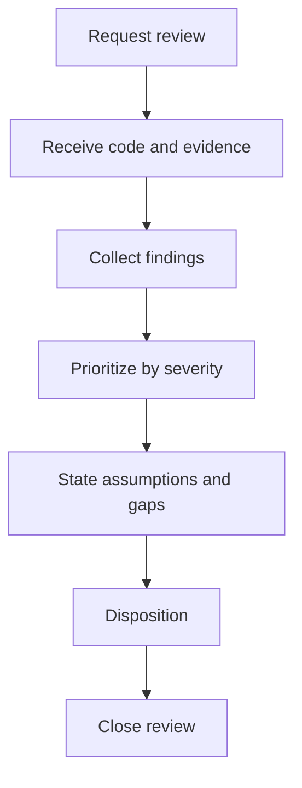

# Review - Code Review & Project Health

## The Iron Law

```text
FINDINGS FIRST, SUMMARY SECOND
```

<HARD-GATE>
- Do not approve a patch, branch, or work item without either a finding, a no-finding rationale, or an explicit testing gap.
- If the conclusion is "no findings", state the review scope and any residual risk clearly.
- Every review must move through three stages: request -> receive -> close the review.
- For solo-dev flows, the review is still findings-first, but the reviewer role is `self-review` rather than pretending there was a separate human reviewer.
</HARD-GATE>

## Process



## 3-Part Review Lifecycle

### 1. Request
- lock review mode, scope, and questions to answer
- decide whether the review is about a diff, repo state, or another artifact

### 2. Receive
- read the actual code and artifacts under review
- use command/test evidence if it exists; otherwise say explicitly that this is a static review
- collect findings before writing any summary

### 3. Close Review
- set a clear review disposition: `ready-for-merge`, `changes-required`, or `blocked-by-residual-risk`
- state what happens next: merge, keep editing, or stop because of risk
- avoid vague endings such as "looks good"
- if the work is release-sensitive, ensure the closing tail is explicit as `self-review` -> `secure` -> `quality-gate` -> `deploy` before the final disposition

## Large-Task Review Discipline

For `large`, release-sensitive, or multi-boundary work:
- prefer an independent review lane for the implemented flow
- if the host supports reviewer subagents, use them
- if not, still separate:
  - implementation evidence
  - reviewer findings
  - final disposition
- do not implement and declare merge-ready in the same pass
- if the build chain used `implementer-quality`, the reviewer lane must remain independent in tone and judgment

## Solo Self-Review

When the same person implements and reviews:
- label the pass as `self-review`
- keep the same findings-first structure and evidence standard
- do not downgrade the bar because no separate reviewer is available
- for release-sensitive or public-facing slices, keep the tail explicit as `self-review` -> `secure` -> `quality-gate` before deploy

Boundary signals:
- auth, payment, or data migration
- multiple boundaries or multiple skills changing at once
- difficult production rollback
- a recent regression in the same area

## Medium+ Closure

Medium and larger slices do not end with an implied thumbs-up.

Before handoff, the review must close the slice explicitly with a disposition and a branch state:
- `ready-for-merge` plus `merge` when the slice is clean
- `changes-required` plus `continue-on-branch` when follow-up edits are needed
- `blocked-by-residual-risk` plus `stop-on-risk` when the evidence is still too weak

If the review has no findings, the no-finding rationale still has to name the scope, the closed slice, and any residual risk.

For medium+ slices, do not leave closure implied in a summary paragraph. The review must say what was closed, what remains open, and which branch state follows from that decision.
For solo-dev medium+ slices, the closure still needs a clear `self-review` disposition, not a vague personal note.

## Avoid Empty Agreement

Reject review language such as:
- "this patch is fine" without findings or rationale
- "nothing alarming" without stating scope
- "maybe it can merge" without a disposition

A useful review must produce one of three things:
- a specific finding
- a clean no-finding rationale with scope and gaps
- a clear disposition for the branch or work item

## Feedback Response Matrix

When responding to review feedback:

|Feedback type | How to handle|
|---------------|-------------|
|Technically correct | Edit, verify, and report fresh evidence|
|Unclear intent | Ask one precise question|
|Technically questionable | Investigate first, then challenge with evidence if needed|
|Stylistic preference | State the tradeoff, the convention, and the final decision|

Good responses:

```text
- I verified: [evidence]. Correct because [reason]. Fixed: [change].
- I evaluated: [evidence]. The current code stays because [reason].
- Clarification needed: [single precise question].
```

Required:
- evidence must be fresh
- the response must clearly decide whether to fix or keep the current behavior
- if the code stays, explain why

Bad responses:

```text
- Good catch. I fixed it.
- Looks fine now.
- I think it is fixed.
```

## Review Modes

|Mode | Goal|
|------|-----|
|Code review | Find bugs, regressions, and missing tests|
|Final Implementation Review | Run a holistic review of the combined implementation before quality gate|
|Health check | Assess build/lint/test/docs/dependencies|
|Handover | Summarize the project and active area|
|Upgrade assessment | Assess upgrade risk|

## Final Implementation Review

Use this mode after a medium or large build chain has produced implementation evidence and before `quality-gate` is used for a ready claim.

Applicability:
- large work: required
- medium work: recommended, and required when multiple files, packets, subagents, or review concerns are involved
- small work: optional unless risk signals appear

Review inputs:
- original request, accepted design/spec/plan, and execution packet history
- changed files, ownership map, and relevant diff
- RED/GREEN/baseline evidence or explicit no-harness fallback
- implementer, spec-reviewer, and quality-reviewer statuses when subagents were used
- known residual risks and open concerns

Rules:
- final review is a holistic review, not another slice-local check
- findings come first, even when the result is clean
- if host subagents are available, dispatch a final reviewer with the consolidated packet
- if no subagent is available, run the same checklist as `self-review` and state that it was not independent
- feed the disposition and residual risk directly into `quality-gate`

Output disposition:
- `ready-for-quality-gate`: no blocker remains and evidence is fresh enough for gate review
- `changes-required`: findings must return to build before gate
- `blocked-by-residual-risk`: evidence or scope uncertainty is too weak for a ready claim

## Branch Resolution

After review, choose exactly one branch resolution. Do not leave the branch state implied.

|Resolution | Use when |
|-----------|----------|
|`merge-local` | Review and quality gate are clean, and local merge is the intended integration path |
|`push-and-pr` | Human review, CI, or remote collaboration is required before merge |
|`keep-branch` | Work is useful but not ready to merge or PR yet |
|`discard-with-confirmation` | The branch/worktree should be abandoned, but only after explicit user confirmation |

Rules:
- never discard a branch, worktree, or user edits without explicit confirmation
- require fresh review/gate evidence before `merge-local` or `push-and-pr`
- when using a worktree, include cleanup state: keep, cleanup after merge, or cleanup after confirmed discard
- if the right answer is unclear, select `keep-branch` and name the missing decision

## Auto-Scan

```text
1. Package manifests / build files (`package.json`, `pyproject.toml`, `go.mod`, `pom.xml`, `build.gradle`, `*.csproj`, ...)
2. Folder structure
3. README / docs / plans
4. Changed files / git status if available
5. Relevant build/lint/test commands
```

Repo state comes first. Read `.brain` only when it is available and materially useful.

## Anti-Rationalization

|Defense | Truth|
|----------|------|
|"Not seeing major errors is enough" | Good review states findings or no-finding rationale explicitly|
|"This is just an overview" | Review still needs findings first|
|"You can review without running checks" | If no evidence exists, say clearly that it is a static review|
|"The patch looks reasonable" | Reasonable is not the same as verified|

## Verification Checklist

- [ ] Review mode defined
- [ ] Source-of-truth artifacts scanned
- [ ] Findings prioritized
- [ ] Assumptions and testing gaps noted
- [ ] Findings and summary kept separate
- [ ] No empty-agreement language
- [ ] Disposition and post-review branch state finalized
- [ ] Feedback handled through the matrix, not just acknowledged
- [ ] Large/high-risk work kept reviewer independence
- [ ] Final Implementation Review completed or explicitly not required
- [ ] Branch Resolution selected before merge/PR/cleanup

## Review Disposition

|Disposition | Use when|
|-------------|---------|
|`ready-for-merge` | No blocker remains that should stop merge|
|`changes-required` | Findings must be fixed before merge|
|`blocked-by-residual-risk` | Evidence is insufficient or risk remains too high|

## Post-Review Branch State

After the disposition, the branch must enter exactly one state:

|Branch state | Use when|
|--------------|---------|
|`merge` | Review is clean and evidence is sufficient|
|`open-pr` | A human/owner review is still required|
|`continue-on-branch` | Findings need immediate follow-up on the current branch|
|`cleanup-only` | Code is acceptable but logs/artifacts/worktree still need cleanup|
|`stop-on-risk` | Risk is too high or evidence is too weak to proceed|

Do not leave the branch in an ambiguous state.

If review feedback is looping without convergence, read `references/failure-recovery-playbooks.md`.

## Output

Saved at:

```text
docs/PROJECT_REVIEW_[date].md
```

Template:

```text
Findings:
1. [severity] [...]
2. [...]

Assumptions / gaps:
- [...]

Disposition:
- [ready-for-merge / changes-required / blocked-by-residual-risk]

Close review:
- [merge / open-pr / continue-on-branch / cleanup-only / stop-on-risk]

Branch resolution:
- [merge-local / push-and-pr / keep-branch / discard-with-confirmation]

Feedback handled:
- [fixed / challenged with evidence / clarification requested / stylistic decision]

Evidence response:
- [I verified: ... / I evaluated: ... / Clarification needed: ...]

Summary:
- [...]
```

## Activation Announcement

```text
Forge: review | findings first, summary second
```

## Response Footer

When this skill is used to complete a task, record its exact skill name in the global final line:

`Skills used: review`

When multiple Forge skills are used, list each used skill exactly once in the shared `Skills used:` line. When no Forge skill is used for the response, use `Skills used: none`. Keep that `Skills used:` line as the final non-empty line of the response and do not add anything after it.
