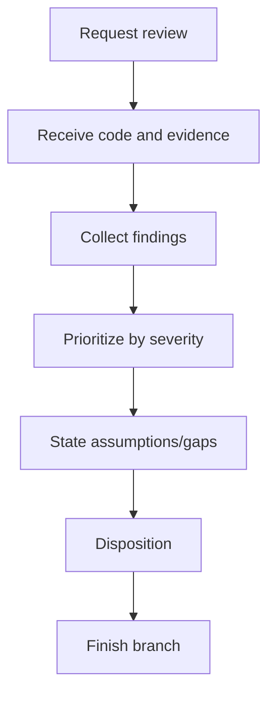

# Review - Code Review & Project Health

## The Iron Law

```
FINDINGS FIRST, SUMMARY SECOND
```

<HARD-GATE>
- Không được "đồng ý cho xong" với user, author, hoặc patch nếu chưa chỉ ra finding, no-finding rationale, hoặc testing gap.
- Nếu kết luận "không có finding", phải nói rõ scope review và residual risk/gap còn lại.
- Review phải đi hết 3 chặng: request -> receive -> finish branch.
</HARD-GATE>

## Process



## 3-Part Review Lifecycle

### 1. Request
- Chốt review mode, scope, và câu hỏi đang cần trả lời
- Xác định review đang dựa trên diff, repo state, hay artifact cụ thể

### 2. Receive
- Đọc code/artifacts thật sự được đưa ra để review
- Nếu có command/test evidence, dùng nó; nếu không có, nói rõ đây là static review
- Collect findings trước khi viết summary

### 3. Finish Branch
- Chốt disposition: `ready-for-merge`, `changes-required`, hoặc `blocked-by-residual-risk`
- Nêu branch/work item nên đi tiếp thế nào: merge, sửa rồi review lại, hay dừng vì risk
- Không kết thúc bằng nhận xét mơ hồ kiểu "trông ổn", "có vẻ tốt"

## Large-Task Review Discipline

Với task `large`, `release-critical`, hoặc `high-risk`:

- Ưu tiên một lượt review độc lập với flow vừa implement
- Nếu host hỗ trợ subagent/reviewer lane riêng, dùng reviewer độc lập thay vì tự review cùng lane implement
- Nếu không có subagent, vẫn phải tách rõ:
  - implementation evidence
  - reviewer findings
  - final disposition
- Không vừa sửa vừa review rồi tự kết luận merge-ready trong cùng một bước
- Nếu build chain đã chọn pipeline `implementer-quality` hoặc `implementer-spec-quality`, reviewer lane phải giữ stance độc lập đúng pipeline đó

High-risk signals:
- auth/payment/data migration
- nhiều boundary hoặc nhiều skill cùng chạm
- rollback production khó
- regression vừa mới xảy ra quanh khu vực đó

## Anti-Performative Agreement

Reject các phản xạ kiểu:
- "Đúng rồi, patch này ổn" khi chưa nêu finding hoặc no-finding rationale
- "Không thấy gì đáng ngại" mà không nói scope review
- "Chắc merge được" khi chưa chốt disposition

Review chỉ có giá trị khi nó tạo ra một trong ba thứ:
- finding cụ thể
- xác nhận không có finding trong scope đã kiểm, kèm gaps/risk
- disposition rõ cho branch/work item

Contract này không chỉ là etiquette. Nó là gate chống performative agreement cho toàn bộ execution chain.

## Feedback Response Matrix

Khi review đang xử lý feedback đã nhận, phản hồi theo loại:

| Loại feedback | Cách xử lý |
|---------------|------------|
| Technically correct | Sửa, verify lại, và nói rõ evidence mới |
| Unclear intent | Hỏi lại bằng một câu hỏi cụ thể, không đoán |
| Technically questionable | Điều tra, rồi challenge bằng evidence nếu cần |
| Stylistic preference | Nói rõ trade-off, convention, và quyết định cuối |

Mẫu phản hồi tốt:

```text
- I verified: [evidence]. Correct because [reason]. Fixed: [change].
- I investigated: [evidence]. Current code stays because [reason].
- Clarification needed: [single precise question].
```

Required:
- evidence phải là mới
- phải có stance sửa hay giữ
- nếu giữ code hiện tại, phải nói rõ vì sao

Mẫu phản hồi tệ:

```text
- Good catch! Fixed.
- Looks fine now.
- Chắc em sửa đúng rồi.
```

## Review Modes

| Mode | Mục tiêu |
|------|----------|
| Code review | Tìm bug, regression, missing tests |
| Health check | Xem build/lint/test/docs/deps |
| Handover | Tóm tắt project và khu vực đang dở |
| Upgrade assessment | Đánh giá rủi ro nâng cấp |

## Auto-Scan

```
1. package manifests / build files (`package.json`, `pyproject.toml`, `go.mod`, `pom.xml`, `build.gradle`, `*.csproj`, ...)
2. Folder structure
3. README / docs / plans
4. Changed files / git status nếu có
5. Build/lint/test commands phù hợp
```

Repo-first. `.brain` chỉ đọc nếu có và thật sự hữu ích.

## Anti-Rationalization

| Bào chữa | Sự thật |
|----------|---------|
| "Không thấy lỗi lớn là đủ" | Review tốt cần nói rõ finding và testing gap |
| "Chỉ cần overview thôi" | Nếu user muốn review, finding phải lên trước |
| "Không chạy check cũng review được" | Không có evidence thì phải nói rõ là static review |
| "Patch nhìn hợp lý nên chắc ổn" | Cảm giác hợp lý không thay cho finding, no-finding rationale, hay disposition |

## Verification Checklist

- [ ] Đã xác định mode review
- [ ] Đã scan source-of-truth artifacts
- [ ] Findings được xếp ưu tiên
- [ ] Đã note assumptions/testing gaps
- [ ] Report tách bạch finding và summary
- [ ] Không rơi vào performative agreement
- [ ] Đã chốt disposition và next branch step
- [ ] Feedback đã được xử lý theo matrix, không chỉ reply cho có
- [ ] Large/high-risk task đã có reviewer discipline đủ độc lập

## Review Disposition

Sau review, chốt một disposition rõ:

| Disposition | Dùng khi |
|-------------|----------|
| `ready-for-merge` | Không còn finding/blocker đủ nặng để giữ lại |
| `changes-required` | Còn finding cần sửa trước khi merge |
| `blocked-by-residual-risk` | Chưa có đủ evidence hoặc risk còn quá lớn |

## Finish-Branch Protocol

Sau disposition, branch/work item phải đi vào đúng một trạng thái:

| Branch state | Dùng khi |
|--------------|----------|
| `merge` | Review sạch, evidence đủ, không còn blocker |
| `open-pr` | Cần human/owner review hoặc org policy yêu cầu PR |
| `continue-on-branch` | Còn findings/follow-up cần sửa ngay trên branch hiện tại |
| `cleanup-only` | Code ổn nhưng còn dọn artifact/log/worktree trước khi coi là xong |
| `stop-on-risk` | Risk quá lớn hoặc evidence thiếu, chưa được đi tiếp |

Không để branch ở trạng thái mơ hồ kiểu "để đó đã", "tạm ổn", hoặc "chắc merge được".

Nếu branch bị kẹt ở tranh luận feedback hoặc disposition không hội tụ, đọc `references/failure-recovery-playbooks.md`.

## Output

Lưu tại:

```
docs/PROJECT_REVIEW_[date].md
```

Mẫu report ngắn:
```
Findings:
1. [severity] [...]
2. [...]

Assumptions / gaps:
- [...]

Disposition:
- [ready-for-merge / changes-required / blocked-by-residual-risk]

Finish branch:
- [merge / open-pr / continue-on-branch / cleanup-only / stop-on-risk]

Feedback handled:
- [fixed / challenged with evidence / clarification requested / stylistic decision]

Evidence response:
- [I verified: ... / I investigated: ... / Clarification needed: ...]

Summary:
- [...]
```

## Activation Announcement

```
Forge Antigravity: review | findings trước, summary sau
```
