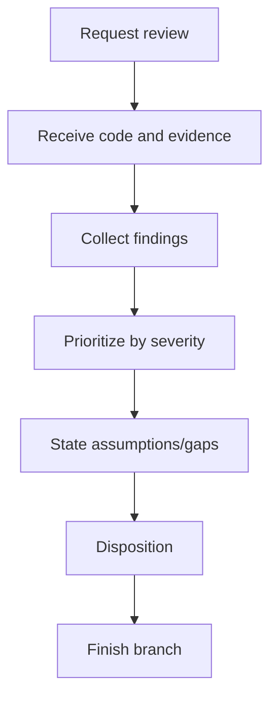

# Review - Code Review & Project Health

## The Iron Law

```
FINDINGS FIRST, SUMMARY SECOND
```

<HARD-GATE>
- Do not "let it go" with the user, author, or patch without indicating a finding, no-finding rationale, or testing gap.
- If the conclusion is "no finding", the scope of review and remaining residual risk/gap must be clearly stated.
- Review must go through 3 stages: request -> receive -> finish branch.
</HARD-GATE>

## Process



## 3-Part Lifecycle Review

### 1. Request
- Finalize review mode, scope, and questions that need to be answered
- Determine if the review is based on a specific diff, repo state, or artifact

### 2. Receive
- Read the actual code/artifacts presented for review
- If there is command/test evidence, use it; If not, state clearly that this is a static review
- Collect findings before writing summary

### 3. Finish Branch
- Battery Disposition: `ready-for-merge`, `changes-required`, or `blocked-by-residual-risk`
- Indicate how the branch/work item should proceed: merge, edit and then review, or stop because of risk
- Don't end with vague comments like "looks good", "looks good"

## Large-Task Review Discipline

With tasks `large`, `release-critical`, or `high-risk`:

- Prioritize an independent review of the flow just implemented
- If the host supports a separate subagent/reviewer lane, use an independent reviewer instead of reviewing the same lane implementation
- If there is no subagent, it is still necessary to clearly separate:
  - implementation evidence
  - reviewer findings
  - final disposition
- Do not edit and review at the same time and then consequently merge-ready in the same step
- If the build chain has chosen pipeline `implementer-quality` or `implementer-spec-quality`, the reviewer lane must maintain stance independent of that pipeline

High-risk signals:
- auth/payment/data migration
- Multiple boundaries or multiple skills touching at the same time
- Rollback production is difficult
- regression just happened around that area

## Anti-Performative Agreement

Reject style reflections:
- "That's right, this patch is fine" without stating finding or no-finding rationale
- "Do not see anything alarming" without saying scope review
- "Maybe it can be merged" when the disposition has not been finalized

Review is only valuable when it creates one of three things:
- specific finding
- confirm there are no findings in the checked scope, including gaps/risks
- Clear disposition for branch/work item

This contract is not just an etiquette. It is a performative agreement gate for the entire execution chain.

## Feedback Response Matrix

When the review is processed received feedback, feedback by type:

|Feedback type | How to handle|
|---------------|------------|
|Technically correct | Edit, verify, and state new evidence|
|Unclear intent | Ask again with a specific question, don't guess|
|Technically questionable | Investigate, then challenge with evidence if necessary|
| Stylistic preference | Clearly state the trade-off, convention, and final decision

Good feedback sample:

```text
- I verified: [evidence]. Correct because [reason]. Fixed: [change].
- I evaluated: [evidence]. Current code stays because [reason].
- Clarification needed: [single precise question].
```

Required:
- evidence must be new
- must have a stance to fix or keep
- If you keep the current code, you must clearly state why

Bad feedback sample:

```text
- Good catch! Fixed.
- Looks fine now.
- I guess I fixed it right.
```

## Review Modes

|Mode | Goal|
|------|----------|
|Code review | Find bugs, regressions, missing tests|
|Health check | See build/lint/test/docs/deps|
|Handover | Summary of project and area in progress|
|Upgrade assessment | Upgrade Risk Assessment|

## Auto-Scan

```
1. package manifests / build files (`package.json`, `pyproject.toml`, `go.mod`, `pom.xml`, `build.gradle`, `*.csproj`,...)
2. Folder structure
3. README / docs / plans
4. Changed files / git status if available
5. Relevant build/lint/test commands
```

Repo-first. `.brain` is read only if available and truly useful.

## Anti-Rationalization

|Defense | Truth|
|----------|---------|
|"Not seeing major errors is enough" | A good review should clearly state the finding and testing gap|
|"Just an overview" | If the user wants to review, finding must come first|
|"You can review even if you don't run a check" | Without evidence, it must be clearly stated that static review|
|"Patch looks reasonable so it should be fine" | A sense of reason does not replace finding, no-finding rationale, or disposition|

## Verification Checklist

- [ ] Review mode has been defined
- [ ] Scanned source-of-truth artifacts
- [ ] Findings are given priority
- [ ] Noted assumptions/testing gaps
- [ ] Report separates finding and summary
- [ ] Does not fall into the performative agreement
- [ ] Arrangement and next branch step finalized
- [ ] Feedback has been processed according to the matrix, not just a reply
- [ ] Large/high-risk task already has a sufficiently independent reviewer discipline

## Review Disposition

After review, finalize a clear disposition:

|Disposition | Use when|
|-------------|----------|
|`ready-for-merge` | No more finding/blocker heavy enough to hold back|
|`changes-required` | The finding needs to be fixed before merging|
|`blocked-by-residual-risk` | There is not enough evidence or the risk is still too great|

## Finish-Branch Protocol

After disposition, the branch/work item must enter exactly one state:

|Branch state | Use when|
|--------------|----------|
|`merge` | Clean review, enough evidence, no more blockers|
|`open-pr` | Need human/owner review or org policy PR request|
|`continue-on-branch` | The findings/follow-up need to be fixed immediately on the current branch|
|`cleanup-only` | The code is fine but still cleaning up artifact/log/worktree before it's considered done|
| `stop-on-risk` | The risk is too large or the evidence is lacking, it is not allowed to proceed

Don't leave the branch in a vague state like "let it be", "it's okay for now", or "maybe it can be merged".

If the branch is stuck on feedback arguments or the disposition is not converging, read `references/failure-recovery-playbooks.md`.

## Output

Saved at:

```
docs/PROJECT_REVIEW_[date].md
```

Short report sample:
```
Findings:
1. [severity] [...]
2. [...]

Assumptions / gaps:
- [...]

Disposition:
- [ready-for-merge / changes-required / blocked-by-residual-risk]

Finish branches:
- [merge/open-pr/continue-on-branch/cleanup-only/stop-on-risk]

Feedback handled:
- [fixed / challenging with evidence / clarification requested / stylistic decision]

Evidence response:
- [I verified:... / I investigated:... / Clarification needed:...]

Summary:
- [...]
```

## Activation Announcement

```
Forge: review | findings first, summary second
```
