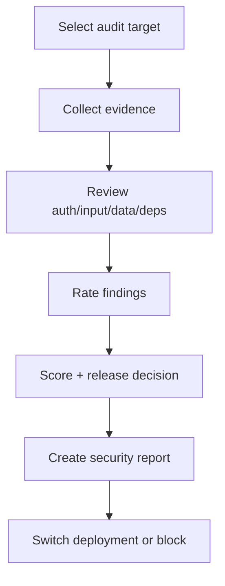

# Secure - Security & Audit

## The Iron Law

```
NO RELEASE WITHOUT EXPLICIT SECURITY REVIEW
```

<HARD-GATE>
- Do not deploy to production without reviewing security.
- Do not ignore hardcoded secrets, including staging.
- Production is blocked if there is an unresolved **critical** or **high** issue.
- Do not release without confirming the correct account/project/tenant/environment of the target.
</HARD-GATE>

---

## Process



## Security Checklist (OWASP-based)

### Authentication & Authorization
```
- Passwords are hashed correctly
- JWT/session expiry is reasonable
- RBAC/permission checks exist on every sensitive endpoint
- Rate limiting exists for login and required APIs
```

### Input Validation
```
- Server-side validation is mandatory
- Parameterized queries
- XSS prevention / escaping output
- CSRF protection if needed
- File upload validates type + size
```

### Data Protection
```
- Sensitive data is protected
- HTTPS / transport security is correct
- Secrets live in env/secret manager, not in code
- Audit logging exists for important operations
```

## Secret Defense Layers

Don't just find secrets in code. With release scope, go through the following classes:

|Layers | Goal | Example|
|-------|----------|-------|
|Write guard | Do not generate/output secrets into code, logs, docs | redact values, do not paste the actual token|
|Pre-commit / repo scan | Catch secrets revealed early | `gitleaks`, `git-secrets`, `trufflehog` or equivalent script|
|Pre-deploy secret audit | Verify secret scope correct release target | env diff, provider secret list, stale secret check|
|Runtime storage | Secret in the right place, right scope, right lifetime | secret manager, least privilege, rotation owner|
|Rotation & recovery | Have a plan when secrets are revealed or accounts are mistaken | revoke, rotate, audit logs, incident owner|

A single tool is not required, but the release-grade repo should have at least one repeatable secret scan.

## Identity-Safe Release Check

Before release, confirmation:

```text
- Git identity / remote is correct
- Cloud account / project / tenant is correct
- Database / auth / storage project is correct
- Environment name and secret scope are correct
```

Identity confusion is a security and operational risk, not just a deployment process error.

### Dependencies
```
- Audit vulnerabilities
- Review new packages / unnecessary packages
- Major upgrades have risky notes
```

## Risk Rating & Score

|Score | Rating | Decision|
|-------|--------|----------|
|90-100 | Ready | Deployable if no longer critical/high|
|70-89 | Conditional | Fix high before production, medium/low can note residual risk|
|<70 | Blocked | Not ready for release|

Score is heuristic. **Severity of finding is more important than overall score.**

## Anti-Rationalization

|Defense | Truth|
|----------|---------|
| "Just staging" | Secret leaks and auth holes are still real risks
| "This package is urgently needed, leave the audit later" | Dependency risk often occurs in a hurry
|"Not seeing an exploit as safe" | Not seen != does not exist|
|"Score is okay then deploy" | Score does not replace reading finding|
| "Secret scan for CI to take care of" | If there is no evidence scan for the current release, it is not considered covered

Code examples:

Bad:

```text
"Secret scan must have already taken care of the pipeline, skip this part."
```

Good:

```text
"This release requires either an evidence-backed secret scan or a current secret control. Without one, the security review is not complete."
```

## Verification Checklist

- [ ] Audit scope has been determined
- [ ] Collected real evidence (config, code, dependency output)
- [ ] Checked secret controls or secret scans in accordance with the scope
- [ ] Verified identity/project/tenant/environment for release scope if any
- [ ] Rate findings by severity
- [ ] Clearly noted production decision: ready / conditional / blocked
- [ ] Listed unresolved risks

## Report Template

```
Security report:
- Scope: [...]
- Evidence: [...]
- Secret controls: [...]
- Identity check: [...]
- Critical/High: [...]
- Medium/Low: [...]
- Score: [x/100]
- Release decision: [ready/conditional/blocked]
- Next actions: [...]
```

## Complexity Scaling

|Level | Approach|
|-------|----------|
|**small** | Focused review for the area the user just changed|
|**medium** | Auth + validation + dependency + config review|
|**large/release** | Full review + release decision + residual risk note|

## Activation Announcement

```
Forge: secure | review findings by severity before making a release decision
```
