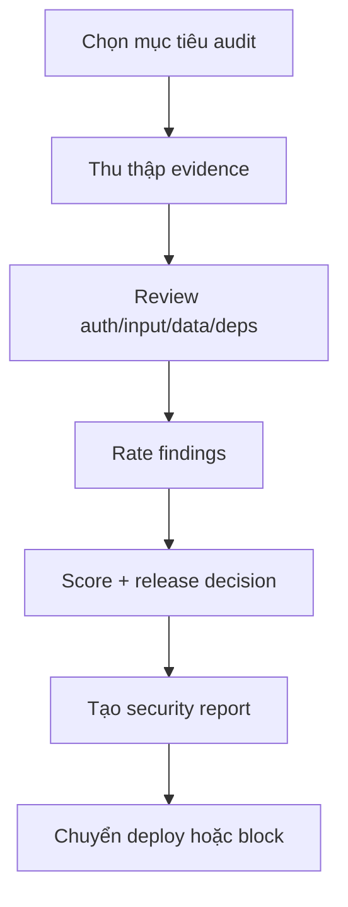

# Secure - Security & Audit

## The Iron Law

```
NO RELEASE WITHOUT EXPLICIT SECURITY REVIEW
```

<HARD-GATE>
- Không deploy production khi chưa review security.
- Không bỏ qua hardcoded secrets, kể cả staging.
- Production bị block nếu còn unresolved **critical** hoặc **high** issue.
- Không release nếu chưa xác nhận đúng account/project/tenant/environment của target.
</HARD-GATE>

---

## Process



## Security Checklist (OWASP-based)

### Authentication & Authorization
```
- Passwords hashed đúng cách
- JWT/session expiry hợp lý
- RBAC/permission checks ở mọi endpoint nhạy cảm
- Rate limiting cho login và API cần thiết
```

### Input Validation
```
- Server-side validation bắt buộc
- Parameterized queries
- XSS prevention / escaping output
- CSRF protection nếu cần
- File upload validate type + size
```

### Data Protection
```
- Sensitive data được bảo vệ
- HTTPS / transport security đúng
- Secrets nằm trong env/secret manager, không trong code
- Audit logging cho thao tác quan trọng
```

## Secret Defense Layers

Không chỉ tìm secret trong code. Với release scope, đi qua các lớp sau:

| Layer | Mục tiêu | Ví dụ |
|-------|----------|-------|
| Write guard | Không generate/output secret vào code, logs, docs | redact values, không paste token thật |
| Pre-commit / repo scan | Bắt secret lộ sớm | `gitleaks`, `git-secrets`, `trufflehog` hoặc script tương đương |
| Pre-deploy secret audit | Verify secret scope đúng release target | env diff, provider secret list, stale secret check |
| Runtime storage | Secret ở đúng nơi, đúng quyền, đúng lifetime | secret manager, least privilege, rotation owner |
| Rotation & recovery | Có plan khi lộ secret hoặc nhầm account | revoke, rotate, audit logs, incident owner |

Không bắt buộc một tool duy nhất, nhưng release-grade repo nên có ít nhất một secret scan lặp lại được.

## Identity-Safe Release Check

Trước release, xác nhận:

```text
- Git identity / remote đúng
- Cloud account / project / tenant đúng
- Database / auth / storage project đúng
- Environment name và secret scope đúng
```

Identity confusion là risk bảo mật và vận hành, không chỉ là lỗi quy trình deploy.

### Dependencies
```
- Audit vulnerabilities
- Review package mới / package không cần thiết
- Major upgrades được note risk
```

## Risk Rating & Score

| Score | Rating | Decision |
|-------|--------|----------|
| 90-100 | Ready | Deploy được nếu không còn critical/high |
| 70-89 | Conditional | Fix high trước production, medium/low có thể note residual risk |
| <70 | Blocked | Chưa sẵn sàng release |

Score là heuristic. **Severity của finding quan trọng hơn điểm tổng.**

## Anti-Rationalization

| Bào chữa | Sự thật |
|----------|---------|
| "Chỉ là staging" | Secret leak và auth hole vẫn là risk thật |
| "Package này cần gấp, bỏ audit sau" | Dependency risk thường vào từ lúc gấp |
| "Không thấy exploit là an toàn" | Không thấy != không tồn tại |
| "Score tạm ổn rồi deploy" | Score không thay thế việc đọc finding |
| "Secret scan để CI lo" | Nếu không có evidence scan cho release hiện tại thì chưa được coi là covered |

Code examples:

Bad:

```text
"Secret scan chắc pipeline đã lo rồi, phần này bỏ qua."
```

Good:

```text
"Release này cần evidence secret scan hoặc secret control hiện hành; nếu chưa có, security review chưa complete."
```

## Verification Checklist

- [ ] Đã xác định phạm vi audit
- [ ] Đã thu thập evidence thật (config, code, dependency output)
- [ ] Đã kiểm secret controls hoặc secret scan phù hợp với scope
- [ ] Đã verify identity/project/tenant/environment cho release scope nếu có
- [ ] Đã rate findings theo severity
- [ ] Đã note rõ production decision: ready / conditional / blocked
- [ ] Đã liệt kê unresolved risks

## Report Template

```
Security report:
- Scope: [...]
- Evidence: [...]
- Secret controls: [...]
- Identity check: [...]
- Critical/High: [...]
- Medium/Low: [...]
- Score: [x/100]
- Release decision: [ready/conditional/blocked]
- Next actions: [...]
```

## Complexity Scaling

| Level | Approach |
|-------|----------|
| **small** | Focused review cho khu vực user vừa đổi |
| **medium** | Auth + validation + dependency + config review |
| **large/release** | Full review + release decision + residual risk note |

## Activation Announcement

```
Forge: secure | review finding theo severity trước khi cho release decision
```
