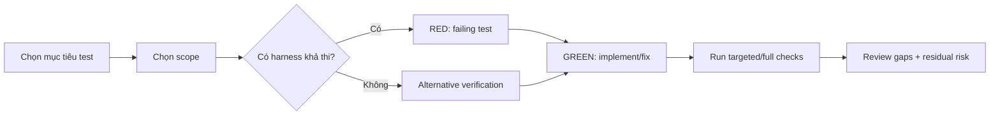

# Test - Testing & TDD

## The Iron Law

```
TESTS MUST PROVE BEHAVIOR, NOT DECORATE FINISHED CODE
```

> Nếu chưa chỉ ra được proof chain đủ rõ, thì chưa được gọi là verified.

<HARD-GATE>
- Nếu task đổi behavior và có harness khả thi, ưu tiên RED trước GREEN.
- Nếu không có harness, phải nói rõ và dùng verification thay thế.
- Không được báo test pass/coverage nếu chưa chạy.
- Không force TDD giả tạo cho task docs/config/release chores.
</HARD-GATE>

---

## Process



## Proof Before Progress

Testing trong Forge không chỉ là "có test". Nó phải tạo bằng chứng theo thứ tự:

1. `Failing proof` hoặc verification thay thế trước khi sửa
2. `Passing proof` cho behavior vừa đổi
3. `Boundary proof` nếu vừa chạm contract/integration/schema/auth
4. `Broader proof` khi blast radius đủ rộng hoặc đang release

Rules:
- Không báo `GREEN` nếu chưa thấy `RED` trong trường hợp harness khả thi
- Không báo "đã verify" nếu chưa mô tả command/scenario nào đã chạy
- Nếu đi bằng verification thay thế, phải mô tả cách lặp lại rõ như một test packet

## Test Strategy Selection

| Tình huống | Chọn |
|------------|------|
| Vừa sửa 1 behavior cụ thể | Targeted test |
| Thay đổi blast radius rộng | Targeted + full suite liên quan |
| Chuẩn bị release / deploy | Full suite + release checks |
| Không có harness | Manual scenario / smoke test / build-lint-typecheck |

## Harness Decision Ladder

Khi chọn cách prove behavior, đi từ mạnh nhất xuống:

1. Test sẵn có hoặc thêm test mới gần boundary đang đổi
2. Targeted integration/component/API test
3. Deterministic reproduction command hoặc script
4. Manual scenario lặp lại được + build/lint/typecheck/smoke

Rules:
- Nếu bậc 1 hoặc 2 khả thi mà bỏ qua, phải nêu lý do kỹ thuật cụ thể
- "Repo này ít test" không phải lý do đủ để nhảy xuống manual
- Khi manual là lựa chọn tốt nhất, phải mô tả scenario đủ chi tiết để người khác rerun được

## RED-GREEN-REFACTOR

### RED
- Một behavior duy nhất
- Tên test mô tả behavior
- Fail đúng lý do cần sửa
- Quan sát output fail thật, không đoán

### GREEN
- Implement tối thiểu để pass
- Không tranh thủ thêm feature
- Chạy lại đúng failing proof trước khi thêm broader checks

### REFACTOR
- Chỉ sau khi green
- Clean nhẹ, không đổi behavior

## Verification Ladder

Sau khi có `GREEN`, chọn mức verify phù hợp:

| Mức | Dùng khi |
|-----|----------|
| `targeted` | Chỉ đổi một behavior hẹp |
| `targeted + boundary` | Có contract/integration/schema/public edge |
| `targeted + relevant suite` | Blast radius rộng trong subsystem |
| `release ladder` | Chuẩn bị merge/deploy cho flow nhạy cảm |

Release ladder tối thiểu:
- targeted proof pass
- boundary hoặc integration check pass
- suite/check liên quan pass
- residual risk note rõ nếu vẫn còn gap

## Test Packet

Với task `medium/large` hoặc verification quan trọng, ghi packet ngắn:

```text
Test packet:
- Behavior under proof: [...]
- RED proof: [test/command/scenario]
- Expected fail signal: [...]
- GREEN proof: [test/command/scenario]
- Boundary checks: [...]
- Broader checks: [...]
- Residual gaps: [...]
```

Rules:
- Nếu không viết nổi `Expected fail signal`, RED đang quá mơ hồ
- Nếu không viết nổi `Boundary checks` cho public interface/migration/auth, verification đang quá yếu

## Evidence Response Contract

Testing output trong Forge không được dừng ở câu kiểu "tests passed".

```text
- I verified: [fresh evidence]. Correct because [reason]. Fixed: [change].
- I investigated: [evidence]. Current code stays because [reason].
- Clarification needed: [single precise question].
```

Applied to testing:
- `fresh evidence` = test output, reproduction output, hoặc command/check vừa chạy
- `reason` = behavior nào đã được prove hoặc gap nào còn lại
- `change/no-change stance` = fix nào đã được chứng minh hoặc vì sao chưa đổi thêm

Reject:
- Tests should be good now.
- Suite passed earlier.
- Manual tested, probably fine.

## Good Tests

| Tiêu chí | Tốt | Xấu |
|----------|-----|-----|
| Scope | Một behavior | Nhiều behavior trong 1 test |
| Naming | Mô tả kết quả mong đợi | `test1`, `works` |
| Signal | Fail đúng lý do | Fail vì setup sai |
| Realism | Ít mock nhất có thể | Mock mọi thứ |

## Anti-Rationalization

| Bào chữa | Sự thật |
|----------|---------|
| "Task nhỏ khỏi test" | Nhỏ hay lớn đều cần bằng chứng phù hợp |
| "Manual test rồi là đủ" | Manual test chỉ đủ khi nó được mô tả và lặp lại được |
| "Repo không có test nên bỏ qua" | Không có harness != không cần verify |
| "Test sau cũng được" | Test-after không chứng minh được ý đồ ban đầu |
| "Giữ code cũ để tham khảo là ổn" | Tham khảo code cũ không chứng minh behavior đang được bảo vệ |
| "Cần explore trước rồi mới viết RED" | Explore được, nhưng khi harness khả thi thì RED vẫn là bằng chứng tốt nhất trước GREEN |
| "TDD không practical" | Nếu bỏ RED, phải nói rõ giới hạn kỹ thuật và verification thay thế là gì |
| "Khó test thì skip" | Khó test nghĩa là cần đổi scope hoặc chiến lược verify, không phải bỏ qua |
| "Suite lớn pass là đủ" | Suite lớn không thay thế cho failing proof đúng behavior vừa đổi |

Code examples:

Bad:

```text
"Task này nhỏ, em test manual là đủ."
```

Good:

```text
"Không có harness phù hợp, nên verification thay thế là [manual scenario/build/lint/typecheck], và em sẽ rerun đúng bước đó sau khi sửa."
```

Good (harness available):

```text
"RED: chạy [test] và thấy fail đúng vì [signal]. GREEN: sửa tối thiểu cho pass. Sau đó chạy thêm [boundary/suite check] vì vừa chạm [contract/integration]."
```

## Reset Rules

Phải dừng và reset cách test khi:
- RED fail vì setup sai hoặc test viết sai intent
- GREEN đạt được nhưng chưa từng quan sát RED trong harness-capable task
- boundary vừa đổi nhưng test packet vẫn chỉ có targeted happy path
- suite pass nhưng reproduction gốc vẫn chưa được chứng minh

Reset ở đây nghĩa là quay lại viết lại proof đúng hơn, không cố giữ một chuỗi verify yếu chỉ vì đã tốn công

## Verification Checklist

- [ ] Đã chọn đúng scope test/check
- [ ] Có failing test khi harness cho phép
- [ ] Hoặc có lý do rõ ràng cho verification thay thế
- [ ] Có test packet hoặc proof chain đủ rõ cho task quan trọng
- [ ] Đã quan sát fail/pass thật, không chỉ suy đoán
- [ ] Boundary checks đã được thêm khi blast radius yêu cầu
- [ ] Đã chạy lại checks sau khi sửa
- [ ] Đã đọc output thật
- [ ] Evidence response contract đã được giữ
- [ ] Đã note residual risk / phần chưa cover

## Output Template

```
Test report:
- Strategy: [targeted/full/alternative]
- Proof chain: [red -> green -> boundary -> broader]
- Verified: [command/check] -> [kết quả]
- Evidence response: [I verified: ... / I investigated: ... / Clarification needed: ...]
- Coverage/gaps: [...]
- Residual risk: [...]
```

## Activation Announcement

```
Forge Antigravity: test | chọn strategy trước, RED khi harness cho phép
```
