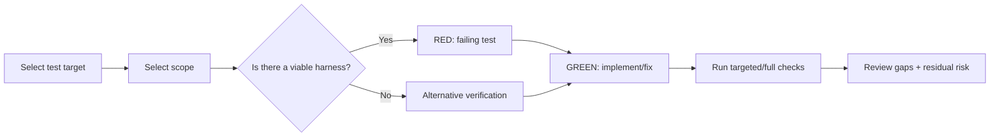

# Test - Testing & TDD

## The Iron Law

```
TESTS MUST PROOVE BEHAVIOR, NOT DECORATE FINISHED CODE
```

> If the proof chain has not been shown clearly enough, it cannot be called verified.

<HARD-GATE>
- If the task changes behavior and has a viable harness, prioritize RED before GREEN.
- If the harness is available and RED was not observed, reset the packet instead of moving forward.
- If there is no harness, it must be clearly stated and use verification instead.
- Do not report test pass/coverage if it has not been run yet.
- Do not artificially force TDD for task docs/config/release chores.
</HARD-GATE>

---

## Process



## Proof Before Progress

Testing in Forge is more than just "having tests". It must generate proofs in the order:

1. `Failing proof` or verify instead before repair
2. `Passing proof` for the newly changed behavior
3. `Boundary proof` if you just touched contract/integration/schema/auth
4. `Broader proof` when blast radius is wide enough or released

Rules:
- Do not report `GREEN` if `RED` has not been found in case the harness is feasible
- Do not say "verified" if no command/scenario has been described yet
- If using verification instead, must describe the iteration clearly as a test packet

## Test Strategy Selection

|Situation | Select|
|------------|------|
|Just fix a specific behavior | Targeted testing|
|Change blast radius wide | Targeted + full related suite|
|Prepare for release / deployment | Full suite + release checks|
|No harness | Manual scenario / smoke test / build-lint-typecheck|

## Harness Decision Ladder

When choosing how to prove behavior, go from strongest down:

1. Existing tests or adding new tests near the changing boundary
2. Targeted integration/component/API test
3. Deterministic reproduction command or script
4. Repeatable manual scenario + build/lint/typecheck/smoke

Rules:
- If level 1 or 2 is feasible but omitted, specific technical reasons must be stated
- "This repo has little testing" is not enough reason to jump down to manual
- When manual is the best choice, the scenario must be described in enough detail for others to rerun
- If a harness exists and RED was skipped, the test packet is invalid and must be rewritten.

## RED-GREEN-REFACTOR

### RED
- A single behavior
- The test name describes the behavior
- Failed for the right reason and needs to be fixed
- Observe the actual output failure, don't guess

### GREEN
- Minimum implementation to pass
- Do not take advantage of additional features
- Rerun the failing proof correctly adding before wider checks

### REFACTOR
- Only after the green
- Lightly clean, no change in behavior

## Verification Ladder

After having `GREEN`, choose the appropriate verification level:

|Level | Use when|
|-----|----------|
|`targeted` | Just change a narrow behavior|
|`targeted + boundary` | There is contract/integration/schema/public edge|
|`targeted + relevant suite` | Blast radius wide in subsystem|
|`release ladder` | Prepare merge/deploy for sensitive flows|

Minimum release ladder:
- targeted proof pass
- boundary or integration check pass
- suite/check related pass
- Residual risk note clearly if there is still a gap

## Test Packet

For important `medium/large` or verification tasks, write a short packet:

```text
Test packets:
- Packet ID / parent packet: [...]
- Behavior under proof: [...]
- Baseline verification: [current command/reproduction before edit]
- RED proof: [test/command/scenario]
- Expected failure signal: [...]
- GREEN proof: [test/command/scenario]
- Boundary checks: [...]
- Broader checks: [...]
- Verification to rerun before handoff: [...]
- Browser QA classification/status if the packet depends on UI or workflow proof: [...]
- Residual gaps: [...]
```

Rules:
- If you can't write `Expected fail signal`, RED is too vague
- If you can't write `Boundary checks` for public interface/migration/auth, verification is too weak
- If RED was skipped while the harness was viable, `Baseline verification` alone does not save the packet; rewrite it correctly
- If browser QA is part of the packet, it is an execution proof for that packet, not a separate sidecar proof chain

## Evidence Response Contract

Testing output in Forge cannot stop at a sentence like "tests passed".

```text
- I verified: [fresh evidence]. Correct because [reason]. Fixed: [change].
- I evaluated: [evidence]. The current code stays because [reason].
- Clarification needed: [single precise question].
```

Applied to testing:
- `fresh evidence` = test output, reproduction output, or command/check just run
- `reason` = which behavior has been proven or which gap remains
- `change/no-change stance` = Which fix has been proven or why hasn't it been changed yet?

Reject:
- Tests should be good now.
- Suite passed earlier.
- Manually tested, probably fine.

## Good Tests

|Criteria | Good | Bad|
|----------|-----|-----|
|Scope | A behavior | Many behaviors in 1 test|
|Naming | Describe expected results | `test1`, `works`|
|Signal | Fail for the right reasons | Fail because of wrong setup|
|Realism | As little mock as possible | Mock everything|

## Anti-Rationalization

|Defense | Truth|
|----------|---------|
|"Small tasks avoid testing" | Small or large, both require appropriate evidence|
| "Manual testing is enough" | Manual testing is only sufficient when it is descriptive and repeatable
|"Repo has no tests so ignore" | No harness != no need to verify|
|"It's okay to test later" | Test-after does not prove the original intention|
|"It's okay to keep the old code for reference" | Referencing old code does not prove that behavior is being protected|
|"Need to explore first before writing RED" | Explore is ok, but when the harness is viable, RED is still the best proof against GREEN|
| "TDD is not practical" | If you remove RED, you must clearly state the technical limitations and what the alternative verification is
|"If it's difficult to test, skip" | Difficult to test means by changing scope or verification strategy, not skipping|
|"Big suite pass is enough" | Big Suite is not a substitute for failing proof, the behavior just changed|

Code examples:

Bad:

```text
"This task is small, manual testing is enough."
```

Good:

```text
"There is no suitable harness, so verification is changed [manual scenario/build/lint/typecheck], and I will rerun that step after fixing."
```

Good (harness available):

```text
"RED: run [test] and fail correctly because of [signal]. GREEN: minimally fix the pass. Then run [boundary/suite check] because it just touched [contract/integration]."
```

## Reset Rules

Testing must be stopped and reset when:
- RED fails because the setup is wrong or the test writes the wrong intent
- GREEN was achieved but RED was never observed in the harness-capable task
- baseline verification was never captured before editing and the report is reconstructing proof after the fact
- The boundary has just changed but the test packet still only has targeted happy path
- suite pass but original reproduction has not been proven yet

Reset here means going back to rewriting the proof properly, not trying to keep a weak verification chain just because it's a waste of effort

## Verification Checklist

- [ ] The correct test/check scope has been selected
- [ ] There is a failing test when the harness allows it
- [ ] Or there is a clear reason for verification instead
- [ ] Have a test packet or proof chain clear enough for important tasks
- [ ] Observed real fail/pass, not just speculation
- [ ] Boundary checks have been added when blast radius is required
- [ ] Rerun checks after editing
- [ ] Read the actual output
- [ ] Evidence response contract has been held
- [ ] Residual risk / portion not covered has been noted

## Output Template

```
Test report:
- Strategy: [targeted/full/alternative]
- Proof chain: [red -> green -> boundary -> wider]
- Verified: [command/check] -> [result]
- Evidence response: [I verified:... / I investigated:... / Clarification needed:...]
- Coverage/gaps: [...]
- Residual risk: [...]
```

## Activation Announcement

```
Forge: test | choose strategy first, RED when the harness allows it
```

## Response Footer

When this skill is used to complete a task, include this exact English line in a footer block at the end of the response:

`Used skill: test.`

Keep that footer block as the last block of the response. If multiple skills are used, include one exact `Used skill:` line per unique skill and do not add anything after the footer block.