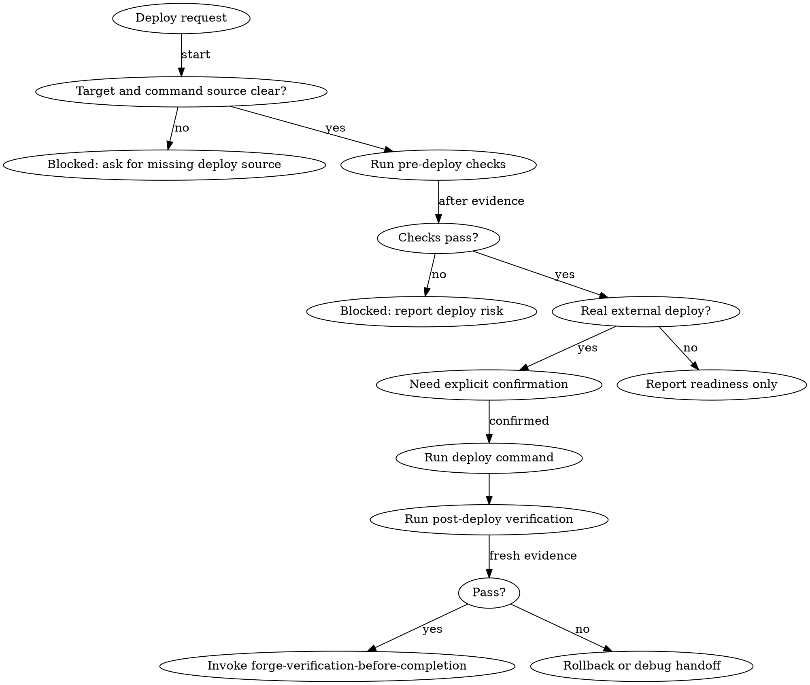

# Forge Deploy

<EXTREMELY-IMPORTANT>
Use this when work is crossing the repo boundary into a live environment or a real release target.

```text
NO DEPLOY CLAIMS WITHOUT FRESH PRE-DEPLOY AND POST-DEPLOY EVIDENCE
```

Do not treat deploy as a synonym for version bump, PR creation, or generic completion.
</EXTREMELY-IMPORTANT>

## Overview

Deploy is a release-facing state transition with external consequences.

**Core principle:** preflight before action, proof after action, rollback path before any risky move.

## Use When

- The user says `deploy`, `ship to production`, `promote this build`, or `check production readiness`.
- A verified change set is about to be pushed into staging, production, or another live runtime.
- The task needs pre-deploy checks, deploy confirmation, smoke checks, or rollback guidance.
- Post-deploy smoke checks failed and the next move is rollback-or-debug, not more feature work.

## Do Not Use When

- The user only wants version or changelog preparation; use `forge-bump-release`.
- The task is only branch, PR, or merge disposition; use `forge-finishing-a-development-branch`.
- A verification failure needs root-cause work before any deploy decision; use `forge-systematic-debugging`.
- No accepted plan or verified change exists and the user is still deciding what to build.

## Required Contract

Before any deploy action or deploy-ready wording, make these fields explicit:

- target environment
- deploy mechanism or command source
- pre-deploy checks and latest evidence
- external side effect confirmation if a real deploy will run
- post-deploy verification plan
- rollback path or rollback owner

If any required field is missing and cannot be derived from repo evidence, stop in blocked state instead of guessing.

## Process Flow



## Preflight

Read [references/deploy-contract.md](references/deploy-contract.md) and [references/deploy-checks.md](references/deploy-checks.md) before applying the skill when deploy details matter.

Preflight must confirm:

- the deploy target is named
- the deploy command or runbook source is real and repo-backed
- the latest relevant verification is fresh enough for a deploy-facing claim
- secrets, config, migration, and runtime assumptions are not hidden
- the rollback path exists, or the missing rollback path is reported as risk

If the repo has no documented deploy path, do not invent one. Report blocked status and name the missing source of truth.

## Execution Rules

- Readiness analysis can proceed without extra confirmation.
- Real deploy execution always needs explicit confirmation before running the external command.
- Use the repo's documented command or platform step; do not substitute a guessed provider flow.
- If the deploy command fails, stop and hand off to `forge-systematic-debugging` or rollback guidance instead of retrying by instinct.
- If post-deploy smoke checks fail, treat the deploy as blocked or failed until rollback or recovery is explicit.

## Post-Deploy Verification

Post-deploy verification must be specific, not verbal.

Typical proof includes:

- smoke test command output
- deployed version or commit visibility
- critical path checks
- health endpoint or service status
- artifact or URL availability

If only partial proof exists, report conditional scope. Do not compress partial proof into `deployed`.

## Rollback And Failure

Use [references/rollback-guidance.md](references/rollback-guidance.md) when the deploy is unhealthy, the smoke checks fail, or the target becomes unsafe during rollout.

A deploy failure report must include:

- where the failure happened
- latest passing proof before failure
- latest failing proof after action
- rollback path or missing rollback blocker
- next skill: usually `forge-systematic-debugging`

Do not expose `/rollback` as a public operator alias from this skill.

## Quick Reference

| User asks | Use |
| --- | --- |
| "Check if this is ready for production" | Preflight only, no deploy command |
| "Deploy this to staging" | Preflight, confirmation, deploy, smoke checks |
| "Ship to production" | Preflight, explicit confirmation, deploy, post-deploy verification |
| "Release 2.1.0" | Use `forge-bump-release` unless a live deploy is also requested |
| "PR is ready, make it live" | Branch/PR decision may need `forge-finishing-a-development-branch` before deploy |

## Common Mistakes

- Treating deploy as the same thing as bumping `VERSION` or updating `CHANGELOG.md`.
- Running a guessed deploy command because the repo hints at a platform but does not document the path.
- Skipping rollback notes because the deploy looked small.
- Calling a deploy successful before running post-deploy smoke checks.
- Hiding missing target, missing command source, or missing rollback as "probably fine."

## Integration

- Called by: deploy prompts, production-readiness prompts, and live rollout requests.
- Calls next: `forge-verification-before-completion` before any deployable or shipped claim.
- Pairs with: `forge-bump-release`, `forge-finishing-a-development-branch`, and `forge-systematic-debugging`.

