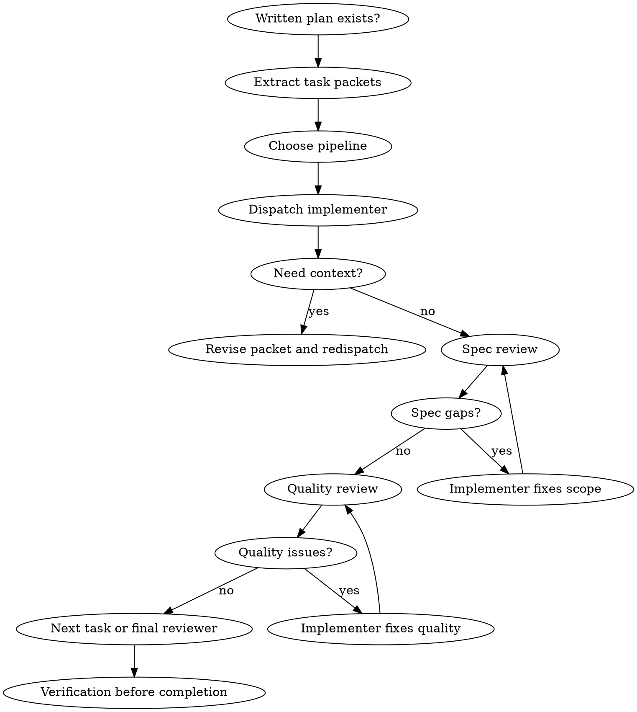

# Forge Subagent-Driven Development

<EXTREMELY-IMPORTANT>
Use this only with a written plan and clear task packets.

Fresh subagent per task. Packet-first dispatch. Spec review before quality review.

The controller owns sequencing, scope, verification strategy, and final claims. Subagents execute lanes; they do not become a second orchestrator.
</EXTREMELY-IMPORTANT>

## Why Subagents

Subagents are useful because they start with isolated context. The controller can give them exactly one task, exact ownership, exact proof expectations, and exact return format.

This prevents:

- polluted context from earlier attempts
- workers silently expanding scope
- reviewers judging implementation quality before checking spec compliance
- the controller losing context while doing implementation work

Core principle:

```text
fresh worker lane + packet-first prompt + spec review before quality review = safer execution
```

## Use When

- A plan exists.
- Tasks are mostly independent or can be executed one at a time with fresh workers.
- The host supports subagents and the user allows delegation.
- Review separation materially reduces risk.
- Medium or large work benefits from fresh context per slice.
- A final holistic review would catch integration drift across slices.

## Do Not Use When

- No implementation plan exists.
- Tasks are tightly coupled and require constant shared context.
- Write scopes overlap.
- The host cannot spawn subagents; use `forge-executing-plans`.
- The controller cannot define ownership, proof, or return format.
- The work is a tiny local edit where subagent overhead adds no quality.

## Process Flow



## Controller Process

1. Read the plan once and extract task packets.
2. Keep critical sequencing in the controller.
3. Dispatch one implementer per task with full task text, owned files, constraints, and proof.
4. If an implementer asks questions, answer before work continues.
5. When implementation returns, run spec compliance review first.
6. Only after spec approval, run code quality review.
7. Reviewer findings go back to the implementer and must be re-reviewed.
8. After all tasks, use `forge-requesting-code-review` and `forge-verification-before-completion`.

## Pipeline Selection

| Pipeline | Use when | Lane order |
| --- | --- | --- |
| `single-lane` | Small bounded work, no independent review needed | controller implements |
| `sequential-lanes` | Host has no subagents, but role separation still helps | implementer -> spec-reviewer -> quality-reviewer |
| `subagent-lanes` | Host can spawn subagents and packets have clear ownership | implementer subagent -> spec reviewer -> quality reviewer -> final reviewer |

Rules:

- use subagent lanes only when packet, ownership, and verification are explicit
- keep tightly coupled work in the controller or split the plan first
- do not let two workers edit the same file unless there is a merge plan
- do not dispatch parallel workers just because subagents are available
- preserve lane separation even when host limitations force sequential execution

## Agent Prompt Structure

Every worker prompt should include, in this order:

1. Task goal and exact success state
2. Owned files or write scope
3. Required read-only context
4. Constraints and non-goals
5. Verification to run
6. Collaboration rules:
   other workers may be editing elsewhere, do not revert unrelated changes, and adjust to concurrent work
7. Return format:
   status, changed files, proof, residual risk, and any open questions

If the packet does not define ownership, proof, and return format, the prompt is not ready to dispatch.

## Packet Template

```text
Forge execution packet:
- Packet ID / parent packet:
- Role: implementer | spec-reviewer | quality-reviewer | final-reviewer
- Task goal:
- Exact success state:
- Owned files or write scope:
- Allowed reads:
- Source plan/spec/design:
- Dependencies:
- Out of scope:
- TDD or repro requirement:
- Verification to run:
- Collaboration rules:
- Return format:
```

Collaboration rules must say:

```text
Other workers may be editing elsewhere. Do not revert unrelated changes.
Stay inside the owned write scope. If the scope is wrong, return NEEDS_CONTEXT.
```

## Model Or Capability Tier

Use capability tiers instead of vendor-specific model names.

| Lane | Default | Upgrade when |
| --- | --- | --- |
| implementer | standard | broad integration, migration, security, repeated failures |
| spec-reviewer | standard | ambiguous requirements or user-facing contract risk |
| quality-reviewer | standard | release-critical, security-sensitive, or high blast radius |
| final-reviewer | capable for large work | many slices, conflicting reviewer signals, broad diff |

Do not send every lane to the strongest model by default. Upgrade because of task shape, not habit.

## Required Statuses

- `DONE`: proceed to spec review.
- `DONE_WITH_CONCERNS`: read and disposition concerns before review.
- `NEEDS_CONTEXT`: provide context and redispatch.
- `BLOCKED`: change context, split task, or escalate to the user or plan.

Never ignore an escalation. If a worker says `NEEDS_CONTEXT` or `BLOCKED`, the controller must change something before retrying: add context, split the packet, upgrade the lane, change verification, or return to the plan.

## Review Order

Spec compliance review always happens before quality review.

Spec reviewer checks:

- matches the source request and accepted plan
- implements the full task packet
- does not add unrequested scope
- preserves named constraints and non-goals
- uses the required proof method

Quality reviewer checks:

- maintainability and integration fit
- correctness risks and edge cases
- test strength and evidence quality
- error handling and state safety
- code style consistency with nearby patterns

If spec review fails, do not start quality review. Return to implementer, fix scope, then re-review spec.

If quality review fails, return the specific finding to the implementer and require proof after the fix. Then run quality review again.

## Final Reviewer Handoff

After all packets are complete, prepare a final reviewer packet before any ready/done claim:

```text
Final reviewer handoff:
- Source request and accepted plan/spec:
- Packet list and completion statuses:
- Changed files and ownership map:
- Spec-review dispositions:
- Quality-review dispositions:
- Verification evidence:
- Known residual risks:
- Open human decisions:
- Requested gate recommendation:
```

Use `references/subagent-prompts/final-reviewer-prompt.md` when the host can run a final reviewer lane. If no reviewer lane exists, run the same checklist locally and say it was not independent.

## Example Dispatch

```text
Task 3: Add workspace resume fallback
Owned files: packages/forge-core/scripts/session_context.py, tests/test_session_context.py
Allowed reads: docs/current/operator-surface.md
Out of scope: adding routing heuristics or new operator actions
Verification: targeted pytest for session context, then contract test if public wording changes
Return: Status, changed files, verification, concerns, residual risk
```

This is strong because the worker knows what to edit, what not to edit, how to prove the work, and how to report back.

## Red Flags

| Rationalization | Reality |
| --- | --- |
| "Skip review; implementer self-reviewed." | Self-review does not replace spec and quality lanes. |
| "Review quality before spec." | Spec compliance comes first. |
| "Dispatch all implementers in parallel." | Only parallelize when write scopes and dependencies are safe. |
| "Let subagents read the whole plan." | Controller provides exact task context. |
| "A short prompt is fine; the worker will infer the rest." | Weak prompt packets produce weak output and noisy review loops. |
| "Reviewer found issues, but they seem minor." | Findings require disposition and re-review. |
| "Worker is blocked, retry the same prompt." | Retry without changing context repeats the failure. |
| "The final diff looks fine." | Slice-level success does not prove holistic integration. |

## Integration

- Called by: `forge-writing-plans` after the user chooses delegated execution, or by `forge-executing-plans` when the written plan clearly supports worker lanes.
- Calls next: `forge-dispatching-parallel-agents`, `forge-requesting-code-review`, and `forge-verification-before-completion`.
- Pairs with: `forge-using-git-worktrees` for isolation and `forge-session-management` for durable packets and handoff.

Shared prompt templates live under the installed Forge orchestrator bundle:

- `references/subagent-execution.md`
- `references/subagent-prompts/implementer-prompt.md`
- `references/subagent-prompts/spec-reviewer-prompt.md`
- `references/subagent-prompts/quality-reviewer-prompt.md`
- `references/subagent-prompts/final-reviewer-prompt.md`
